# 시스템 아키텍처 문서

> **문서 버전**: 2.0
> **작성일**: 2025-12-21
> **대상 시스템**: Storige + Bookmoa 통합 인쇄 쇼핑몰 시스템

---

## 목차

1. [시스템 개요](#1-시스템-개요)
2. [전체 시스템 구성도](#2-전체-시스템-구성도)
3. [시스템 컴포넌트](#3-시스템-컴포넌트)
4. [네트워크 토폴로지](#4-네트워크-토폴로지)
5. [데이터 흐름](#5-데이터-흐름)
6. [인프라스트럭처](#6-인프라스트럭처)
7. [보안 아키텍처](#7-보안-아키텍처)
8. [확장성 및 고가용성](#8-확장성-및-고가용성)

---

## 1. 시스템 개요

### 1.1 시스템 목적

Storige-Bookmoa는 인쇄 상품의 온라인 편집 및 주문을 위한 통합 시스템입니다.

- **Bookmoa**: 레거시 PHP 기반 B2C 쇼핑몰 (주문, 결제, 회원 관리)
- **Storige**: 최신 TypeScript 기반 편집 시스템 (캔버스 편집, PDF 처리)

### 1.2 시스템 특징

| 특징 | 설명 |
|------|------|
| 하이브리드 아키텍처 | 레거시 PHP + 모던 Node.js 공존 |
| 마이크로서비스 지향 | API, Worker, Editor 분리 운영 |
| 비동기 처리 | Bull Queue 기반 PDF 처리 |
| 이중 인증 | API Key (서버간) + JWT (클라이언트) |

### 1.3 기술 스택 요약


---

## 2. 전체 시스템 구성도

### 2.1 High-Level Architecture


### 2.2 상세 구성도


---

## 3. 시스템 컴포넌트

### 3.1 컴포넌트 매트릭스

| 컴포넌트 | 유형 | 포트 | 기술 스택 | 역할 |
|----------|------|------|-----------|------|
| Bookmoa Front | Web | 80/443 | PHP, JS | B2C 쇼핑몰 |
| Bookmoa Nimda | Web | 80/443 | PHP | B2B 관리자 |
| Storige Editor | SPA | 3000 | React, Fabric.js | 캔버스 편집기 |
| Storige Admin | SPA | 3001 | React, Ant Design | 템플릿/상품 관리 |
| Storige API | REST | 4000 | NestJS, TypeORM | 비즈니스 로직 |
| Storige Worker | Service | 4001 | NestJS, Bull | PDF 처리 |
| MariaDB | Database | 3306 | MariaDB 11.2 | 영구 저장소 |
| Redis | Cache/Queue | 6379 | Redis 7.2 | 캐시/큐 |

### 3.2 컴포넌트 의존성


### 3.3 Bookmoa 내부 구조


### 3.4 Storige API 모듈 구조


---

## 4. 네트워크 토폴로지

### 4.1 개발 환경


### 4.2 프로덕션 환경


---

## 5. 데이터 흐름

### 5.1 고객 주문 플로우


### 5.2 PDF 처리 파이프라인


### 5.3 인증 흐름


---

## 6. 인프라스트럭처

### 6.1 서버 사양 (권장)

| 서버 | CPU | RAM | Storage | 용도 |
|------|-----|-----|---------|------|
| Web Server | 4 Core | 8GB | 100GB SSD | Apache + PHP |
| API Server | 4 Core | 8GB | 50GB SSD | NestJS API |
| Worker Server | 8 Core | 16GB | 200GB SSD | PDF 처리 |
| DB Server | 4 Core | 16GB | 500GB SSD | MariaDB |
| Redis Server | 2 Core | 4GB | 20GB SSD | Cache/Queue |

### 6.2 Docker Compose 구성


### 6.3 파일 스토리지 구조

```
/app/storage/
├── uploads/              # 업로드된 원본 파일
│   ├── {year}/
│   │   ├── {month}/
│   │   │   └── {uuid}.pdf
├── templates/            # 템플릿 에셋
│   └── {templateId}/
│       ├── canvas.json
│       └── thumbnail.png
├── outputs/              # 처리된 결과물
│   └── {jobId}/
│       ├── merged.pdf
│       └── preview.png
├── thumbnails/           # 썸네일
│   └── {uuid}.png
└── temp/                 # 임시 파일
    └── {sessionId}/
```

---

## 7. 보안 아키텍처

### 7.1 인증 체계


### 7.2 보안 계층

| 계층 | 보안 조치 |
|------|----------|
| 네트워크 | HTTPS/TLS 1.3, Firewall, IP Whitelist |
| 애플리케이션 | JWT 인증, CORS, Rate Limiting |
| 데이터 | SQL Injection 방지, XSS 방지 |
| 파일 | MIME Type 검증, 파일 크기 제한 |

### 7.3 CORS 설정


---

## 8. 확장성 및 고가용성

### 8.1 수평 확장 전략


### 8.2 장애 대응

| 컴포넌트 | 장애 시나리오 | 대응 방안 |
|----------|--------------|----------|
| API Server | 인스턴스 다운 | LB가 다른 인스턴스로 라우팅 |
| Worker | 프로세스 크래시 | PM2 자동 재시작 |
| Database | 마스터 다운 | 슬레이브 프로모션 |
| Redis | 메모리 부족 | 데이터 만료 정책 적용 |

### 8.3 백업 전략

```mermaid
gantt
    title 백업 스케줄
    dateFormat HH:mm
    section Database
    Full Backup     :done, 02:00, 1h
    Incremental     :active, 06:00, 30m
    Incremental     :active, 12:00, 30m
    Incremental     :active, 18:00, 30m
    section Files
    Storage Sync    :done, 03:00, 2h
    section Logs
    Log Rotation    :done, 00:00, 30m
```



---

## 부록

### A. 환경변수 목록

#### Storige API
```bash
# Database
DATABASE_HOST=localhost
DATABASE_PORT=3306
DATABASE_USER=storige
DATABASE_PASSWORD=****
DATABASE_NAME=storige

# Redis
REDIS_HOST=localhost
REDIS_PORT=6379

# JWT
JWT_SECRET=****
JWT_EXPIRES_IN=1h

# API Keys
API_KEYS=key1,key2,key3

# CORS
CORS_ORIGIN=https://bookmoa.noriter.co.kr
```

#### Bookmoa
```apache
SetEnv STORIGE_API_URL "http://localhost:4000/api"
SetEnv STORIGE_API_KEY "your-api-key"
SetEnv STORIGE_EDITOR_BUNDLE_URL "/storige-embed/editor-bundle.iife.js"
```

### B. 포트 매핑

| 서비스 | 개발 포트 | 프로덕션 포트 |
|--------|----------|--------------|
| Bookmoa | 8080 | 80/443 |
| Storige Editor | 3000 | 3000 |
| Storige Admin | 3001 | 3001 |
| Storige API | 4000 | 4000 |
| Storige Worker | 4001 | 4001 |
| MariaDB | 3306 | 3306 |
| Redis | 6379 | 6379 |

### C. 헬스체크 엔드포인트

| 엔드포인트 | 설명 |
|------------|------|
| `GET /health` | API 기본 상태 |
| `GET /health/db` | 데이터베이스 연결 |
| `GET /health/redis` | Redis 연결 |
| `GET /health/worker` | Worker 상태 |

---

## 변경 이력

| 버전 | 날짜 | 변경 내용 |
|------|------|----------|
| 2.0 | 2025-12-21 | Mermaid 다이어그램 추가, 전면 개편 |
| 1.2 | 2024-12-14 | 개발환경 Apache 전환 |
| 1.0 | 2024-12-11 | 최초 작성 |
