# 소프트웨어 아키텍처 문서

> **문서 버전**: 1.0
> **작성일**: 2025-12-21
> **대상 시스템**: Storige + Bookmoa 통합 인쇄 쇼핑몰 시스템

---

## 목차

1. [아키텍처 개요](#1-아키텍처-개요)
2. [Storige 아키텍처](#2-storige-아키텍처)
3. [Bookmoa 아키텍처](#3-bookmoa-아키텍처)
4. [데이터베이스 설계](#4-데이터베이스-설계)
5. [API 설계](#5-api-설계)
6. [이벤트 기반 아키텍처](#6-이벤트-기반-아키텍처)
7. [디자인 패턴](#7-디자인-패턴)
8. [코드 구조](#8-코드-구조)

---

## 1. 아키텍처 개요

### 1.1 아키텍처 스타일

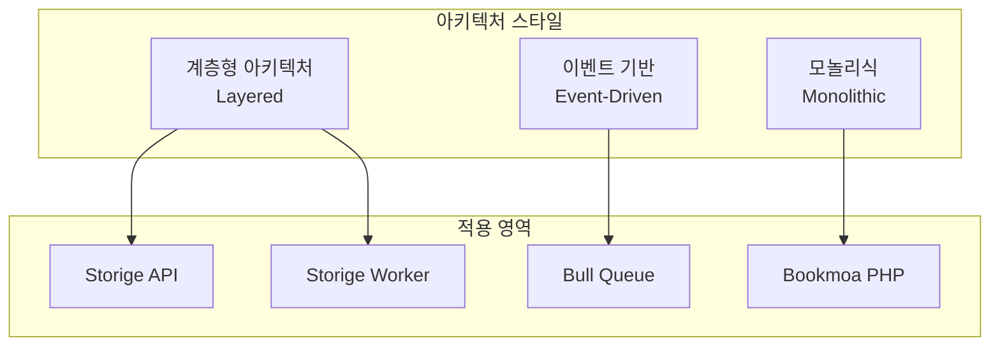
```mermaid
graph TB
    subgraph "아키텍처 스타일"
        A[계층형 아키텍처<br/>Layered]
        B[이벤트 기반<br/>Event-Driven]
        C[모놀리식<br/>Monolithic]
    end

    subgraph "적용 영역"
        A --> API[Storige API]
        A --> WK[Storige Worker]
        B --> QUEUE[Bull Queue]
        C --> BM[Bookmoa PHP]
    end
```

### 1.2 기술 스택 상세

#### Storige (Modern Stack)

| 레이어 | 기술 | 버전 | 용도 |
|--------|------|------|------|
| Frontend | React | 18.x | UI 프레임워크 |
| State | Zustand | 4.x | 상태 관리 |
| Canvas | Fabric.js | 6.x | 캔버스 편집 |
| Build | Vite | 5.x | 번들링 |
| Style | TailwindCSS | 3.x | 스타일링 |
| Backend | NestJS | 10.x | API 프레임워크 |
| ORM | TypeORM | 0.3.x | 데이터베이스 |
| Queue | Bull | 4.x | 작업 큐 |
| PDF | pdf-lib | 1.x | PDF 처리 |

#### Bookmoa (Legacy Stack)

| 레이어 | 기술 | 버전 | 용도 |
|--------|------|------|------|
| Server | Apache | 2.4 | 웹 서버 |
| Runtime | PHP | 7.x+ | 백엔드 |
| Framework | Nexmotion | Custom | MVC 프레임워크 |
| Database | ADODB | 5.x | DB 추상화 |
| PDF | Ghostscript | 9.22 | PDF 처리 |

### 1.3 모노레포 구조 (Storige)

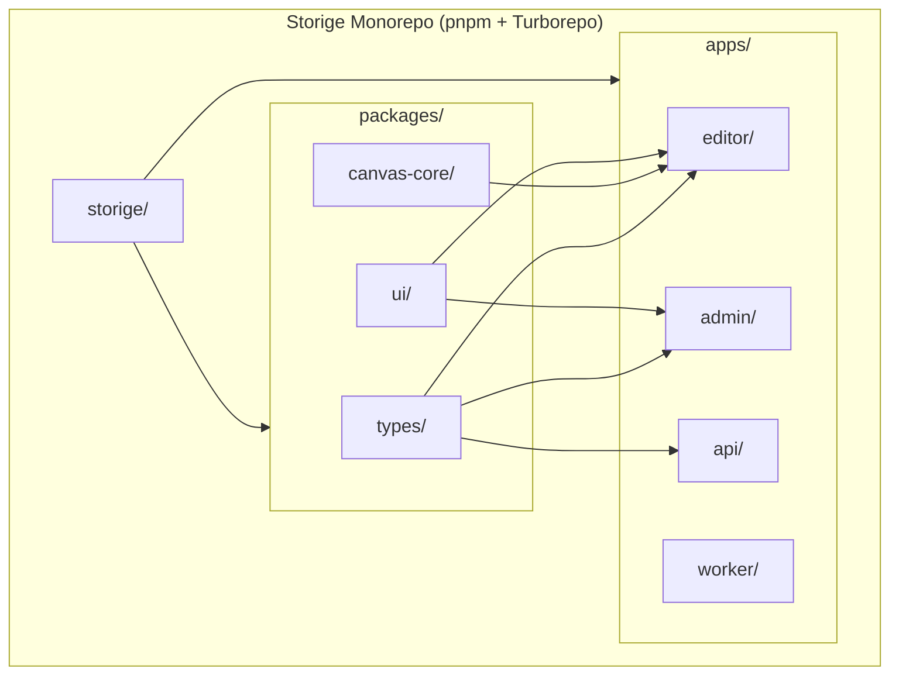
```mermaid
graph TB
    subgraph "Storige Monorepo (pnpm + Turborepo)"
        ROOT[storige/]

        subgraph "apps/"
            ED[editor/]
            AM[admin/]
            API[api/]
            WK[worker/]
        end

        subgraph "packages/"
            TYPES[types/]
            CORE[canvas-core/]
            UI[ui/]
        end

        ROOT --> apps/
        ROOT --> packages/

        TYPES --> ED
        TYPES --> AM
        TYPES --> API
        CORE --> ED
        UI --> ED
        UI --> AM
    end
```

---

## 2. Storige 아키텍처

### 2.1 Editor 아키텍처

#### 2.1.1 컴포넌트 구조

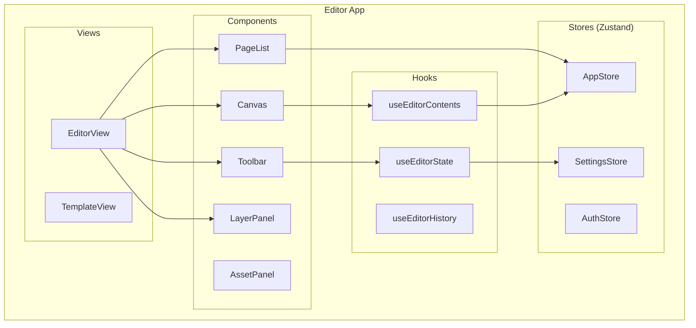
```mermaid
graph TB
    subgraph "Editor App"
        subgraph "Views"
            EV[EditorView]
            TV[TemplateView]
        end

        subgraph "Components"
            TB[Toolbar]
            CV[Canvas]
            PL[PageList]
            LP[LayerPanel]
            AP[AssetPanel]
        end

        subgraph "Hooks"
            UEC[useEditorContents]
            UES[useEditorState]
            UEH[useEditorHistory]
        end

        subgraph "Stores (Zustand)"
            AS[AppStore]
            SS[SettingsStore]
            AUS[AuthStore]
        end

        EV --> TB
        EV --> CV
        EV --> PL
        EV --> LP

        TB --> UES
        CV --> UEC
        PL --> AS

        UEC --> AS
        UES --> SS
    end
```

#### 2.1.2 Canvas Core 플러그인 시스템

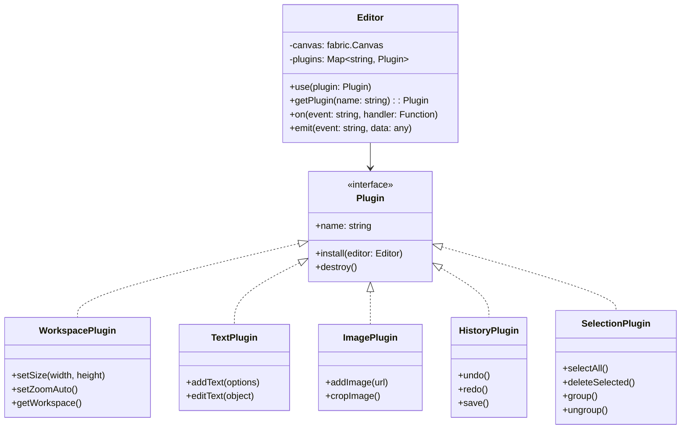
```mermaid
classDiagram
    class Editor {
        -canvas: fabric.Canvas
        -plugins: Map~string, Plugin~
        +use(plugin: Plugin)
        +getPlugin(name: string): Plugin
        +on(event: string, handler: Function)
        +emit(event: string, data: any)
    }

    class Plugin {
        <<interface>>
        +name: string
        +install(editor: Editor)
        +destroy()
    }

    class WorkspacePlugin {
        +setSize(width, height)
        +setZoomAuto()
        +getWorkspace()
    }

    class TextPlugin {
        +addText(options)
        +editText(object)
    }

    class ImagePlugin {
        +addImage(url)
        +cropImage()
    }

    class HistoryPlugin {
        +undo()
        +redo()
        +save()
    }

    class SelectionPlugin {
        +selectAll()
        +deleteSelected()
        +group()
        +ungroup()
    }

    Plugin <|.. WorkspacePlugin
    Plugin <|.. TextPlugin
    Plugin <|.. ImagePlugin
    Plugin <|.. HistoryPlugin
    Plugin <|.. SelectionPlugin

    Editor --> Plugin
```

#### 2.1.3 상태 관리 (Zustand)

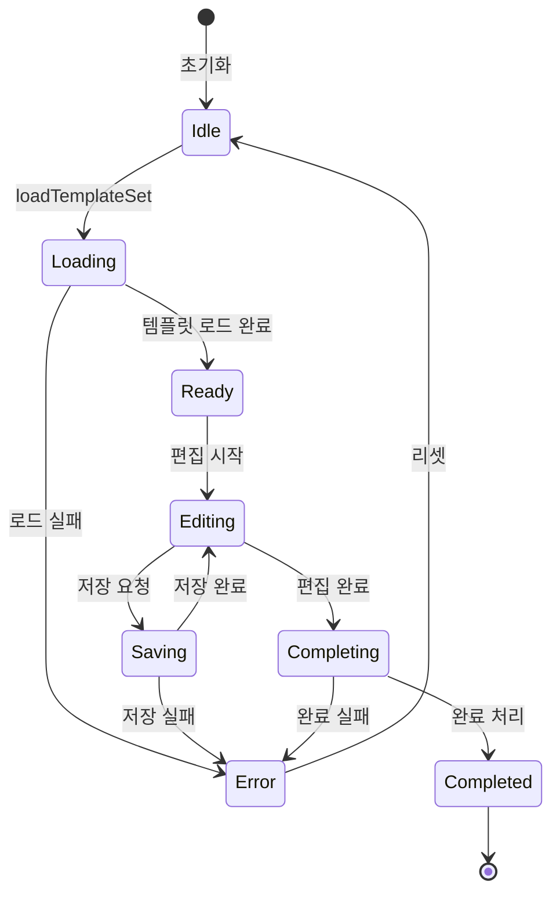
```mermaid
stateDiagram-v2
    [*] --> Idle: 초기화

    Idle --> Loading: loadTemplateSet
    Loading --> Ready: 템플릿 로드 완료
    Loading --> Error: 로드 실패

    Ready --> Editing: 편집 시작
    Editing --> Saving: 저장 요청
    Saving --> Editing: 저장 완료
    Saving --> Error: 저장 실패

    Editing --> Completing: 편집 완료
    Completing --> Completed: 완료 처리
    Completing --> Error: 완료 실패

    Error --> Idle: 리셋
    Completed --> [*]
```

### 2.2 API 아키텍처

#### 2.2.1 계층 구조

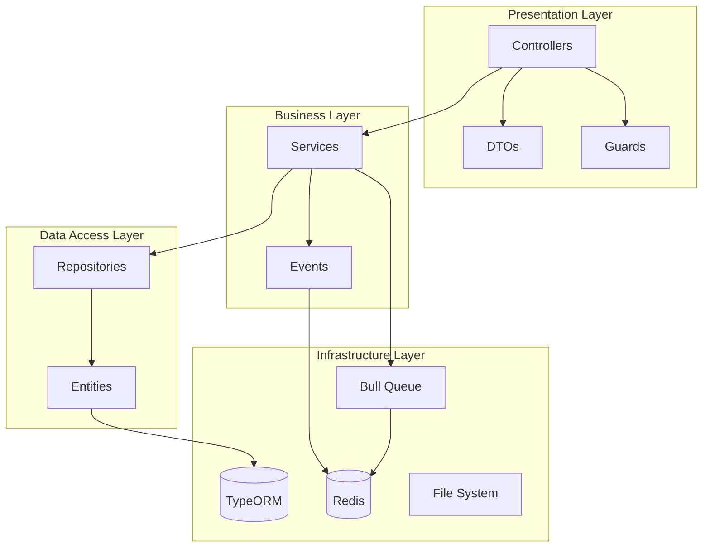
```mermaid
graph TB
    subgraph "Presentation Layer"
        CTRL[Controllers]
        DTO[DTOs]
        GUARD[Guards]
    end

    subgraph "Business Layer"
        SVC[Services]
        EVENT[Events]
    end

    subgraph "Data Access Layer"
        REPO[Repositories]
        ENT[Entities]
    end

    subgraph "Infrastructure Layer"
        DB[(TypeORM)]
        REDIS[(Redis)]
        QUEUE[Bull Queue]
        FS[File System]
    end

    CTRL --> SVC
    CTRL --> DTO
    CTRL --> GUARD

    SVC --> REPO
    SVC --> EVENT
    SVC --> QUEUE

    REPO --> ENT
    ENT --> DB
    EVENT --> REDIS
    QUEUE --> REDIS
```

#### 2.2.2 모듈 의존성

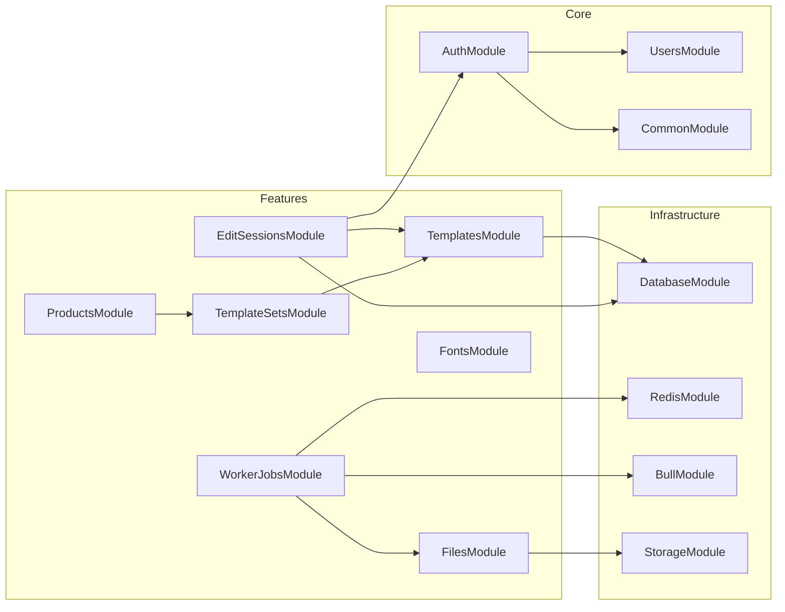
```mermaid
graph LR
    subgraph "Core"
        AUTH[AuthModule]
        USERS[UsersModule]
        COMMON[CommonModule]
    end

    subgraph "Features"
        TMPL[TemplatesModule]
        TSET[TemplateSetsModule]
        PROD[ProductsModule]
        SESS[EditSessionsModule]
        JOBS[WorkerJobsModule]
        FILES[FilesModule]
        FONTS[FontsModule]
    end

    subgraph "Infrastructure"
        DB[DatabaseModule]
        REDIS[RedisModule]
        BULL[BullModule]
        STORE[StorageModule]
    end

    AUTH --> USERS
    AUTH --> COMMON
    SESS --> AUTH
    SESS --> TMPL
    JOBS --> FILES
    JOBS --> BULL
    TSET --> TMPL
    PROD --> TSET

    TMPL --> DB
    SESS --> DB
    FILES --> STORE
    JOBS --> REDIS
```

#### 2.2.3 API 인증 흐름

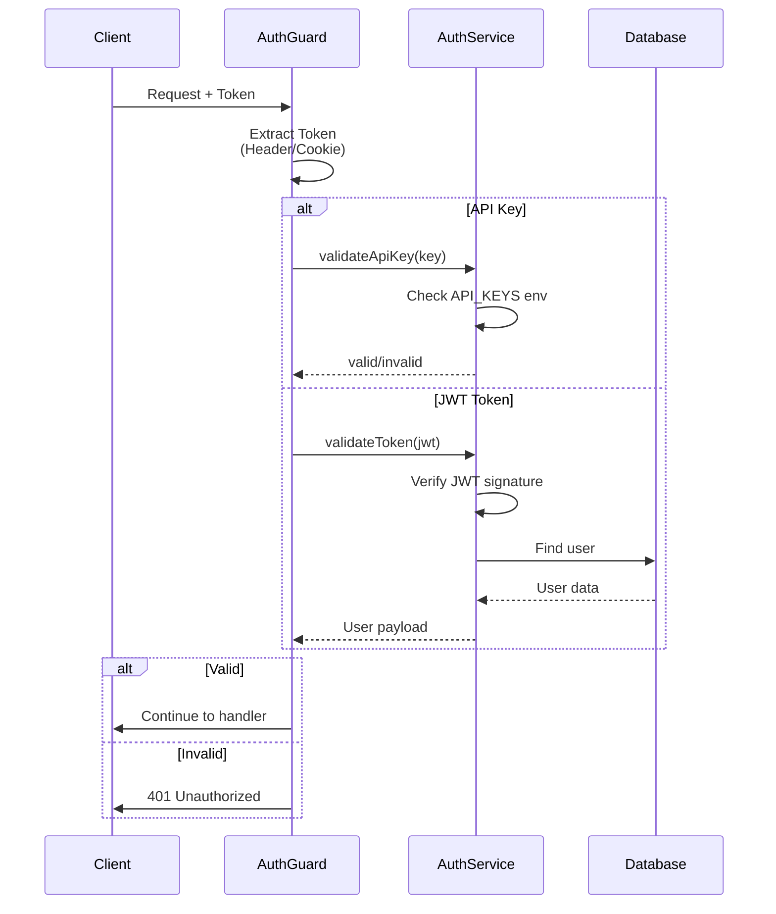
```mermaid
sequenceDiagram
    participant C as Client
    participant G as AuthGuard
    participant S as AuthService
    participant DB as Database

    C->>G: Request + Token
    G->>G: Extract Token<br/>(Header/Cookie)

    alt API Key
        G->>S: validateApiKey(key)
        S->>S: Check API_KEYS env
        S-->>G: valid/invalid
    else JWT Token
        G->>S: validateToken(jwt)
        S->>S: Verify JWT signature
        S->>DB: Find user
        DB-->>S: User data
        S-->>G: User payload
    end

    alt Valid
        G->>C: Continue to handler
    else Invalid
        G->>C: 401 Unauthorized
    end
```

### 2.3 Worker 아키텍처

#### 2.3.1 작업 처리 파이프라인

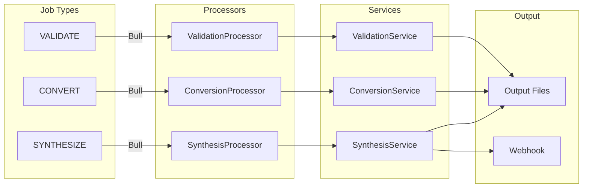
```mermaid
graph LR
    subgraph "Job Types"
        JV[VALIDATE]
        JC[CONVERT]
        JS[SYNTHESIZE]
    end

    subgraph "Processors"
        PV[ValidationProcessor]
        PC[ConversionProcessor]
        PS[SynthesisProcessor]
    end

    subgraph "Services"
        VS[ValidationService]
        CS[ConversionService]
        SS[SynthesisService]
    end

    subgraph "Output"
        OUT[Output Files]
        WH[Webhook]
    end

    JV -->|Bull| PV
    JC -->|Bull| PC
    JS -->|Bull| PS

    PV --> VS
    PC --> CS
    PS --> SS

    VS --> OUT
    CS --> OUT
    SS --> OUT
    SS --> WH
```

#### 2.3.2 Bull Queue 설정

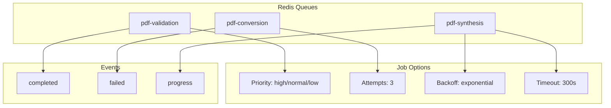
```mermaid
graph TB
    subgraph "Redis Queues"
        Q1[pdf-validation]
        Q2[pdf-conversion]
        Q3[pdf-synthesis]
    end

    subgraph "Job Options"
        P1[Priority: high/normal/low]
        P2[Attempts: 3]
        P3[Backoff: exponential]
        P4[Timeout: 300s]
    end

    subgraph "Events"
        E1[completed]
        E2[failed]
        E3[progress]
    end

    Q1 --> P1
    Q2 --> P2
    Q3 --> P3
    Q3 --> P4

    Q1 --> E1
    Q2 --> E2
    Q3 --> E3
```

---

## 3. Bookmoa 아키텍처

### 3.1 MVC 구조

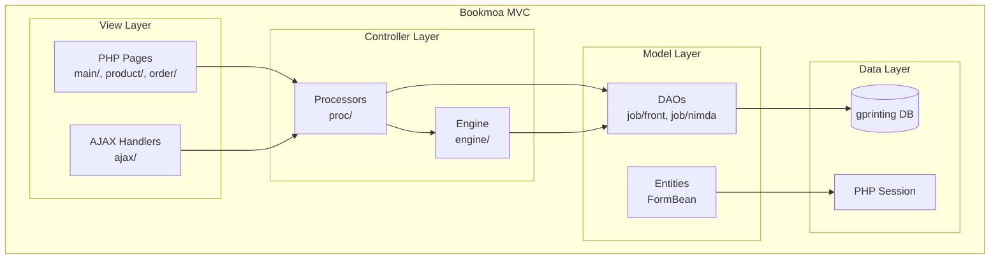
```mermaid
graph TB
    subgraph "Bookmoa MVC"
        subgraph "View Layer"
            PAGES[PHP Pages<br/>main/, product/, order/]
            AJAX[AJAX Handlers<br/>ajax/]
        end

        subgraph "Controller Layer"
            PROC[Processors<br/>proc/]
            ENGINE[Engine<br/>engine/]
        end

        subgraph "Model Layer"
            DAO[DAOs<br/>job/front, job/nimda]
            ENTITY[Entities<br/>FormBean]
        end

        subgraph "Data Layer"
            DB[(gprinting DB)]
            SESSION[PHP Session]
        end
    end

    PAGES --> PROC
    AJAX --> PROC
    PROC --> ENGINE
    PROC --> DAO
    ENGINE --> DAO
    DAO --> DB
    ENTITY --> SESSION
```

### 3.2 주요 클래스 다이어그램

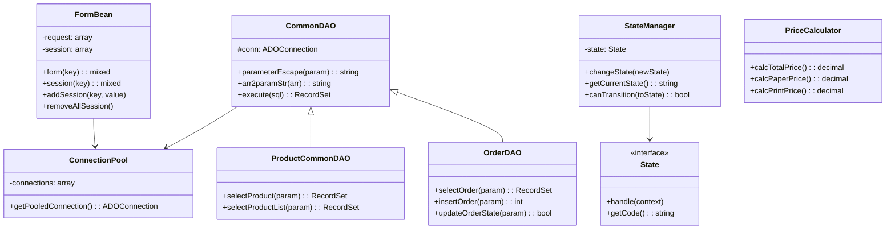
```mermaid
classDiagram
    class FormBean {
        -request: array
        -session: array
        +form(key): mixed
        +session(key): mixed
        +addSession(key, value)
        +removeAllSession()
    }

    class ConnectionPool {
        -connections: array
        +getPooledConnection(): ADOConnection
    }

    class CommonDAO {
        #conn: ADOConnection
        +parameterEscape(param): string
        +arr2paramStr(arr): string
        +execute(sql): RecordSet
    }

    class ProductCommonDAO {
        +selectProduct(param): RecordSet
        +selectProductList(param): RecordSet
    }

    class OrderDAO {
        +selectOrder(param): RecordSet
        +insertOrder(param): int
        +updateOrderState(param): bool
    }

    class StateManager {
        -state: State
        +changeState(newState)
        +getCurrentState(): string
        +canTransition(toState): bool
    }

    class State {
        <<interface>>
        +handle(context)
        +getCode(): string
    }

    class PriceCalculator {
        +calcTotalPrice(): decimal
        +calcPaperPrice(): decimal
        +calcPrintPrice(): decimal
    }

    CommonDAO <|-- ProductCommonDAO
    CommonDAO <|-- OrderDAO
    StateManager --> State
    FormBean --> ConnectionPool
    CommonDAO --> ConnectionPool
```

### 3.3 Storige 작업 상태

> **참고**: 주문의 접수(310)부터 구매확정(020-021)까지의 상태는 북모아에서 관리합니다.
> Storige는 편집 세션과 Worker 작업 상태만 관리합니다.

#### 편집 세션 상태

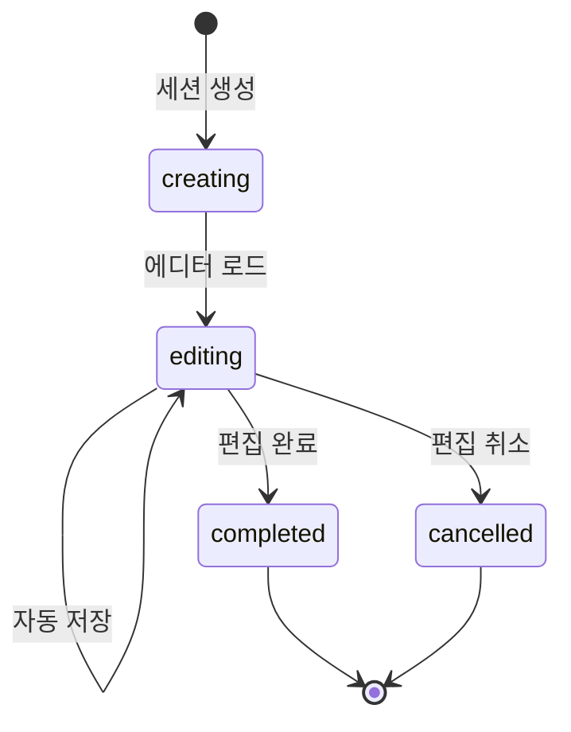
```mermaid
stateDiagram-v2
    [*] --> creating: 세션 생성
    creating --> editing: 에디터 로드
    editing --> editing: 자동 저장
    editing --> completed: 편집 완료
    editing --> cancelled: 편집 취소
    completed --> [*]
    cancelled --> [*]
```

| 상태 | 설명 |
|------|------|
| `creating` | 세션 생성 중 |
| `editing` | 편집 중 (자동 저장 포함) |
| `completed` | 편집 완료 |
| `cancelled` | 편집 취소 |

#### Worker 작업 상태

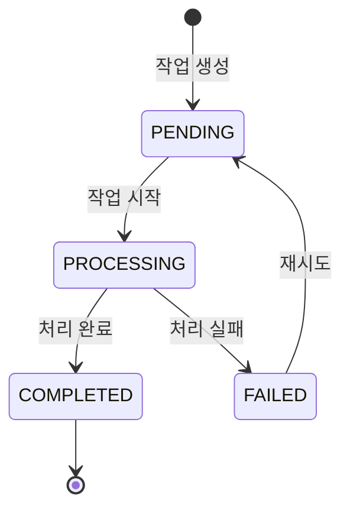
```mermaid
stateDiagram-v2
    [*] --> PENDING: 작업 생성
    PENDING --> PROCESSING: 작업 시작
    PROCESSING --> COMPLETED: 처리 완료
    PROCESSING --> FAILED: 처리 실패
    FAILED --> PENDING: 재시도
    COMPLETED --> [*]
```

| 상태 | 설명 |
|------|------|
| `PENDING` | 대기 중 |
| `PROCESSING` | 처리 중 |
| `COMPLETED` | 완료 |
| `FAILED` | 실패 (재시도 가능) |

---

## 4. 데이터베이스 설계

### 4.1 Storige DB ERD

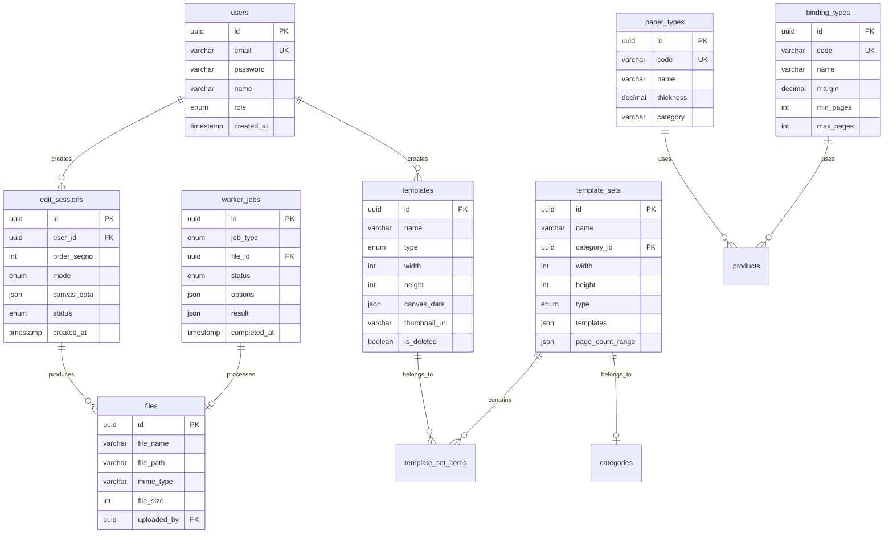
```mermaid
erDiagram
    users ||--o{ edit_sessions : creates
    users ||--o{ templates : creates

    templates ||--o{ template_set_items : belongs_to
    template_sets ||--o{ template_set_items : contains
    template_sets ||--o| categories : belongs_to

    edit_sessions ||--o{ files : produces
    worker_jobs ||--o| files : processes

    paper_types ||--o{ products : uses
    binding_types ||--o{ products : uses

    users {
        uuid id PK
        varchar email UK
        varchar password
        varchar name
        enum role
        timestamp created_at
    }

    templates {
        uuid id PK
        varchar name
        enum type
        int width
        int height
        json canvas_data
        varchar thumbnail_url
        boolean is_deleted
    }

    template_sets {
        uuid id PK
        varchar name
        uuid category_id FK
        int width
        int height
        enum type
        json templates
        json page_count_range
    }

    edit_sessions {
        uuid id PK
        uuid user_id FK
        int order_seqno
        enum mode
        json canvas_data
        enum status
        timestamp created_at
    }

    worker_jobs {
        uuid id PK
        enum job_type
        uuid file_id FK
        enum status
        json options
        json result
        timestamp completed_at
    }

    files {
        uuid id PK
        varchar file_name
        varchar file_path
        varchar mime_type
        int file_size
        uuid uploaded_by FK
    }

    paper_types {
        uuid id PK
        varchar code UK
        varchar name
        decimal thickness
        varchar category
    }

    binding_types {
        uuid id PK
        varchar code UK
        varchar name
        decimal margin
        int min_pages
        int max_pages
    }
```

### 4.2 Bookmoa DB 주요 테이블

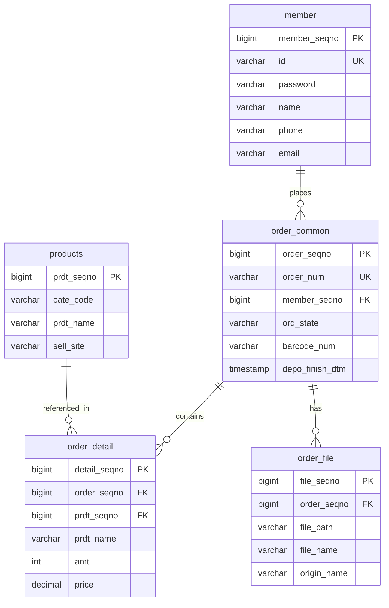
```mermaid
erDiagram
    member ||--o{ order_common : places
    order_common ||--o{ order_detail : contains
    order_common ||--o{ order_file : has
    products ||--o{ order_detail : referenced_in

    member {
        bigint member_seqno PK
        varchar id UK
        varchar password
        varchar name
        varchar phone
        varchar email
    }

    order_common {
        bigint order_seqno PK
        varchar order_num UK
        bigint member_seqno FK
        varchar ord_state
        varchar barcode_num
        timestamp depo_finish_dtm
    }

    order_detail {
        bigint detail_seqno PK
        bigint order_seqno FK
        bigint prdt_seqno FK
        varchar prdt_name
        int amt
        decimal price
    }

    order_file {
        bigint file_seqno PK
        bigint order_seqno FK
        varchar file_path
        varchar file_name
        varchar origin_name
    }

    products {
        bigint prdt_seqno PK
        varchar cate_code
        varchar prdt_name
        varchar sell_site
    }
```

### 4.3 테이블 관계 (통합 뷰)

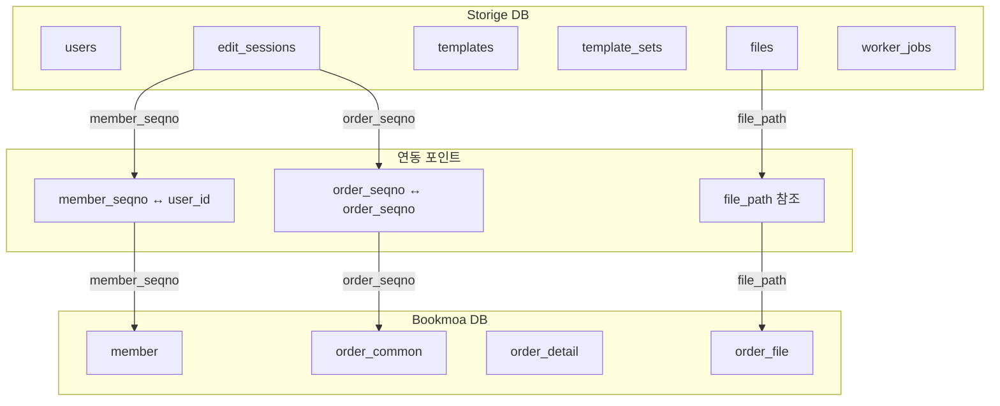
```mermaid
graph TB
    subgraph "Storige DB"
        S_USER[users]
        S_SESS[edit_sessions]
        S_TMPL[templates]
        S_TSET[template_sets]
        S_FILE[files]
        S_JOBS[worker_jobs]
    end

    subgraph "Bookmoa DB"
        B_MEM[member]
        B_ORD[order_common]
        B_DET[order_detail]
        B_FILE[order_file]
    end

    subgraph "연동 포인트"
        LINK1[member_seqno ↔ user_id]
        LINK2[order_seqno ↔ order_seqno]
        LINK3[file_path 참조]
    end

    S_SESS -->|member_seqno| LINK1
    LINK1 -->|member_seqno| B_MEM

    S_SESS -->|order_seqno| LINK2
    LINK2 -->|order_seqno| B_ORD

    S_FILE -->|file_path| LINK3
    LINK3 -->|file_path| B_FILE
```

---

## 5. API 설계

### 5.1 RESTful API 구조

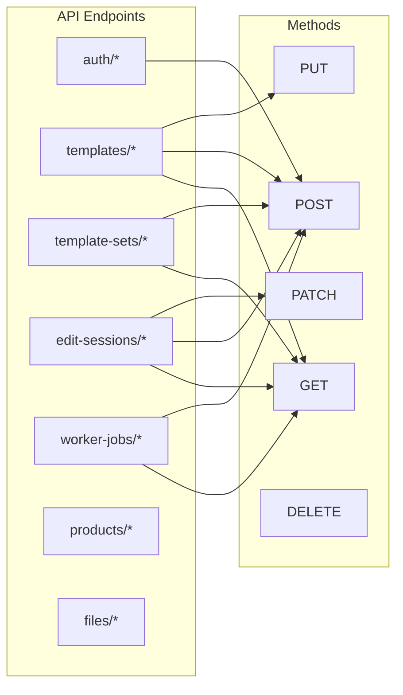
```mermaid
graph LR
    subgraph "API Endpoints"
        AUTH["auth/*"]
        TMPL["templates/*"]
        TSET["template-sets/*"]
        SESS["edit-sessions/*"]
        JOBS["worker-jobs/*"]
        PROD["products/*"]
        FILES["files/*"]
    end

    subgraph "Methods"
        GET[GET]
        POST[POST]
        PUT[PUT]
        PATCH[PATCH]
        DELETE[DELETE]
    end

    AUTH --> POST
    TMPL --> GET
    TMPL --> POST
    TMPL --> PUT
    TSET --> GET
    TSET --> POST
    SESS --> GET
    SESS --> POST
    SESS --> PATCH
    JOBS --> GET
    JOBS --> POST
```

### 5.2 주요 API 흐름

#### 에디터 세션 API

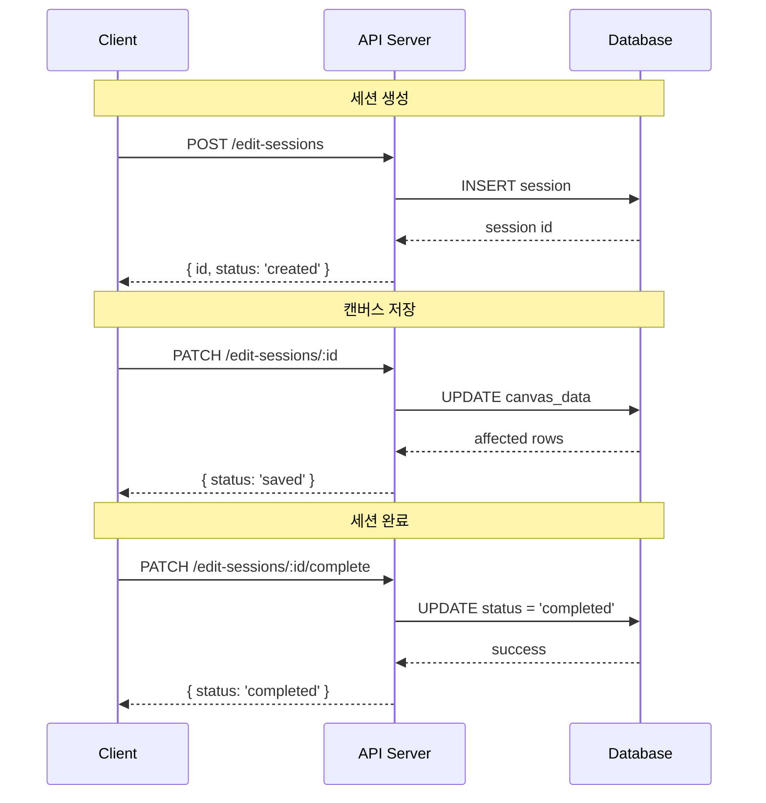
```mermaid
sequenceDiagram
    participant C as Client
    participant API as API Server
    participant DB as Database

    Note over C,DB: 세션 생성
    C->>API: POST /edit-sessions
    API->>DB: INSERT session
    DB-->>API: session id
    API-->>C: { id, status: 'created' }

    Note over C,DB: 캔버스 저장
    C->>API: PATCH /edit-sessions/:id
    API->>DB: UPDATE canvas_data
    DB-->>API: affected rows
    API-->>C: { status: 'saved' }

    Note over C,DB: 세션 완료
    C->>API: PATCH /edit-sessions/:id/complete
    API->>DB: UPDATE status = 'completed'
    DB-->>API: success
    API-->>C: { status: 'completed' }
```

#### Worker Job API

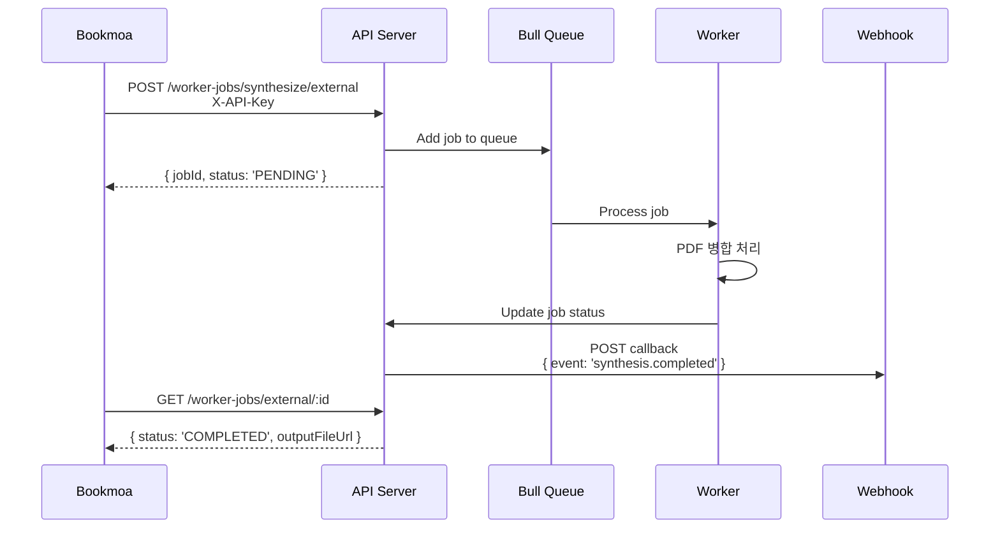
```mermaid
sequenceDiagram
    participant B as Bookmoa
    participant API as API Server
    participant Q as Bull Queue
    participant W as Worker
    participant WH as Webhook

    B->>API: POST /worker-jobs/synthesize/external<br/>X-API-Key
    API->>Q: Add job to queue
    API-->>B: { jobId, status: 'PENDING' }

    Q->>W: Process job
    W->>W: PDF 병합 처리
    W->>API: Update job status
    API->>WH: POST callback<br/>{ event: 'synthesis.completed' }

    B->>API: GET /worker-jobs/external/:id
    API-->>B: { status: 'COMPLETED', outputFileUrl }
```

### 5.3 에러 응답 형식

```mermaid
graph TB
    subgraph "Error Response Structure"
        ERR[Error Response]
        ERR --> SC["statusCode: number"]
        ERR --> MSG["message: string or string[]"]
        ERR --> ER["error: string"]
        ERR --> TS["timestamp: string"]
        ERR --> PATH["path: string"]
    end
```

---

## 6. 이벤트 기반 아키텍처

### 6.1 Bull Queue 이벤트

```mermaid
flowchart TB
    subgraph "Job Lifecycle"
        direction TB
        CREATED[Job Created]
        WAITING[Waiting]
        ACTIVE[Active]
        PROGRESS[Progress]
        COMPLETED[Completed]
        FAILED[Failed]
        DELAYED[Delayed]
    end

    CREATED --> WAITING
    WAITING --> ACTIVE
    ACTIVE --> PROGRESS
    PROGRESS --> COMPLETED
    PROGRESS --> FAILED
    FAILED --> DELAYED
    DELAYED --> WAITING
```

### 6.2 Webhook 이벤트

```mermaid
sequenceDiagram
    participant W as Worker
    participant API as API Server
    participant WH as Webhook Receiver

    W->>API: Job Completed
    API->>WH: POST callback<br/>X-Storige-Event: session.validated

    alt Success
        WH-->>API: 200 OK
    else Failure
        WH-->>API: 4xx/5xx
        Note over API: Retry after 2s
        API->>WH: Retry POST
    end
```

### 6.3 이벤트 페이로드

```mermaid
graph TB
    subgraph "Event Types"
        E1[session.validated]
        E2[session.failed]
        E3[synthesis.completed]
        E4[synthesis.failed]
    end

    subgraph "Common Fields"
        F1[event: string]
        F2[timestamp: ISO8601]
    end

    subgraph "Session Events"
        S1[sessionId]
        S2[orderSeqno]
        S3[status]
        S4[fileType]
    end

    subgraph "Synthesis Events"
        SY1[jobId]
        SY2[orderId]
        SY3[outputFileUrl]
        SY4[result]
    end

    E1 --> F1
    E2 --> F1
    E3 --> F1
    E4 --> F1

    E1 --> S1
    E2 --> S1
    E3 --> SY1
    E4 --> SY1
```

---

## 7. 디자인 패턴

### 7.1 적용된 패턴

```mermaid
mindmap
  root((Design Patterns))
    Creational
      Factory[Factory<br/>PriceCalculator]
      Singleton[Singleton<br/>ConnectionPool]
    Structural
      Decorator[Decorator<br/>NestJS Guards]
      Adapter[Adapter<br/>TypeORM Repositories]
    Behavioral
      State[State<br/>JobStateManager]
      Strategy[Strategy<br/>PriceCalculator]
      Observer[Observer<br/>Bull Events]
    Architectural
      Repository[Repository<br/>DAO Layer]
      Module[Module<br/>NestJS Modules]
      Plugin[Plugin<br/>Canvas Plugins]
```

### 7.2 State 패턴 (Worker 작업)

> **참고**: 주문 상태(OrderStateManager)는 북모아에서 관리합니다.
> Storige에서는 Worker 작업 상태에 State 패턴을 적용합니다.

```mermaid
classDiagram
    class JobContext {
        -currentState: JobState
        +setState(state)
        +process()
    }

    class JobState {
        <<interface>>
        +handle(context)
        +canTransitionTo(state): bool
    }

    class PendingState {
        +handle(context)
        +canTransitionTo(state): bool
    }

    class ProcessingState {
        +handle(context)
        +canTransitionTo(state): bool
    }

    class CompletedState {
        +handle(context)
        +canTransitionTo(state): bool
    }

    class FailedState {
        +handle(context)
        +canTransitionTo(state): bool
    }

    JobState <|.. PendingState
    JobState <|.. ProcessingState
    JobState <|.. CompletedState
    JobState <|.. FailedState

    JobContext --> JobState
```

### 7.3 Plugin 패턴 (캔버스 에디터)

```mermaid
classDiagram
    class PluginManager {
        -plugins: Map
        +register(plugin)
        +unregister(name)
        +get(name): Plugin
        +broadcast(event, data)
    }

    class Plugin {
        <<abstract>>
        +name: string
        +version: string
        +install(editor)
        +destroy()
        +on(event, handler)
    }

    class WorkspacePlugin {
        -workspace: Rect
        +setSize(w, h)
        +setZoom(level)
    }

    class TextPlugin {
        +addText()
        +editText()
    }

    class ImagePlugin {
        +addImage()
        +cropImage()
    }

    PluginManager "1" --> "*" Plugin
    Plugin <|-- WorkspacePlugin
    Plugin <|-- TextPlugin
    Plugin <|-- ImagePlugin
```

---

## 8. 코드 구조

### 8.1 Storige 디렉토리 구조

```
storige/
├── apps/
│   ├── api/
│   │   └── src/
│   │       ├── auth/              # 인증 모듈
│   │       │   ├── auth.module.ts
│   │       │   ├── auth.controller.ts
│   │       │   ├── auth.service.ts
│   │       │   ├── guards/
│   │       │   └── strategies/
│   │       ├── templates/         # 템플릿 모듈
│   │       ├── template-sets/     # 템플릿셋 모듈
│   │       ├── edit-sessions/     # 편집세션 모듈
│   │       ├── worker-jobs/       # 워커잡 모듈
│   │       ├── products/          # 상품 모듈
│   │       │   ├── spine.controller.ts
│   │       │   └── spine.service.ts
│   │       ├── files/             # 파일 모듈
│   │       └── webhook/           # 웹훅 모듈
│   │
│   ├── editor/
│   │   └── src/
│   │       ├── views/             # 페이지 뷰
│   │       ├── components/        # UI 컴포넌트
│   │       ├── hooks/             # 커스텀 훅
│   │       ├── stores/            # Zustand 스토어
│   │       └── api/               # API 클라이언트
│   │
│   └── worker/
│       └── src/
│           ├── processors/        # Bull 프로세서
│           └── services/          # 비즈니스 서비스
│
├── packages/
│   ├── types/                     # 공유 타입
│   ├── canvas-core/               # 캔버스 코어
│   │   └── src/
│   │       ├── Editor.ts
│   │       └── plugins/
│   └── ui/                        # 공유 UI
│
└── docs/                          # 문서
```

### 8.2 Bookmoa 디렉토리 구조

```
bookmoa/
├── front/                         # B2C 고객 포털
│   ├── ajax/                      # AJAX 핸들러
│   │   ├── common/
│   │   ├── order/
│   │   └── product/
│   ├── proc/                      # 비즈니스 로직
│   ├── common/
│   │   └── sess_common.php        # 세션 초기화
│   ├── main/                      # 메인 페이지
│   ├── product/                   # 상품 페이지
│   ├── order/                     # 주문 페이지
│   ├── mypage/                    # 마이페이지
│   ├── storige/                   # Storige 연동
│   │   ├── edit.php
│   │   └── storige_common.php
│   └── webpay_*/                  # PG 모듈
│
├── nimda/                         # B2B 관리자 포털
│   ├── ajax/
│   ├── proc/
│   ├── cypress/                   # PDF 조판 엔진
│   │   ├── process/
│   │   └── ghostscript-9.22/
│   └── engine/                    # 가격계산 엔진
│
└── inc/                           # 공통 라이브러리
    ├── com/nexmotion/
    │   ├── common/
    │   │   ├── util/
    │   │   └── entity/
    │   └── job/
    │       ├── front/
    │       └── nimda/
    ├── classes/dprinting/
    │   ├── StateManager/
    │   └── PriceCalculator/
    ├── common_dao/
    ├── common_lib/
    └── common_define/
```

---

## 부록

### A. 기술 결정 기록 (ADR)

| 결정 | 이유 | 대안 |
|------|------|------|
| NestJS 채택 | TypeScript 지원, 모듈화, DI | Express, Fastify |
| Zustand 사용 | 경량, 간단한 API | Redux, Recoil |
| Bull Queue | Redis 기반, 신뢰성 | Agenda, Bee-Queue |
| TypeORM | TypeScript 친화적 | Prisma, Sequelize |
| Fabric.js | 풍부한 기능, 커뮤니티 | Konva, Paper.js |

### B. 코딩 컨벤션

#### NestJS (TypeScript)
```typescript
// 서비스 클래스
@Injectable()
export class TemplateService {
  constructor(
    @InjectRepository(Template)
    private templateRepo: Repository<Template>,
  ) {}

  async findOne(id: string): Promise<Template> {
    return this.templateRepo.findOneOrFail({ where: { id } });
  }
}
```

#### PHP (Bookmoa)
```php
// DAO 클래스
class OrderDAO extends CommonDAO {
    public function selectOrder($conn, $param) {
        $sql = "SELECT * FROM order_common WHERE order_seqno = ?";
        $param = $this->parameterEscape($conn, $param['order_seqno']);
        return $conn->Execute($sql, array($param));
    }
}
```

---

## 변경 이력

| 버전 | 날짜 | 변경 내용 |
|------|------|----------|
| 1.0 | 2025-12-21 | 최초 작성 |
