# Storige - Bookmoa 연동안 (Integration Guide)

> 북모아 PHP 쇼핑몰과 Storige 에디터 시스템 간의 기술적 연동 가이드

---

## 목차

1. [연동 개요](#1-연동-개요)
2. [인증 체계](#2-인증-체계)
3. [에디터 임베딩](#3-에디터-임베딩)
4. [API 연동 상세](#4-api-연동-상세)
5. [PDF 병합 워크플로우](#5-pdf-병합-워크플로우)
6. [웹훅 (Callback) 처리](#6-웹훅-callback-처리)
7. [데이터 동기화](#7-데이터-동기화)
8. [에러 처리 및 복구](#8-에러-처리-및-복구)
9. [보안 고려사항](#9-보안-고려사항)
10. [운영 가이드](#10-운영-가이드)

---

## 1. 연동 개요

### 1.1 연동 목적

Storige 에디터 시스템을 북모아 PHP 쇼핑몰에 통합하여:
- **온라인 편집 기능 제공**: 고객이 직접 인쇄물 디자인 편집
- **자동화된 PDF 처리**: 편집된 표지 + 업로드된 내지 자동 병합
- **실시간 견적 계산**: 페이지수/용지/제본에 따른 책등 폭 자동 계산

### 1.2 연동 아키텍처

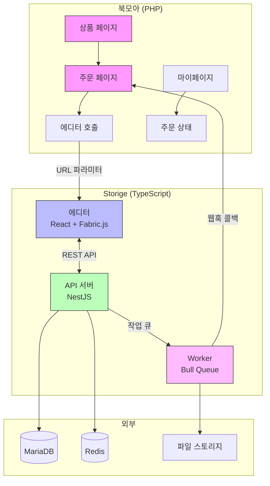

### 1.3 연동 방식

| 연동 유형 | 방식 | 설명 |
|----------|------|------|
| **에디터 → 페이지** | JS 번들 임베딩 | React 에디터를 IIFE 번들로 빌드하여 PHP 페이지에 로드 |
| **북모아 → API** | REST API + API Key | 서버 간 통신 (인증 토큰 발급, 작업 요청) |
| **에디터 → API** | REST API + JWT | 클라이언트-서버 통신 (편집 세션 관리) |
| **Worker → 북모아** | Webhook 콜백 | PDF 처리 완료/실패 시 알림 |

### 1.4 연동 시나리오 흐름

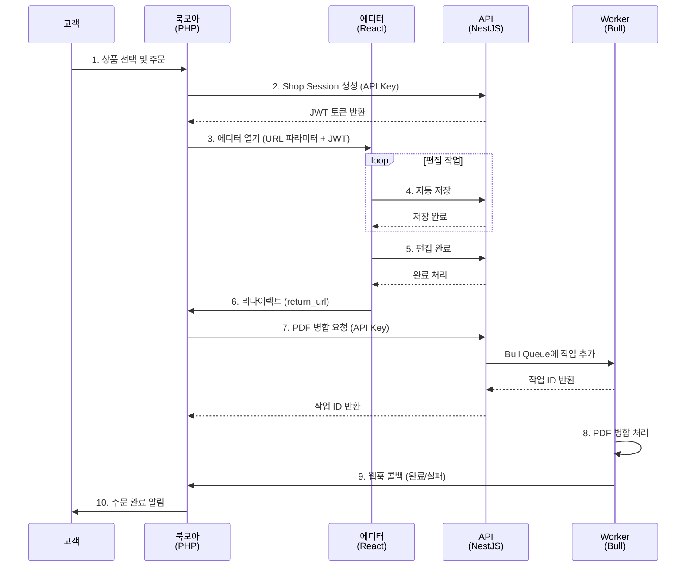

---

## 2. 인증 체계

### 2.1 이중 인증 구조

Storige는 두 가지 인증 방식을 사용합니다:

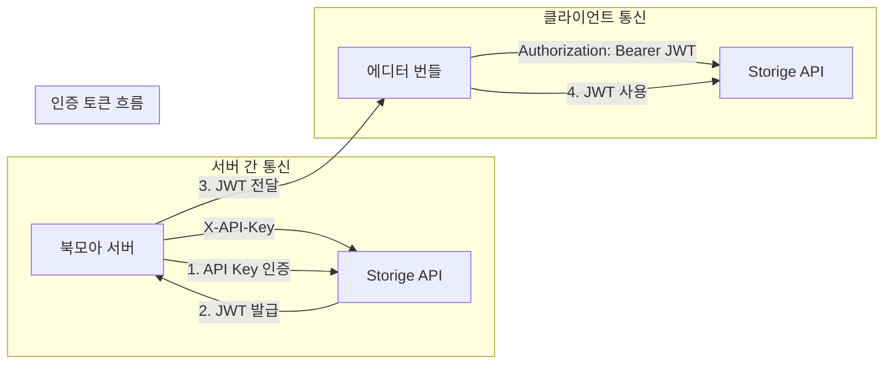

### 2.2 API Key 인증 (서버 간)

**용도**: 북모아 PHP 서버 → Storige API 서버

**헤더 형식**:
```http
X-API-Key: your-secure-api-key
```

**적용 엔드포인트**:
- `POST /api/auth/shop-session` - JWT 토큰 발급
- `POST /api/worker-jobs/synthesize/external` - PDF 병합 요청
- `GET /api/worker-jobs/external/:id` - 작업 상태 조회

**환경 설정 (Storige)**:
```bash
# .env
API_KEYS=api-key-1,api-key-2,api-key-3
```

**환경 설정 (북모아 - Apache)**:
```apache
SetEnv STORIGE_API_KEY "api-key-1"
```

### 2.3 JWT 토큰 인증 (클라이언트)

**용도**: 에디터 JS 번들 → Storige API

**토큰 발급 흐름**:

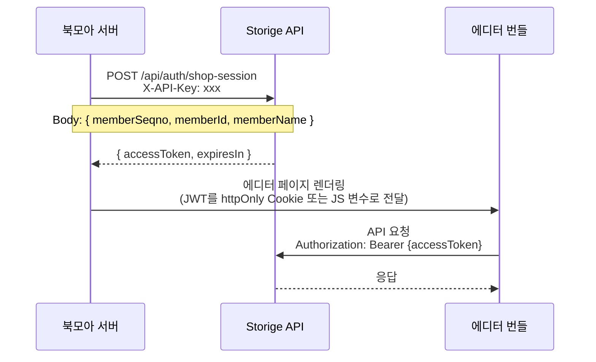

**토큰 발급 API**:

```http
POST /api/auth/shop-session
X-API-Key: your-api-key
Content-Type: application/json

{
  "memberSeqno": 12345,
  "memberId": "user@example.com",
  "memberName": "홍길동"
}
```

**응답**:
```json
{
  "success": true,
  "accessToken": "eyJhbGciOiJIUzI1NiIsInR5cCI6IkpXVCJ9...",
  "expiresIn": 3600,
  "member": {
    "seqno": 12345,
    "id": "user@example.com",
    "name": "홍길동"
  }
}
```

### 2.4 JWT 페이로드 구조

```json
{
  "sub": "shop:12345",
  "memberId": "user@example.com",
  "memberName": "홍길동",
  "type": "shop_session",
  "iat": 1703001600,
  "exp": 1703005200
}
```

### 2.5 토큰 갱신 전략

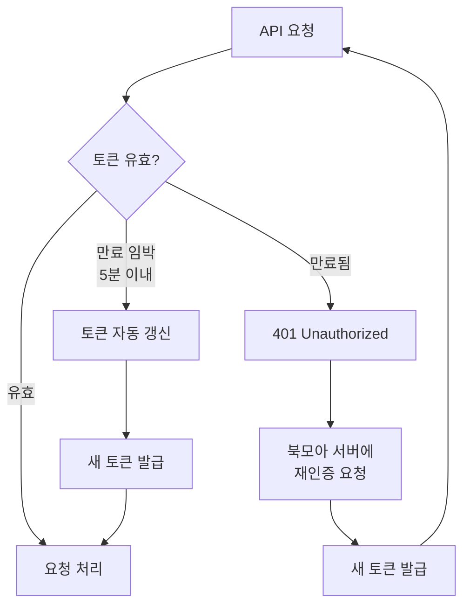

---

## 3. 에디터 임베딩

### 3.1 번들 빌드

```bash
cd storige
pnpm install
pnpm --filter @storige/editor build:embed:prod
```

**빌드 결과물**:
```
apps/editor/dist-embed/
├── editor-bundle.iife.js   # JS 번들 (~1.2MB gzip)
└── editor-bundle.css       # CSS 스타일 (~8KB gzip)
```

### 3.2 번들 배포

```bash
# S3 배포 예시
aws s3 cp apps/editor/dist-embed/editor-bundle.iife.js \
  s3://cdn-bucket/storige/v1.0.0/
aws s3 cp apps/editor/dist-embed/editor-bundle.css \
  s3://cdn-bucket/storige/v1.0.0/
```

**환경 설정 (북모아)**:
```apache
SetEnv STORIGE_EDITOR_BUNDLE_URL "https://cdn.example.com/storige/v1.0.0/editor-bundle.iife.js"
SetEnv STORIGE_EDITOR_CSS_URL "https://cdn.example.com/storige/v1.0.0/editor-bundle.css"
```

### 3.3 에디터 페이지 구조 (PHP)

```php
<?php
// /storige/edit.php
require_once $_SERVER["DOCUMENT_ROOT"] . "/common/sess_common.php";
require_once "storige_common.php";

// 1. 파라미터 검증
$templateSetId = $fb->form("template_set_id");
$orderSeqno = $fb->form("order_seqno");
$pageCount = (int)$fb->form("page_count");
$paperType = $fb->form("paper_type");
$bindingType = $fb->form("binding_type");

// 2. JWT 토큰 발급
$token = getStorigeToken([
    'memberSeqno' => $fb->session("member_seqno"),
    'memberId' => $fb->session("member_id"),
    'memberName' => $fb->session("member_name"),
]);

// 3. 에디터 설정
$editorConfig = [
    'templateSetId' => $templateSetId,
    'orderSeqno' => $orderSeqno,
    'pageCount' => $pageCount,
    'paperType' => $paperType,
    'bindingType' => $bindingType,
    'token' => $token['accessToken'],
    'apiBaseUrl' => STORIGE_API_URL,
    'returnUrl' => '/mypage/order_detail.php?order_seqno=' . $orderSeqno,
];
?>
<!DOCTYPE html>
<html>
<head>
    <meta charset="UTF-8">
    <meta name="viewport" content="width=device-width, initial-scale=1.0">
    <title>편집하기 - 북모아</title>
    <link rel="stylesheet" href="<?= STORIGE_EDITOR_CSS_URL ?>">
</head>
<body>
    <div id="editor-root"></div>

    <script>
        window.EDITOR_CONFIG = <?= json_encode($editorConfig) ?>;
    </script>
    <script src="<?= STORIGE_EDITOR_BUNDLE_URL ?>"></script>
    <script>
        // 에디터 초기화
        window.StorigeEditor.create({
            ...window.EDITOR_CONFIG,
            onReady: function() {
                console.log('에디터 준비 완료');
            },
            onComplete: function(result) {
                console.log('편집 완료:', result);
                window.location.href = window.EDITOR_CONFIG.returnUrl;
            },
            onError: function(error) {
                alert('에러: ' + error.message);
            }
        }).mount('editor-root');
    </script>
</body>
</html>
```

### 3.4 URL 파라미터 상세

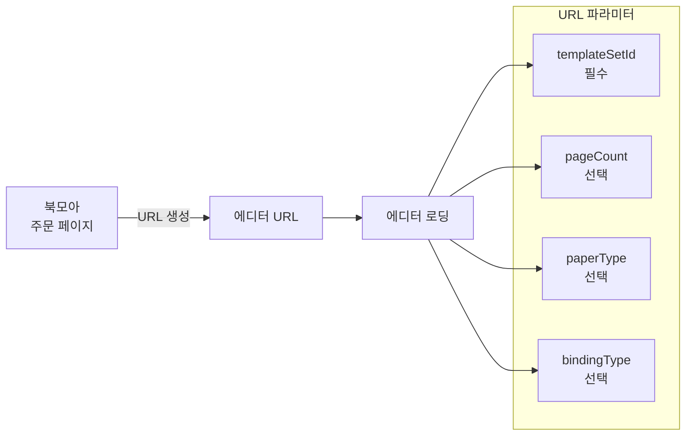

| 파라미터 | 필수 | 타입 | 설명 | 예시 |
|----------|------|------|------|------|
| `templateSetId` | ✅ | UUID | 템플릿셋 ID | `550e8400-...` |
| `pageCount` | ❌ | number | 내지 페이지수 | `50` |
| `paperType` | ❌ | string | 용지 코드 | `mojo_80g` |
| `bindingType` | ❌ | string | 제본 코드 | `perfect` |
| `orderSeqno` | ❌ | number | 주문 번호 | `12345` |
| `sessionId` | ❌ | UUID | 기존 세션 ID (재편집) | `660e8400-...` |
| `returnUrl` | ❌ | string | 완료 후 리다이렉트 URL | `/mypage/...` |

### 3.5 에디터 JavaScript API

```javascript
// 에디터 인스턴스 생성
const editor = window.StorigeEditor.create({
    // 필수 설정
    templateSetId: 'ts-001',
    token: 'jwt-token',
    apiBaseUrl: 'https://api.storige.com/api',

    // 선택 설정
    pageCount: 50,
    paperType: 'mojo_80g',
    bindingType: 'perfect',
    orderSeqno: 12345,

    // 콜백 함수
    onReady: function() {},
    onSave: function(result) {},
    onComplete: function(result) {},
    onCancel: function() {},
    onError: function(error) {}
});

// DOM에 마운트
editor.mount('editor-root');

// 프로그래매틱 제어
editor.save();       // 저장
editor.complete();   // 완료
editor.cancel();     // 취소
editor.undo();       // 실행취소
editor.redo();       // 재실행
editor.getState();   // 상태 조회
editor.unmount();    // 언마운트
```

---

## 4. API 연동 상세

### 4.1 API 엔드포인트 맵

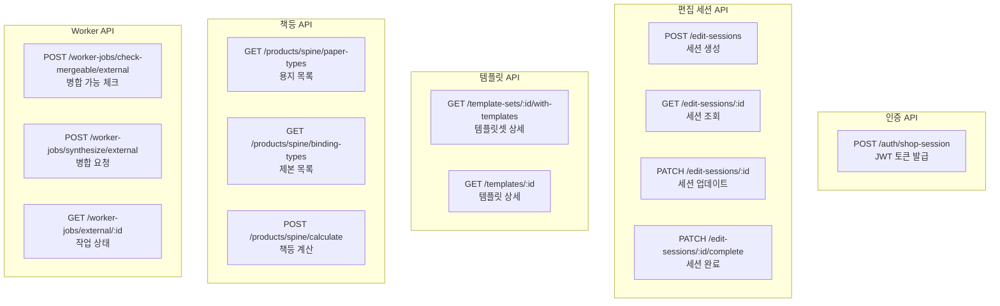

### 4.2 편집 세션 관리

#### 세션 생성

```http
POST /api/edit-sessions
Authorization: Bearer {jwt}
Content-Type: application/json

{
  "orderSeqno": 99999,
  "mode": "both",
  "templateSetId": "ts-001"
}
```

#### 세션 자동 저장

```http
PATCH /api/edit-sessions/{sessionId}
Authorization: Bearer {jwt}
Content-Type: application/json

{
  "canvasData": {
    "pages": [...],
    "version": "2.0"
  },
  "status": "editing"
}
```

#### 세션 완료

```http
PATCH /api/edit-sessions/{sessionId}/complete
Authorization: Bearer {jwt}
```

### 4.3 책등 계산 API

#### 용지 종류 조회

```http
GET /api/products/spine/paper-types
```

**응답**:
```json
[
  { "code": "mojo_70g", "name": "모조지 70g", "thickness": 0.09, "category": "body" },
  { "code": "mojo_80g", "name": "모조지 80g", "thickness": 0.10, "category": "body" },
  { "code": "art_200g", "name": "아트지 200g", "thickness": 0.18, "category": "cover" }
]
```

#### 제본 방식 조회

```http
GET /api/products/spine/binding-types
```

**응답**:
```json
[
  { "code": "perfect", "name": "무선제본", "margin": 0.5, "minPages": 32, "maxPages": null },
  { "code": "saddle", "name": "중철제본", "margin": 0.3, "minPages": null, "maxPages": 64 },
  { "code": "spiral", "name": "스프링제본", "margin": 3.0, "minPages": null, "maxPages": null },
  { "code": "hardcover", "name": "양장제본", "margin": 2.0, "minPages": null, "maxPages": null }
]
```

#### 책등 폭 계산

```http
POST /api/products/spine/calculate
Content-Type: application/json

{
  "pageCount": 100,
  "paperType": "mojo_80g",
  "bindingType": "perfect"
}
```

**응답**:
```json
{
  "spineWidth": 5.5,
  "paperThickness": 0.10,
  "bindingMargin": 0.5,
  "warnings": [],
  "formula": "(100 / 2) × 0.10 + 0.5 = 5.50mm"
}
```

**계산 공식**:
```
책등 폭 (mm) = (페이지수 / 2) × 용지 두께 + 제본 여유분
```

### 4.4 책등 계산 연동 (PHP)

```php
<?php
function calculateSpineWidth($pageCount, $paperType, $bindingType) {
    $ch = curl_init(STORIGE_API_URL . '/products/spine/calculate');

    curl_setopt_array($ch, [
        CURLOPT_POST => true,
        CURLOPT_RETURNTRANSFER => true,
        CURLOPT_HTTPHEADER => ['Content-Type: application/json'],
        CURLOPT_POSTFIELDS => json_encode([
            'pageCount' => $pageCount,
            'paperType' => $paperType,
            'bindingType' => $bindingType,
        ]),
    ]);

    $response = curl_exec($ch);
    $httpCode = curl_getinfo($ch, CURLINFO_HTTP_CODE);
    curl_close($ch);

    if ($httpCode !== 201) {
        throw new Exception('책등 계산 실패');
    }

    return json_decode($response, true);
}

// 사용 예시
$result = calculateSpineWidth(100, 'mojo_80g', 'perfect');
echo "책등 폭: " . $result['spineWidth'] . "mm";  // 5.5mm
```

---

## 5. PDF 병합 워크플로우

### 5.1 병합 프로세스 개요

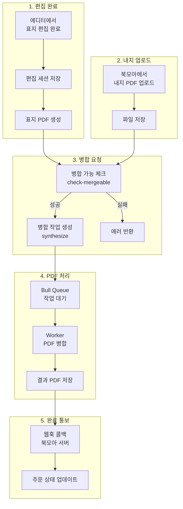

### 5.2 병합 가능 여부 체크

**용도**: 편집 저장 시점에 사전 검증

```http
POST /api/worker-jobs/check-mergeable/external
X-API-Key: {api-key}
Content-Type: application/json

{
  "editSessionId": "session-uuid",
  "coverFileId": "cover-file-uuid",
  "contentFileId": "content-file-uuid",
  "spineWidth": 5.5
}
```

**성공 응답**:
```json
{
  "mergeable": true
}
```

**실패 응답**:
```json
{
  "mergeable": false,
  "issues": [
    {
      "code": "CONTENT_FILE_INACCESSIBLE",
      "message": "내지 파일에 접근할 수 없습니다."
    }
  ]
}
```

### 5.3 병합 작업 요청

**용도**: 주문 확정 시점에 실제 병합 실행

```http
POST /api/worker-jobs/synthesize/external
X-API-Key: {api-key}
Content-Type: application/json

{
  "editSessionId": "session-uuid",
  "coverFileId": "cover-file-uuid",
  "contentFileId": "content-file-uuid",
  "spineWidth": 5.5,
  "orderId": "ORD-2024-12345",
  "priority": "high",
  "callbackUrl": "https://bookmoa.com/api/webhook/synthesis"
}
```

**응답**:
```json
{
  "id": "job-uuid",
  "jobType": "SYNTHESIZE",
  "status": "PENDING",
  "options": {
    "orderId": "ORD-2024-12345",
    "callbackUrl": "https://bookmoa.com/api/webhook/synthesis"
  },
  "createdAt": "2024-12-20T10:00:00Z"
}
```

### 5.4 작업 상태 조회

```http
GET /api/worker-jobs/external/{jobId}
X-API-Key: {api-key}
```

**작업 상태**:

| status | 설명 |
|--------|------|
| `PENDING` | 대기 중 |
| `PROCESSING` | 처리 중 |
| `COMPLETED` | 완료 |
| `FAILED` | 실패 |

**완료 응답**:
```json
{
  "id": "job-uuid",
  "jobType": "SYNTHESIZE",
  "status": "COMPLETED",
  "outputFileUrl": "/storage/temp/synthesized_xxx.pdf",
  "result": {
    "totalPages": 52,
    "spineWidth": 5.5,
    "previewUrl": "/storage/temp/synthesized_xxx_preview.png"
  },
  "createdAt": "2024-12-20T10:00:00Z",
  "completedAt": "2024-12-20T10:00:30Z"
}
```

### 5.5 병합 연동 코드 (PHP)

```php
<?php
class StorigeSynthesis {
    private $apiKey;
    private $apiUrl;

    public function __construct($apiKey, $apiUrl) {
        $this->apiKey = $apiKey;
        $this->apiUrl = $apiUrl;
    }

    /**
     * 병합 가능 여부 체크
     */
    public function checkMergeable($editSessionId, $coverFileId, $contentFileId, $spineWidth) {
        return $this->request('POST', '/worker-jobs/check-mergeable/external', [
            'editSessionId' => $editSessionId,
            'coverFileId' => $coverFileId,
            'contentFileId' => $contentFileId,
            'spineWidth' => $spineWidth,
        ]);
    }

    /**
     * 병합 작업 요청
     */
    public function synthesize($params) {
        return $this->request('POST', '/worker-jobs/synthesize/external', $params);
    }

    /**
     * 작업 상태 조회
     */
    public function getJobStatus($jobId) {
        return $this->request('GET', "/worker-jobs/external/{$jobId}");
    }

    private function request($method, $endpoint, $data = null) {
        $ch = curl_init($this->apiUrl . $endpoint);

        $headers = [
            'X-API-Key: ' . $this->apiKey,
            'Content-Type: application/json',
        ];

        curl_setopt_array($ch, [
            CURLOPT_RETURNTRANSFER => true,
            CURLOPT_HTTPHEADER => $headers,
        ]);

        if ($method === 'POST') {
            curl_setopt($ch, CURLOPT_POST, true);
            curl_setopt($ch, CURLOPT_POSTFIELDS, json_encode($data));
        }

        $response = curl_exec($ch);
        $httpCode = curl_getinfo($ch, CURLINFO_HTTP_CODE);
        curl_close($ch);

        return [
            'code' => $httpCode,
            'data' => json_decode($response, true),
        ];
    }
}

// 사용 예시
$synthesis = new StorigeSynthesis(STORIGE_API_KEY, STORIGE_API_URL);

// 1. 병합 가능 체크
$check = $synthesis->checkMergeable($editSessionId, $coverFileId, $contentFileId, 5.5);
if (!$check['data']['mergeable']) {
    throw new Exception('병합 불가: ' . $check['data']['issues'][0]['message']);
}

// 2. 병합 요청
$result = $synthesis->synthesize([
    'editSessionId' => $editSessionId,
    'coverFileId' => $coverFileId,
    'contentFileId' => $contentFileId,
    'spineWidth' => 5.5,
    'orderId' => $orderSeqno,
    'priority' => 'high',
    'callbackUrl' => 'https://bookmoa.com/storige/proc/synthesis_callback.php',
]);

$jobId = $result['data']['id'];
```

---

## 6. 웹훅 (Callback) 처리

### 6.1 웹훅 흐름

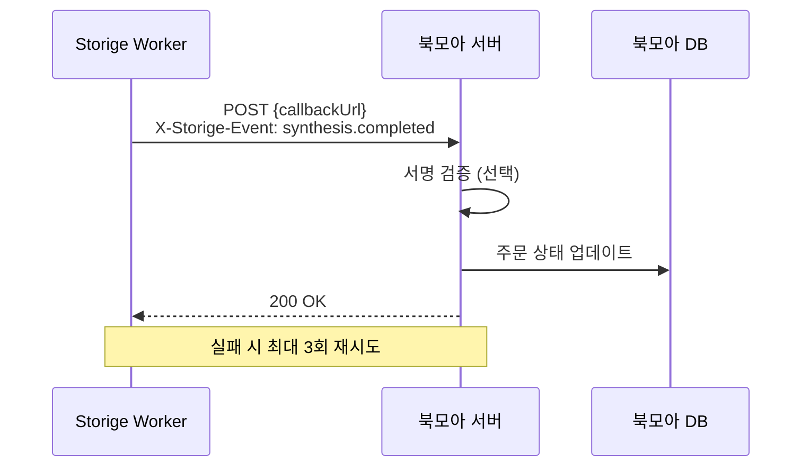

### 6.2 웹훅 페이로드

**완료 이벤트**:
```json
{
  "event": "synthesis.completed",
  "jobId": "job-uuid",
  "orderId": "ORD-2024-12345",
  "status": "completed",
  "outputFileUrl": "/storage/temp/synthesized_xxx.pdf",
  "result": {
    "totalPages": 52,
    "previewUrl": "/storage/temp/synthesized_xxx_preview.png"
  },
  "timestamp": "2024-12-20T10:00:30Z"
}
```

**실패 이벤트**:
```json
{
  "event": "synthesis.failed",
  "jobId": "job-uuid",
  "orderId": "ORD-2024-12345",
  "status": "failed",
  "errorMessage": "Cover PDF is corrupted",
  "timestamp": "2024-12-20T10:00:30Z"
}
```

### 6.3 웹훅 헤더

| 헤더 | 값 | 설명 |
|------|-----|------|
| `Content-Type` | `application/json` | JSON 페이로드 |
| `X-Storige-Event` | `synthesis.completed` / `synthesis.failed` | 이벤트 유형 |
| `X-Storige-Timestamp` | `1703001630` | Unix 타임스탬프 |
| `X-Storige-Signature` | `sha256=abc123...` | HMAC 서명 (선택) |

### 6.4 웹훅 수신 처리 (PHP)

```php
<?php
// /storige/proc/synthesis_callback.php

// 1. 헤더 검증
$event = $_SERVER['HTTP_X_STORIGE_EVENT'] ?? '';
$timestamp = $_SERVER['HTTP_X_STORIGE_TIMESTAMP'] ?? '';
$signature = $_SERVER['HTTP_X_STORIGE_SIGNATURE'] ?? '';

// 2. 타임스탬프 검증 (5분 이내)
if (abs(time() - (int)$timestamp) > 300) {
    http_response_code(400);
    exit('Timestamp expired');
}

// 3. 서명 검증 (선택)
$payload = file_get_contents('php://input');
$expectedSignature = 'sha256=' . hash_hmac('sha256', $payload, STORIGE_WEBHOOK_SECRET);
if (!hash_equals($expectedSignature, $signature)) {
    http_response_code(401);
    exit('Invalid signature');
}

// 4. 페이로드 파싱
$data = json_decode($payload, true);
$orderId = $data['orderId'];

// 5. 이벤트별 처리
switch ($event) {
    case 'synthesis.completed':
        // 주문 상태 업데이트
        updateOrderStatus($orderId, 'pdf_ready', [
            'outputFileUrl' => $data['outputFileUrl'],
            'totalPages' => $data['result']['totalPages'],
        ]);
        break;

    case 'synthesis.failed':
        // 실패 처리
        updateOrderStatus($orderId, 'pdf_failed', [
            'errorMessage' => $data['errorMessage'],
        ]);
        // 관리자 알림
        notifyAdmin("PDF 병합 실패: {$orderId} - {$data['errorMessage']}");
        break;
}

http_response_code(200);
echo json_encode(['received' => true]);
```

### 6.5 재시도 정책

| 시도 | 지연 시간 | 설명 |
|------|----------|------|
| 1차 | 즉시 | 최초 전송 |
| 2차 | 1분 후 | 첫 번째 재시도 |
| 3차 | 5분 후 | 두 번째 재시도 |
| 4차 | 30분 후 | 마지막 재시도 |

실패 조건:
- HTTP 상태 코드 `5xx` (서버 오류)
- 연결 타임아웃 (30초)
- DNS 해결 실패

---

## 7. 데이터 동기화

### 7.1 데이터 흐름도

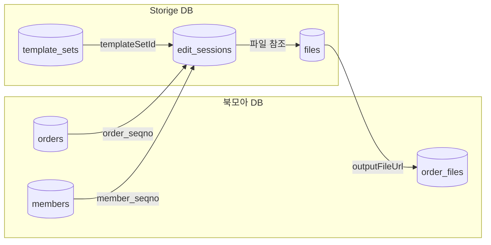

### 7.2 공유 키 매핑

| 북모아 | Storige | 용도 |
|--------|---------|------|
| `order_seqno` | `orderSeqno` | 주문 연결 |
| `member_seqno` | JWT `sub` | 사용자 식별 |
| `file_seqno` | `fileId` | 파일 참조 |

### 7.3 세션 상태 동기화

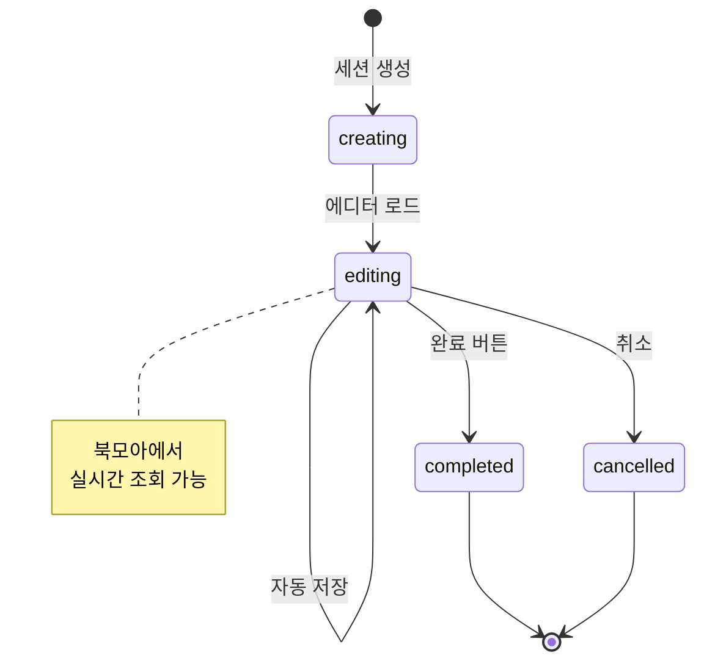

### 7.4 상태 조회 API (북모아 → Storige)

```php
<?php
// 편집 세션 상태 조회
function getEditSessionStatus($sessionId) {
    $response = file_get_contents(
        STORIGE_API_URL . "/edit-sessions/{$sessionId}/status",
        false,
        stream_context_create([
            'http' => [
                'header' => "X-API-Key: " . STORIGE_API_KEY,
            ]
        ])
    );

    return json_decode($response, true);
}
```

---

## 8. 에러 처리 및 복구

### 8.1 에러 코드 체계

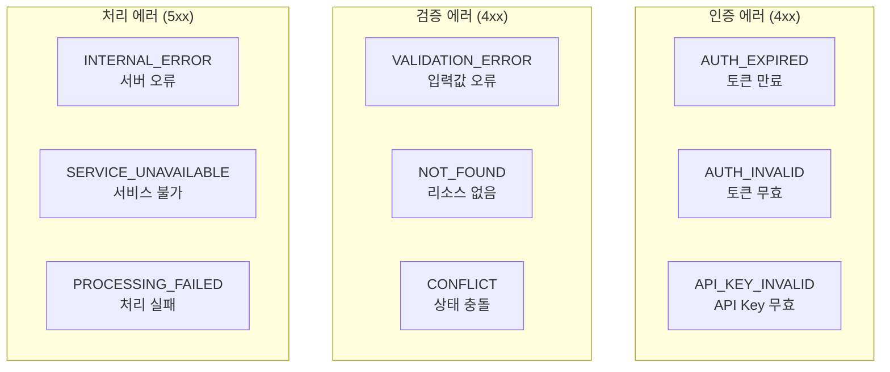

### 8.2 에러 응답 형식

```json
{
  "statusCode": 400,
  "error": "Bad Request",
  "message": "페이지 수는 최소 32페이지 이상이어야 합니다.",
  "code": "VALIDATION_ERROR",
  "details": {
    "field": "pageCount",
    "constraint": "min",
    "value": 20,
    "required": 32
  }
}
```

### 8.3 주요 에러 및 대응

| 에러 코드 | HTTP | 원인 | 대응 |
|-----------|------|------|------|
| `AUTH_EXPIRED` | 401 | JWT 만료 | 토큰 재발급 |
| `AUTH_INVALID` | 401 | JWT 위조/변조 | 재로그인 |
| `API_KEY_INVALID` | 401 | API Key 오류 | 키 확인 |
| `SESSION_NOT_FOUND` | 404 | 세션 없음 | 새 세션 생성 |
| `TEMPLATE_NOT_FOUND` | 404 | 템플릿 없음 | 템플릿 ID 확인 |
| `PAGE_COUNT_INVALID` | 400 | 페이지수 범위 초과 | 값 조정 |
| `FILE_INACCESSIBLE` | 400 | 파일 접근 불가 | 파일 재업로드 |

### 8.4 재시도 전략

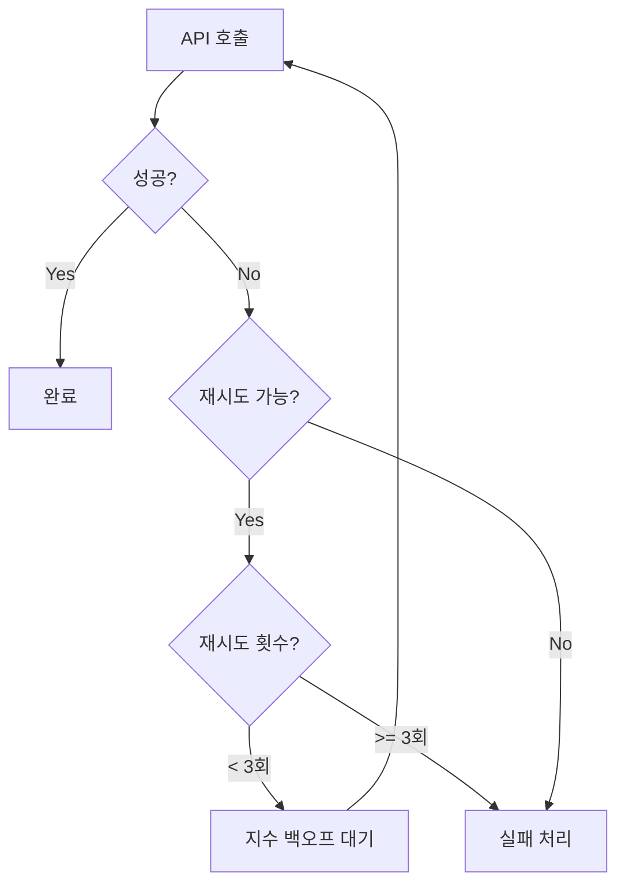

**재시도 가능 조건**:
- HTTP 5xx (서버 오류)
- 네트워크 타임아웃
- `ECONNRESET`, `ETIMEDOUT`

**재시도 불가 조건**:
- HTTP 4xx (클라이언트 오류)
- 인증 실패
- 검증 실패

### 8.5 에러 처리 예시 (PHP)

```php
<?php
function callStorigeApi($method, $endpoint, $data = null, $retries = 3) {
    $lastError = null;

    for ($attempt = 1; $attempt <= $retries; $attempt++) {
        try {
            $response = makeRequest($method, $endpoint, $data);

            if ($response['code'] >= 200 && $response['code'] < 300) {
                return $response['data'];
            }

            // 4xx 에러는 재시도하지 않음
            if ($response['code'] >= 400 && $response['code'] < 500) {
                throw new StorigeApiException(
                    $response['data']['message'],
                    $response['data']['code'],
                    $response['code']
                );
            }

            // 5xx 에러는 재시도
            $lastError = new Exception("Server error: {$response['code']}");

        } catch (ConnectionException $e) {
            $lastError = $e;
        }

        // 지수 백오프
        if ($attempt < $retries) {
            $delay = pow(2, $attempt) * 100; // 200ms, 400ms, 800ms
            usleep($delay * 1000);
        }
    }

    throw $lastError;
}
```

---

## 9. 보안 고려사항

### 9.1 보안 아키텍처

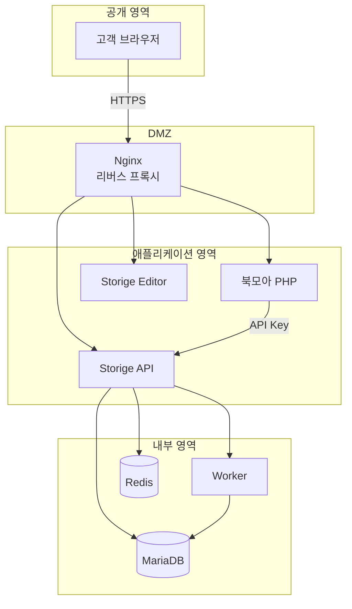

### 9.2 인증 보안

| 항목 | 권장 설정 |
|------|----------|
| API Key 길이 | 최소 32자 |
| API Key 저장 | 환경변수 (코드 하드코딩 금지) |
| JWT 만료 시간 | 1시간 |
| JWT 알고리즘 | HS256 이상 |
| 비밀키 길이 | 최소 256비트 |

### 9.3 통신 보안

| 항목 | 권장 설정 |
|------|----------|
| 프로토콜 | HTTPS (TLS 1.2+) |
| CORS 설정 | 명시적 도메인 (와일드카드 금지) |
| 쿠키 설정 | `HttpOnly`, `Secure`, `SameSite=Strict` |

### 9.4 입력 검증

```php
<?php
// 모든 외부 입력 검증
function validateOrderSeqno($value) {
    if (!is_numeric($value) || $value <= 0) {
        throw new InvalidArgumentException('Invalid order_seqno');
    }
    return (int)$value;
}

function validateUuid($value) {
    if (!preg_match('/^[0-9a-f]{8}-[0-9a-f]{4}-[0-9a-f]{4}-[0-9a-f]{4}-[0-9a-f]{12}$/i', $value)) {
        throw new InvalidArgumentException('Invalid UUID format');
    }
    return $value;
}

function validatePaperType($value) {
    $allowed = ['mojo_70g', 'mojo_80g', 'art_200g', 'matte_200g'];
    if (!in_array($value, $allowed)) {
        throw new InvalidArgumentException('Invalid paper type');
    }
    return $value;
}
```

### 9.5 파일 보안

| 항목 | 보안 조치 |
|------|----------|
| 파일 업로드 | MIME 타입 검증, 확장자 화이트리스트 |
| 파일 저장 | 웹 루트 외부, 임의의 파일명 |
| 파일 접근 | 인증된 다운로드 URL, 만료 시간 설정 |
| PDF 처리 | 격리된 샌드박스 환경 |

---

## 10. 운영 가이드

### 10.1 환경별 설정

#### 개발 환경

```bash
# 북모아 (Apache)
SetEnv STORIGE_API_URL "http://localhost:4000/api"
SetEnv STORIGE_API_KEY "dev-api-key-for-testing"
SetEnv STORIGE_EDITOR_BUNDLE_URL "http://localhost:3000/editor-bundle.iife.js"

# Storige (.env)
NODE_ENV=development
API_KEYS=dev-api-key-for-testing
CORS_ORIGIN=http://localhost:8080
```

#### 스테이징 환경

```bash
# 북모아
SetEnv STORIGE_API_URL "https://staging-api.storige.com/api"
SetEnv STORIGE_API_KEY "staging-secure-key"

# Storige
NODE_ENV=staging
API_KEYS=staging-secure-key
CORS_ORIGIN=https://staging.bookmoa.com
```

#### 운영 환경

```bash
# 북모아
SetEnv STORIGE_API_URL "https://api.storige.com/api"
SetEnv STORIGE_API_KEY "production-secure-key-xxxxx"

# Storige
NODE_ENV=production
API_KEYS=production-secure-key-xxxxx
CORS_ORIGIN=https://bookmoa.com,https://www.bookmoa.com
```

### 10.2 헬스체크

```bash
# API 헬스체크
curl https://api.storige.com/api/health

# Worker 헬스체크
curl https://api.storige.com/api/worker/health

# 전체 연결 테스트
curl -X POST https://api.storige.com/api/auth/shop-session \
  -H "X-API-Key: your-api-key" \
  -H "Content-Type: application/json" \
  -d '{"memberSeqno": 1, "memberId": "test", "memberName": "Test"}'
```

### 10.3 로그 모니터링

**Storige 로그 위치**:
```
/var/log/storige/
├── api.log           # API 요청/응답 로그
├── worker.log        # Worker 처리 로그
├── error.log         # 에러 로그
└── access.log        # 접근 로그
```

**주요 모니터링 지표**:
- API 응답 시간 (p95 < 500ms)
- Worker 큐 길이 (< 100)
- 에러율 (< 1%)
- JWT 토큰 발급 실패율

### 10.4 장애 대응

| 장애 유형 | 증상 | 대응 |
|----------|------|------|
| API 연결 불가 | 타임아웃, 503 | 서버 상태 확인, 재시작 |
| 인증 실패 | 401 지속 | API Key, JWT Secret 확인 |
| PDF 병합 지연 | 큐 누적 | Worker 스케일업, 우선순위 조정 |
| 파일 저장 실패 | 디스크 풀 | 스토리지 확장, 임시 파일 정리 |

### 10.5 버전 업그레이드

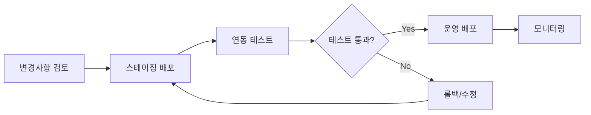

**호환성 체크리스트**:
- [ ] API 엔드포인트 변경 여부
- [ ] 요청/응답 필드 변경 여부
- [ ] 에디터 번들 버전 호환성
- [ ] 웹훅 페이로드 변경 여부
- [ ] 데이터베이스 마이그레이션 필요 여부

---

## 부록: 코드 참조

### A. 용지 종류 (paper_types)

| code | name | thickness (mm) | category |
|------|------|----------------|----------|
| `mojo_70g` | 모조지 70g | 0.09 | body |
| `mojo_80g` | 모조지 80g | 0.10 | body |
| `seokji_70g` | 서적지 70g | 0.10 | body |
| `newsprint_45g` | 신문지 45g | 0.06 | body |
| `art_200g` | 아트지 200g | 0.18 | cover |
| `matte_200g` | 매트지 200g | 0.20 | cover |
| `card_300g` | 카드지 300g | 0.35 | cover |
| `kraft_120g` | 크라프트지 120g | 0.16 | cover |

### B. 제본 방식 (binding_types)

| code | name | margin (mm) | minPages | maxPages | pageMultiple |
|------|------|-------------|----------|----------|--------------|
| `perfect` | 무선제본 | 0.5 | 32 | - | - |
| `saddle` | 중철제본 | 0.3 | - | 64 | 4 |
| `spiral` | 스프링제본 | 3.0 | - | - | - |
| `hardcover` | 양장제본 | 2.0 | - | - | - |

### C. 변경 이력

| 버전 | 날짜 | 변경 내용 |
|------|------|----------|
| 1.0 | 2025-12-21 | 최초 작성 |

---

## 문의

- **기술 문의**: Storige 개발팀
- **API 문서**: `/api/docs` (Swagger UI)
