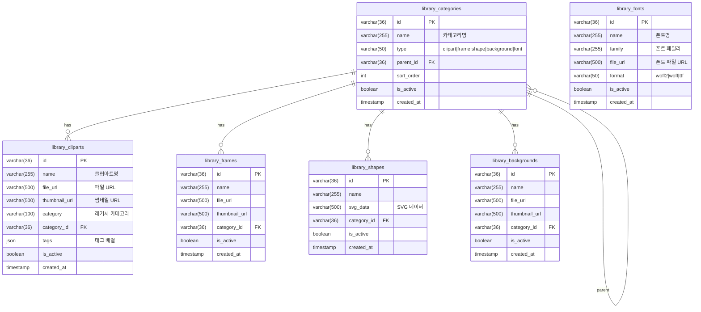

# Storige 데이터베이스 ERD

## 문서 개요

| 항목 | 내용 |
|------|------|
| 작성일 | 2025-12-21 |
| 데이터베이스 | MariaDB 11.2 |
| ORM | TypeORM (synchronize mode in dev) |

---

## 1. 전체 ERD 개요


---

## 2. 도메인별 상세 ERD

### 2.1 인증 및 사용자 도메인


**테이블 설명:**
- `users`: 시스템 사용자 (관리자, 에디터 사용자)

---

### 2.2 상품 도메인


**테이블 설명:**
- `products`: 인쇄 상품 정보 (와우프레스 연동)
- `product_sizes`: 상품별 사이즈 옵션

---

### 2.3 책등 계산 도메인 (Spine)


**테이블 설명:**
- `paper_types`: 용지 종류 및 두께 정보 (책등 폭 계산용)
- `binding_types`: 제본 방식 및 마진 정보 (책등 폭 계산용)

**책등 폭 계산 공식:**
```
책등 폭 = (페이지수 / 2) × 종이 두께 + 제본 여유분
```

**초기 데이터:**

| 용지 코드 | 용지명 | 두께 (mm) | 카테고리 |
|----------|--------|-----------|---------|
| mojo_70g | 모조지 70g | 0.09 | body |
| mojo_80g | 모조지 80g | 0.10 | body |
| seokji_70g | 서적지 70g | 0.10 | body |
| newsprint_45g | 신문지 45g | 0.06 | body |
| art_200g | 아트지 200g | 0.18 | cover |
| matte_200g | 매트지 200g | 0.20 | cover |
| card_300g | 카드지 300g | 0.35 | cover |
| kraft_120g | 크라프트지 120g | 0.16 | cover |

| 제본 코드 | 제본명 | 마진 (mm) | 최소 페이지 | 최대 페이지 | 페이지 배수 |
|----------|--------|-----------|------------|------------|-----------|
| perfect | 무선제본 | 0.5 | 32 | - | - |
| saddle | 중철제본 | 0.3 | - | 64 | 4 |
| spiral | 스프링제본 | 3.0 | - | - | - |
| hardcover | 양장제본 | 2.0 | - | - | - |

---

### 2.4 템플릿 도메인


**테이블 설명:**
- `categories`: 계층형 카테고리 (3단계까지)
- `template_sets`: 템플릿 묶음 (책자 구성)
- `template_set_items`: 템플릿셋-템플릿 연결
- `templates`: 개별 템플릿 (표지, 내지, 책등 등)

**템플릿 타입:**
| 타입 | 설명 |
|------|------|
| wing | 날개 |
| cover | 표지 |
| spine | 책등 |
| page | 내지 |

---

### 2.5 편집 세션 도메인


**테이블 설명:**
- `file_edit_sessions`: 편집 세션 (bookmoa 주문과 연결)
- `files`: 업로드된 파일 메타데이터
- `worker_jobs`: PDF 처리 작업 큐

**세션 상태 흐름:**
```
draft → editing → complete
```

**워커 작업 타입:**
| 타입 | 설명 |
|------|------|
| validation | PDF 유효성 검증 |
| conversion | RGB → CMYK 변환 |
| synthesis | 표지+내지 병합 |

---

### 2.6 라이브러리 도메인



**테이블 설명:**
- `library_categories`: 라이브러리 카테고리
- `library_cliparts`: 클립아트 리소스
- `library_frames`: 프레임 리소스
- `library_shapes`: 도형 리소스
- `library_backgrounds`: 배경 이미지 리소스
- `library_fonts`: 웹폰트 리소스

---

## 3. Bookmoa 연동 테이블 (참조용)

bookmoa PHP 시스템의 기존 테이블을 참조하는 뷰 엔티티입니다.


**참고:** 이 테이블들은 bookmoa 시스템에서 관리되며, Storige에서는 읽기 전용으로 참조합니다.

---

## 4. 인덱스 정보

### 주요 인덱스

| 테이블 | 인덱스명 | 컬럼 | 설명 |
|--------|----------|------|------|
| templates | idx_template_type | type | 템플릿 타입 검색 |
| templates | idx_template_deleted | is_deleted | 삭제 필터링 |
| template_sets | idx_template_set_type | type | 템플릿셋 타입 검색 |
| template_sets | idx_template_set_deleted | is_deleted | 삭제 필터링 |
| files | idx_files_order_seqno | order_seqno | 주문별 파일 조회 |
| files | idx_files_member_seqno | member_seqno | 회원별 파일 조회 |

---

## 5. 데이터 흐름


---

## 6. 변경 이력

| 날짜 | 버전 | 변경 내용 |
|------|------|----------|
| 2025-12-21 | 1.0 | 초기 ERD 문서 작성 |
| 2025-12-21 | 1.1 | 책등 계산 도메인 (paper_types, binding_types) 추가 |
