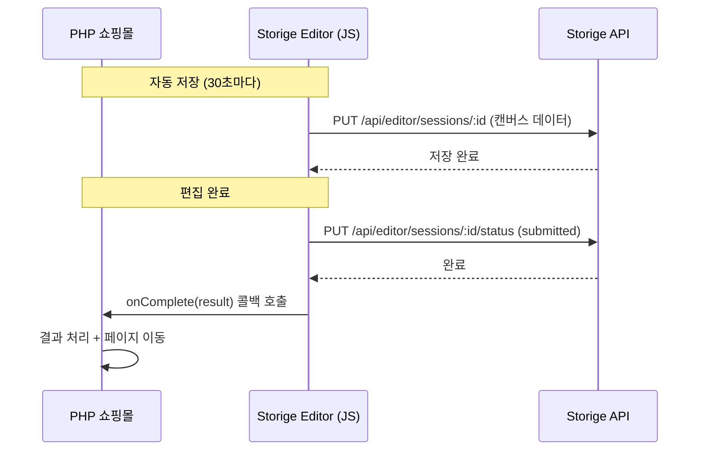

# PHP 에디터 연동 테스트 계획서

> 목적: 외부 PHP 쇼핑몰에서 Storige 에디터를 JS 번들로 임베딩하여 연동하는 테스트 환경 구축

---

## 1. 개요

### 1.1 목표
- PHP 기반 쇼핑몰에서 Storige 에디터를 JS 번들로 직접 구동하는 테스트 페이지 구현
- 템플릿셋 ID 기반 에디터 초기화 검증
- 상품 → 에디터 → 저장 → 콜백 전체 흐름 테스트

### 1.2 연동 방식 (PRD 9.1 준수)

```html
<!-- 쇼핑몰 페이지 (PHP) -->
<div id="editor-root"></div>
<script src="editor-bundle.js"></script>
```

**핵심 차이점 (iframe 방식 vs JS 번들 방식)**:
| 항목 | iframe 방식 | JS 번들 방식 (채택) |
|------|-------------|---------------------|
| 통신 | postMessage | 직접 함수 호출 |
| 격리 | 완전 분리 | 동일 DOM 컨텍스트 |
| 스타일 | 독립적 | 쇼핑몰과 공유 |
| 성능 | 별도 로딩 | 번들 단일 로딩 |
| 인증 | 별도 토큰 전달 | 쇼핑몰 세션 공유 가능 |

### 1.3 연동 시나리오

```
┌─────────────────────────────────────────────────────────────────┐
│                    PHP 쇼핑몰 (호스트)                           │
│  ┌───────────────────────────────────────────────────────────┐  │
│  │                                                           │  │
│  │   [상품 선택] → [에디터 열기] → [편집] → [저장/완료]         │  │
│  │        ↓              ↓            ↓           ↓         │  │
│  │   templateSetId   openEditor()  캔버스 편집   onComplete  │  │
│  │        ↓              ↓            ↓           ↓         │  │
│  │   상품정보 조회   에디터 마운트   실시간 저장   결과 콜백    │  │
│  │                                                           │  │
│  └───────────────────────────────────────────────────────────┘  │
│                                                                 │
│  ┌───────────────────────────────────────────────────────────┐  │
│  │              <div id="editor-root">                       │  │
│  │                 Storige Editor (React)                    │  │
│  │                 - Fabric.js 캔버스                         │  │
│  │                 - 템플릿셋 기반 초기화                      │  │
│  │              </div>                                       │  │
│  └───────────────────────────────────────────────────────────┘  │
└─────────────────────────────────────────────────────────────────┘
```

---

## 2. 시스템 구성

### 2.1 파일 구조

```
storige/
├── test-php/                          # PHP 테스트 환경 (신규)
│   ├── docker-compose.yml             # PHP + nginx 컨테이너
│   ├── nginx.conf                     # nginx 설정
│   ├── php/
│   │   ├── index.php                  # 테스트 홈페이지
│   │   ├── products.php               # 상품 목록 페이지
│   │   ├── editor.php                 # 에디터 임베딩 페이지
│   │   ├── callback.php               # 편집 완료 콜백 처리
│   │   ├── api/
│   │   │   ├── get-token.php          # JWT 토큰 발급
│   │   │   ├── get-products.php       # 상품 목록 조회
│   │   │   └── save-result.php        # 편집 결과 저장
│   │   ├── assets/
│   │   │   ├── css/style.css
│   │   │   └── js/storige-loader.js   # 에디터 로더 모듈
│   │   └── config.php                 # 설정 파일
│   └── README.md                      # 설치 및 실행 가이드
├── apps/editor/                       # 기존 에디터
│   └── dist/                          # 빌드된 번들 (editor-bundle.js)
└── apps/api/                          # 기존 API
```

### 2.2 서비스 구성

| 서비스 | 포트 | 역할 |
|--------|------|------|
| PHP (nginx + php-fpm) | 8080 | 테스트 쇼핑몰 |
| Storige API | 4000 | 백엔드 API |

**참고**: 에디터는 별도 서버가 아닌 PHP 페이지에 JS 번들로 직접 임베딩됩니다.

---

## 3. 구현 상세

### 3.1 Phase 1: 에디터 번들 빌드 설정

#### 에디터 Library 모드 빌드 설정
```typescript
// apps/editor/vite.config.ts
export default defineConfig({
  build: {
    lib: {
      entry: 'src/embed.tsx',          // 임베딩용 진입점
      name: 'StorigeEditor',
      fileName: 'editor-bundle',
      formats: ['iife']                // 전역 변수로 노출
    },
    rollupOptions: {
      output: {
        globals: {
          // 외부 의존성 (필요시)
        }
      }
    }
  }
});
```

#### 임베딩용 진입점 (embed.tsx)
```typescript
// apps/editor/src/embed.tsx
import React from 'react';
import { createRoot, Root } from 'react-dom/client';
import { EditorApp } from './EditorApp';

interface EditorConfig {
  templateSetId: string;
  productId: string;
  token: string;
  sessionId?: string;
  options?: {
    pages?: number;
    coverWing?: { front: number; back: number };
    paper?: { type: string; weight: number };
  };
  onComplete?: (result: EditorResult) => void;
  onCancel?: () => void;
  onError?: (error: Error) => void;
}

interface EditorResult {
  sessionId: string;
  pages: { initial: number; final: number };
  files: { cover?: string; content?: string };
  savedAt: string;
}

class StorigeEditorInstance {
  private root: Root | null = null;
  private container: HTMLElement | null = null;
  private config: EditorConfig;

  constructor(config: EditorConfig) {
    this.config = config;
  }

  mount(elementId: string) {
    this.container = document.getElementById(elementId);
    if (!this.container) {
      throw new Error(`Element #${elementId} not found`);
    }

    this.root = createRoot(this.container);
    this.root.render(
      <EditorApp
        {...this.config}
        onComplete={this.handleComplete.bind(this)}
        onCancel={this.handleCancel.bind(this)}
      />
    );
  }

  unmount() {
    if (this.root) {
      this.root.unmount();
      this.root = null;
    }
  }

  private handleComplete(result: EditorResult) {
    this.config.onComplete?.(result);
  }

  private handleCancel() {
    this.config.onCancel?.();
  }
}

// 전역 API 노출
declare global {
  interface Window {
    StorigeEditor: {
      create: (config: EditorConfig) => StorigeEditorInstance;
      version: string;
    };
  }
}

window.StorigeEditor = {
  create: (config: EditorConfig) => new StorigeEditorInstance(config),
  version: '1.0.0'
};

export { StorigeEditorInstance, EditorConfig, EditorResult };
```

### 3.2 Phase 2: PHP 테스트 환경 구축

#### docker-compose.yml
```yaml
version: '3.8'
services:
  php-test:
    image: php:8.2-fpm
    volumes:
      - ./php:/var/www/html
    networks:
      - storige-test

  nginx-test:
    image: nginx:alpine
    ports:
      - "8080:80"
    volumes:
      - ./php:/var/www/html
      - ./nginx.conf:/etc/nginx/conf.d/default.conf
    depends_on:
      - php-test
    networks:
      - storige-test

networks:
  storige-test:
    driver: bridge
```

#### nginx.conf
```nginx
server {
    listen 80;
    server_name localhost;
    root /var/www/html;
    index index.php;

    # PHP 처리
    location ~ \.php$ {
        fastcgi_pass php-test:9000;
        fastcgi_index index.php;
        fastcgi_param SCRIPT_FILENAME $document_root$fastcgi_script_name;
        include fastcgi_params;
    }

    # 정적 파일
    location /assets/ {
        alias /var/www/html/assets/;
    }

    # 에디터 번들 (빌드된 파일)
    location /editor-bundle.js {
        alias /var/www/html/assets/js/editor-bundle.js;
        add_header Cache-Control "no-cache";
    }
}
```

### 3.3 Phase 3: 에디터 임베딩 페이지

#### editor.php
```php
<?php
require_once 'config.php';

// 1. 세션/인증 확인
session_start();
if (!isset($_SESSION['user_id'])) {
    header('Location: /login.php');
    exit;
}

// 2. 템플릿셋 ID 확인
$templateSetId = $_GET['templateSetId'] ?? null;
$productId = $_GET['productId'] ?? null;
$sessionId = $_GET['sessionId'] ?? null; // 재편집시

if (!$templateSetId || !$productId) {
    die('템플릿셋 ID와 상품 ID가 필요합니다.');
}

// 3. API 토큰 발급
$token = getEditorToken($_SESSION['user_id']);
?>
<!DOCTYPE html>
<html lang="ko">
<head>
    <meta charset="UTF-8">
    <meta name="viewport" content="width=device-width, initial-scale=1.0">
    <title>디자인 편집 - 테스트 쇼핑몰</title>
    <link rel="stylesheet" href="/assets/css/style.css">
</head>
<body>
    <div class="editor-page">
        <!-- 상단 헤더 (쇼핑몰 네비게이션) -->
        <header class="shop-header">
            <h1>테스트 쇼핑몰</h1>
            <nav>
                <a href="/">홈</a>
                <a href="/products.php">상품</a>
            </nav>
        </header>

        <!-- 에디터 컨테이너 -->
        <div id="editor-root" class="editor-container">
            <div class="loading">에디터 로딩 중...</div>
        </div>

        <!-- 하단 액션 버튼 (쇼핑몰에서 제공) -->
        <footer class="editor-actions">
            <button id="btn-cancel" class="btn-secondary">편집 취소</button>
            <button id="btn-save" class="btn-primary">임시 저장</button>
            <button id="btn-complete" class="btn-success">편집 완료</button>
        </footer>
    </div>

    <!-- 에디터 번들 로드 -->
    <script src="/editor-bundle.js"></script>
    <script>
        // 편집기 초기화
        const editor = window.StorigeEditor.create({
            // 필수 데이터
            templateSetId: '<?= htmlspecialchars($templateSetId) ?>',
            productId: '<?= htmlspecialchars($productId) ?>',
            token: '<?= htmlspecialchars($token) ?>',

            // 선택 데이터
            <?php if ($sessionId): ?>
            sessionId: '<?= htmlspecialchars($sessionId) ?>',
            <?php endif; ?>

            // 동적 옵션 (쇼핑몰에서 전달)
            options: {
                pages: <?= intval($_GET['pages'] ?? 20) ?>,
                <?php if (isset($_GET['wingFront']) && isset($_GET['wingBack'])): ?>
                coverWing: {
                    front: <?= intval($_GET['wingFront']) ?>,
                    back: <?= intval($_GET['wingBack']) ?>
                }
                <?php endif; ?>
            },

            // 콜백 함수
            onComplete: function(result) {
                console.log('편집 완료:', result);
                // 쇼핑몰 주문 페이지로 이동
                window.location.href = '/callback.php?' + new URLSearchParams({
                    sessionId: result.sessionId,
                    pages: result.pages.final,
                    productId: '<?= htmlspecialchars($productId) ?>'
                }).toString();
            },

            onCancel: function() {
                console.log('편집 취소');
                if (confirm('편집을 취소하시겠습니까?\n작업 내용이 저장되지 않습니다.')) {
                    window.location.href = '/products.php';
                }
            },

            onError: function(error) {
                console.error('에디터 오류:', error);
                alert('에디터 오류가 발생했습니다: ' + error.message);
            }
        });

        // 에디터 마운트
        editor.mount('editor-root');

        // 버튼 이벤트 연결
        document.getElementById('btn-cancel').onclick = () => editor.cancel?.();
        document.getElementById('btn-save').onclick = () => editor.save?.();
        document.getElementById('btn-complete').onclick = () => editor.complete?.();
    </script>
</body>
</html>
```

### 3.4 Phase 4: API 연동 흐름

#### 편집기 초기화 흐름

```
1. PHP 페이지 로드
   ↓
2. editor-bundle.js 로드
   ↓
3. StorigeEditor.create(config) 호출
   ↓
4. editor.mount('editor-root')
   ↓
5. React 앱 렌더링
   ↓
6. useEffect에서 초기화:
   - GET /api/template-sets/:templateSetId (템플릿셋 정보)
   - POST /api/editor/sessions (세션 생성) 또는
   - GET /api/editor/sessions/:sessionId (기존 세션 로드)
   ↓
7. 캔버스 초기화 완료
```

#### 저장 및 완료 흐름



---

## 4. 에디터 API 인터페이스

### 4.1 전역 API (window.StorigeEditor)

```typescript
interface StorigeEditor {
  // 에디터 인스턴스 생성
  create(config: EditorConfig): EditorInstance;

  // 버전 정보
  version: string;
}
```

### 4.2 에디터 인스턴스 API

```typescript
interface EditorInstance {
  // DOM에 마운트
  mount(elementId: string): void;

  // DOM에서 언마운트
  unmount(): void;

  // 현재 상태 저장
  save(): Promise<SaveResult>;

  // 편집 완료 (콜백 호출)
  complete(): Promise<void>;

  // 편집 취소 (콜백 호출)
  cancel(): void;

  // 실행 취소
  undo(): void;

  // 다시 실행
  redo(): void;

  // 현재 상태 조회
  getState(): EditorState;
}
```

### 4.3 콜백 데이터 형식

```typescript
// 편집 완료 콜백 데이터
interface EditorResult {
  sessionId: string;
  editCode: string;           // 레거시 호환
  pages: {
    initial: number;          // 시작 페이지수
    final: number;            // 최종 페이지수
  };
  files: {
    cover?: string;           // 표지 파일 경로
    content?: string;         // 내지 파일 경로
    thumbnail?: string;       // 썸네일 이미지
  };
  savedAt: string;            // ISO 8601
}
```

---

## 5. 테스트 시나리오

### 5.1 기본 연동 테스트

| # | 테스트 케이스 | 기대 결과 |
|---|--------------|----------|
| 1 | 상품 페이지에서 "편집" 클릭 | 에디터 JS 로드 및 마운트 |
| 2 | 템플릿셋 정보 로드 | API에서 규격 정보 조회 성공 |
| 3 | 캔버스 초기화 | 템플릿 기반 캔버스 렌더링 |
| 4 | 텍스트 추가 후 저장 | API 저장 성공 |
| 5 | 편집 완료 버튼 클릭 | onComplete 콜백 + 결과 데이터 |
| 6 | 페이지 이동 | 쇼핑몰 콜백 페이지로 이동 |

### 5.2 재편집 테스트

| # | 테스트 케이스 | 기대 결과 |
|---|--------------|----------|
| 1 | sessionId로 에디터 열기 | 기존 편집 데이터 로드 |
| 2 | 수정 후 저장 | 기존 세션 업데이트 |
| 3 | 완료 | 동일한 sessionId로 완료 처리 |

### 5.3 에러 핸들링 테스트

| # | 테스트 케이스 | 기대 결과 |
|---|--------------|----------|
| 1 | 잘못된 templateSetId | onError 콜백 + 에러 메시지 |
| 2 | 토큰 만료 | 재인증 요청 또는 에러 |
| 3 | 네트워크 끊김 | 로컬 임시 저장 + 복구 안내 |
| 4 | 세션 충돌 (다른 탭) | 잠금 경고 표시 |

### 5.4 성능 테스트

| # | 테스트 케이스 | 기준 |
|---|--------------|------|
| 1 | 에디터 번들 로드 | < 1초 (gzip 압축시) |
| 2 | 초기 렌더링 | < 2초 |
| 3 | 템플릿셋 API 응답 | < 500ms |
| 4 | 저장 응답 | < 1초 |

---

## 6. 보안 고려사항

### 6.1 CORS 설정

```typescript
// apps/api/src/main.ts
app.enableCors({
    origin: ['http://localhost:8080', 'https://your-shop.com'],
    credentials: true,
    methods: ['GET', 'POST', 'PUT', 'DELETE'],
});
```

### 6.2 토큰 검증
- JWT 토큰에 사용자 ID, 권한, 만료 시간 포함
- 각 API 요청 시 토큰 검증
- 세션별 사용자 소유권 확인

### 6.3 CSP (Content Security Policy)

```php
// PHP에서 CSP 헤더 설정
header("Content-Security-Policy: script-src 'self' 'unsafe-inline'; style-src 'self' 'unsafe-inline';");
```

---

## 7. 구현 체크리스트

### Phase 1: 에디터 번들 빌드 설정
- [ ] Vite library mode 설정
- [ ] embed.tsx 진입점 생성
- [ ] 전역 API (window.StorigeEditor) 구현
- [ ] 번들 빌드 테스트

### Phase 2: PHP 테스트 환경
- [ ] Docker Compose 설정 (PHP 8.2 + nginx)
- [ ] 기본 PHP 페이지 템플릿
- [ ] CORS 설정 (API)
- [ ] 환경 변수 및 설정 파일

### Phase 3: 에디터 임베딩 페이지
- [ ] editor.php 페이지 구현
- [ ] 토큰 발급 API 연동
- [ ] 콜백 처리 페이지 (callback.php)
- [ ] 스타일링 (에디터 + 쇼핑몰 UI 조화)

### Phase 4: 전체 흐름 테스트
- [ ] 상품 선택 → 에디터 열기 흐름
- [ ] 편집 → 저장 → 완료 흐름
- [ ] 재편집 흐름
- [ ] 에러 핸들링 테스트

---

## 8. 참고 자료

- [PRD 9.1 쇼핑몰-편집기 연동 구조](/PRD.md#91-쇼핑몰-편집기-연동-구조)
- [PRD 9.2 편집기 오픈시 전달 데이터](/PRD.md#92-편집기-오픈시-전달-데이터)
- [PRD 9.3 편집기 종료시 콜백 데이터](/PRD.md#93-편집기-종료시-콜백-데이터)
- [템플릿셋 엔티티](/apps/api/src/templates/entities/template-set.entity.ts)
