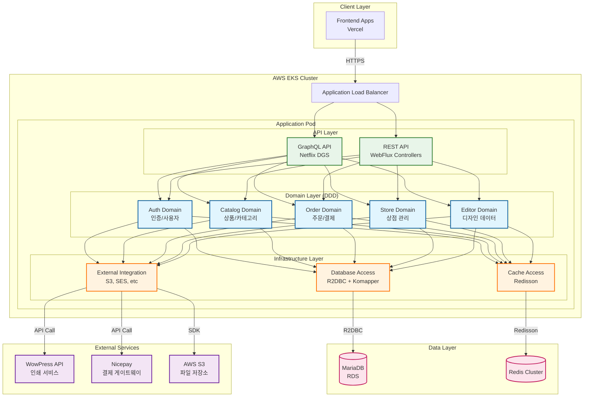
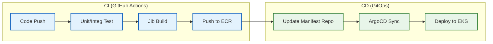

# 백엔드 아키텍처 (Backend Architecture)

> 상위 문서: [SYSTEM-ARCHITECTURE.md](./SYSTEM-ARCHITECTURE.md)

---

## 1. 시스템 개요

백엔드는 **Spring Boot 3**와 **Kotlin**으로 구축된 **모듈형 모놀리스(Modular Monolith)** 구조이며, **AWS EKS (Elastic Kubernetes Service)** 상에서 운영됩니다.

---

## 2. 백엔드 아키텍처 다이어그램

---

## 3. 기술 스택

- **언어**: Kotlin 2.1.10 (JVM 17)
- **프레임워크**: Spring Boot 3.4.3 (WebFlux)
- **API**:
  - **GraphQL**: Netflix DGS Framework (메인 데이터 조회/조작)
  - **REST**: Spring WebFlux (인증, 결제 등 특정 도메인)
- **데이터베이스 접근**:
  - **R2DBC**: Non-blocking I/O를 위한 리액티브 관계형 데이터베이스 연결
  - **Komapper**: R2DBC를 위한 Kotlin 네이티브 ORM
  - **Flyway**: 데이터베이스 스키마 마이그레이션 도구
- **캐시**: Redis Cluster (Redisson 클라이언트)
- **아키텍처 패턴**: DDD (Domain-Driven Design)

---

## 4. 핵심 컴포넌트 (`ownweb-app`)

### 4.1 GraphQL 계층
Netflix DGS를 사용하여 스키마와 데이터 페처(Data Fetcher)를 정의합니다.

### 4.2 REST 계층
인증(Auth), 결제(Payment) 등 REST 방식이 적합하거나 외부 콜백이 필요한 경우 사용합니다.

### 4.3 도메인 계층
비즈니스 로직, 엔티티, 도메인 서비스를 포함합니다.
- **Auth**: 인증 및 사용자 관리
- **Catalog**: 상품 및 카테고리 관리
- **Order**: 주문 및 결제 처리
- **Store**: 멀티테넌트 상점 관리
- **Editor**: 디자인 에디터 데이터 관리

### 4.4 인프라 계층
외부 통합(AWS S3, SES, WowPress API 등)을 처리합니다.

---

## 5. 인프라 및 배포 (Infrastructure & Deployment)

### 5.1 AWS 인프라 구성

- **컴퓨팅**: AWS EKS (Elastic Kubernetes Service)
  - **Control Plane**: AWS 관리형 쿠버네티스 마스터
  - **Data Plane**: 관리형 노드 그룹 (Managed Node Groups)
- **네트워크**:
  - **VPC**: 프라이빗/퍼블릭 서브넷 분리
  - **ALB**: Ingress Controller를 통한 트래픽 라우팅
- **데이터 스토리지**:
  - **Amazon RDS**: Multi-AZ 배포된 MariaDB
  - **ElastiCache**: 고가용성 Redis Cluster

### 5.2 CI/CD 및 GitOps 파이프라인

백엔드 배포는 **GitOps** 방법론을 채택하여 인프라 형상을 코드로 관리하고 자동화합니다.

#### CI (Continuous Integration)
- **GitHub Actions**: 코드가 푸시되면 자동으로 테스트와 빌드를 수행합니다.
- **Jib**: Docker 데몬 없이 최적화된 컨테이너 이미지를 빌드하여 **Amazon ECR**에 푸시합니다.
- **이미지 태깅**: Git 커밋 해시(SHA)를 태그로 사용하여 추적 가능성을 확보합니다.

#### CD (Continuous Deployment - GitOps)
- **Manifest Repository**: 쿠버네티스 배포 설정(Helm Chart/Kustomize)을 별도의 Git 저장소에서 관리합니다.
- **ArgoCD**: 쿠버네티스 클러스터 내에 설치되어 Manifest 저장소의 변경 사항을 감지하고, 현재 클러스터 상태를 원하는 상태(Desired State)로 자동으로 동기화(Sync)합니다.
- **롤링 업데이트**: 무중단 배포를 보장하며, 문제 발생 시 ArgoCD를 통해 즉시 롤백할 수 있습니다.

---

## 6. 데이터 흐름 및 외부 연동

1. **사용자 요청**: 사용자는 Vercel에 배포된 프론트엔드 애플리케이션에 접속합니다.
2. **API 호출**: 프론트엔드에서 `/api`로 요청을 보내면 Vercel Rewrites가 이를 AWS ALB로 전달합니다.
3. **이미지/파일 요청**:
   - 이미지: `User -> Image CDN (CloudFront) -> Lambda -> S3` 흐름으로 최적화된 이미지를 수신
   - 파일: `User -> File CDN (CloudFront) -> S3` 흐름으로 업로드된 파일을 수신
4. **API 처리**: EKS 상의 Spring Boot 애플리케이션이 GraphQL 또는 REST 요청을 처리합니다.
5. **데이터 접근**: R2DBC를 통해 MariaDB에 접근하거나 Redis 캐시를 활용합니다.
6. **외부 서비스 연동**:
   - **WowPress API**: 인쇄 주문 및 상품 정보 연동
   - **Nicepay**: 결제 승인 및 취소 처리
