# 에디터 아키텍처 (Editor Architecture)

> 상위 문서: [SYSTEM-ARCHITECTURE.md](./SYSTEM-ARCHITECTURE.md)

---

## 1. 시스템 개요

WowMall Editor는 웹 기반 그래픽 디자인 에디터로, 사용자가 캔버스 인터페이스를 통해 디자인을 생성하고 편집할 수 있습니다. 텍스트 조작, 이미지 처리, 색상 관리(RGB/CMYK) 등의 기능을 지원합니다.

---

## 2. 에디터 아키텍처 다이어그램

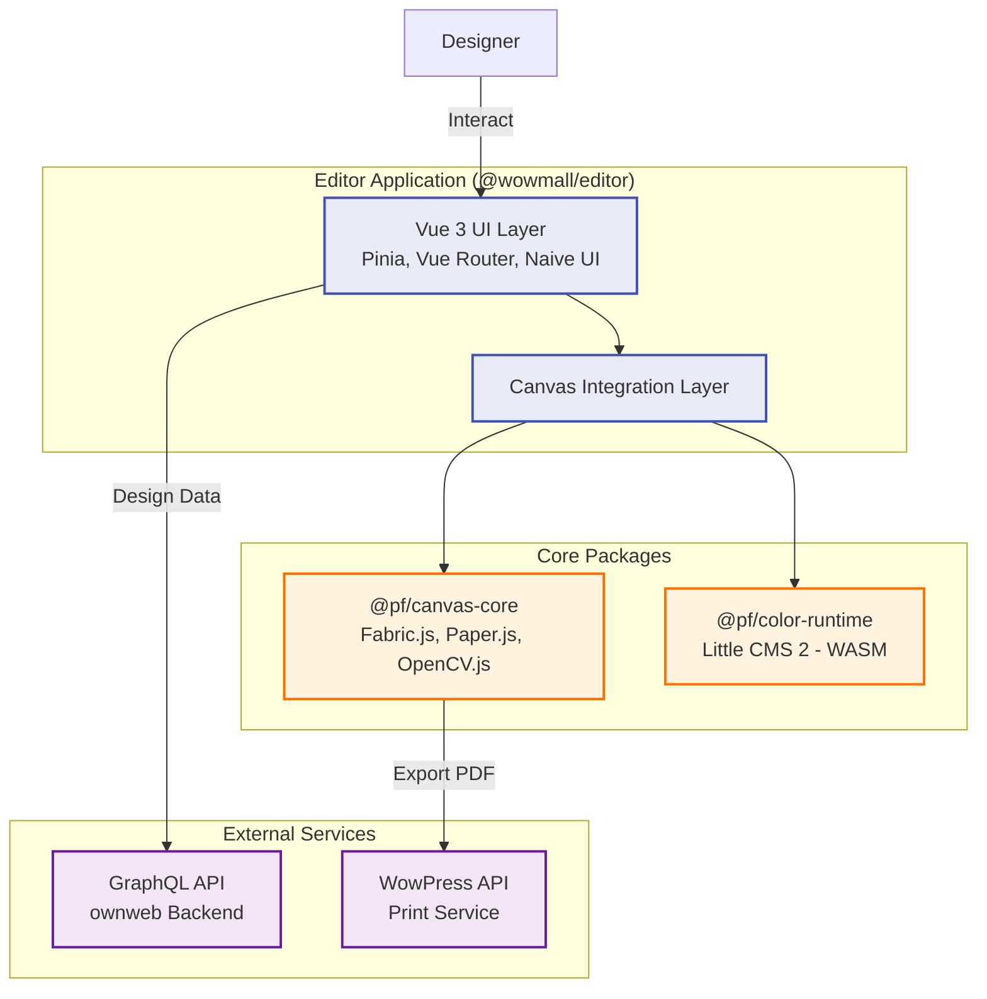

---

## 3. 기술 스택

### 3.1 코어
- **모노레포 관리**: pnpm, Turborepo
- **언어**: TypeScript
- **빌드 도구**: Vite

### 3.2 프론트엔드 애플리케이션 (apps/web)
- **프레임워크**: Vue 3 (Composition API)
- **상태 관리**: Pinia
- **라우팅**: Vue Router
- **UI 라이브러리**: Naive UI, TailwindCSS
- **GraphQL 클라이언트**: Apollo Client

### 3.3 그래픽 & 캔버스 (packages/canvas-core)
- **캔버스 엔진**: Fabric.js, Paper.js
- **이미지 처리**: OpenCV.js (@techstark/opencv-js)
- **PDF 생성**: jsPDF, svg2pdf.js, pdf-lib
- **폰트 처리**: opentype.js, fontfaceobserver

### 3.4 색상 관리 (packages/color-runtime)
- **색상 변환**: Little CMS 2 (WebAssembly로 컴파일)
- **런타임**: WebAssembly (WASM)

---

## 4. 모노레포 구조 (Monorepo Structure)

에디터 프로젝트는 **pnpm workspaces**와 **Turborepo**를 사용하는 모노레포(Monorepo) 구조로 되어 있습니다.

### 4.1 모노레포란?

**모노레포(Monorepo)**는 여러 개의 관련 패키지나 프로젝트를 하나의 저장소에서 관리하는 방식입니다. 이와 대비되는 방식인 **멀티레포(Multirepo, Polyrepo)**는 각 패키지를 별도의 저장소에서 관리합니다.

```
# 멀티레포 (기존 방식)
canvas-core/         ← 별도 저장소
color-runtime/       ← 별도 저장소
editor-app/          ← 별도 저장소

# 모노레포 (에디터 방식)
webeasy-editor/
├── apps/
│   └── web/         ← @wowmall/editor
└── packages/
    ├── canvas-core/     ← @pf/canvas-core
    └── color-runtime/   ← @pf/color-runtime
```

### 4.2 디렉토리 구조

```
webeasy-editor/
├── pnpm-workspace.yaml    # 워크스페이스 정의
├── package.json           # 루트 패키지 (스크립트, devDependencies)
├── turbo.json             # Turborepo 빌드 설정
├── apps/
│   └── web/               # 메인 에디터 애플리케이션
│       └── package.json   # @wowmall/editor
└── packages/
    ├── canvas-core/       # 캔버스 코어 라이브러리
    │   └── package.json   # @pf/canvas-core
    └── color-runtime/     # 색상 변환 WASM 런타임
        └── package.json   # @pf/color-runtime
```

### 4.3 패키지 네이밍 컨벤션

에디터에서는 두 가지 npm 스코프(scope)를 사용합니다:

| 스코프 | 소유자 | 용도 |
|--------|--------|------|
| `@wowmall/*` | WowMall (클라이언트) | 서비스 애플리케이션 |
| `@pf/*` | PassionFactory (외주 개발사) | 코어 라이브러리 |

**@pf**는 외주 개발사인 **PassionFactory**의 약자입니다. 이렇게 분리한 이유는:

1. **소유권 구분**: 외주 개발사가 작성한 코드와 WowMall 자체 코드를 명확히 구분
2. **재사용성**: `@pf/*` 패키지는 다른 프로젝트에서도 재사용 가능하도록 범용적으로 설계
3. **유지보수**: 코어 기능(`@pf/*`)과 비즈니스 로직(`@wowmall/*`)의 책임 분리

### 4.4 workspace:* 프로토콜

모노레포 내 패키지 간 의존성은 `workspace:*` 프로토콜을 사용합니다:

```json
// apps/web/package.json (@wowmall/editor)
{
  "dependencies": {
    "@pf/canvas-core": "workspace:*",
    "@pf/color-runtime": "workspace:*"
  }
}

// packages/canvas-core/package.json (@pf/canvas-core)
{
  "dependencies": {
    "@pf/color-runtime": "workspace:*"
  }
}
```

**workspace:*의 동작:**
- 로컬 워크스페이스의 해당 패키지를 **직접 링크**
- npm에서 다운로드하지 않고 **로컬 파일 시스템**을 사용
- 코드 변경 시 **즉시 반영** (빌드 후)
- 배포 시 pnpm이 자동으로 실제 버전으로 변환

### 4.5 pnpm-workspace.yaml

워크스페이스에 포함할 디렉토리를 정의합니다:

```yaml
# pnpm-workspace.yaml
packages:
  - "apps/*"      # apps/ 하위 모든 디렉토리
  - "packages/*"  # packages/ 하위 모든 디렉토리
```

### 4.6 Turborepo 빌드 오케스트레이션

Turborepo는 모노레포의 빌드/테스트를 효율적으로 관리합니다:

```json
// turbo.json
{
  "tasks": {
    "build": {
      "dependsOn": ["^build"],  // 의존 패키지 먼저 빌드
      "outputs": ["dist/**"]
    },
    "dev": {
      "dependsOn": ["^build"],
      "cache": false
    }
  }
}
```

**`^build`의 의미:**
- `@wowmall/editor`가 `@pf/canvas-core`에 의존할 때
- `pnpm build` 실행 시 **자동으로 canvas-core를 먼저 빌드**
- 개발자가 수동으로 순서를 관리할 필요 없음

### 4.7 패키지 의존성 흐름

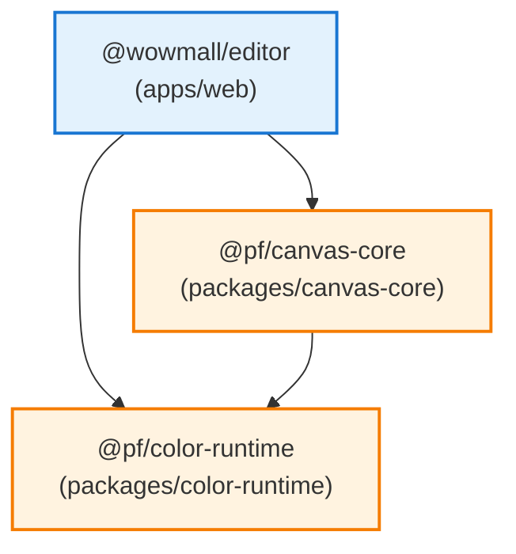

### 4.8 모노레포의 장점

| 장점 | 설명 |
|------|------|
| **원자적 변경** | 여러 패키지를 동시에 수정하고 한 번에 커밋 |
| **코드 공유** | 패키지 간 타입, 유틸리티 쉽게 공유 |
| **의존성 관리** | 공통 의존성을 루트에서 한 번만 설치 |
| **일관된 도구** | ESLint, Prettier, TypeScript 설정 공유 |
| **캐싱** | Turborepo가 빌드 결과를 캐싱하여 재빌드 속도 향상 |

---

## 5. 주요 컴포넌트

### 5.1 에디터 애플리케이션 (@wowmall/editor)
사용자를 위한 진입점입니다. UI, 사용자 상호작용을 처리하고 캔버스 코어를 통합합니다. GraphQL을 통해 백엔드와 통신하여 디자인 데이터를 가져오고 저장합니다.

### 5.2 캔버스 코어 (@pf/canvas-core)
모든 복잡한 그래픽 로직을 캡슐화합니다. Fabric.js와 Paper.js를 추상화하여 에디터에 깔끔한 API를 제공합니다.
- 캔버스 렌더링 및 조작
- 벡터화 및 이미지 처리
- PDF 내보내기 및 생성

---

## 6. 이미지 처리 및 벡터화 아키텍처 (Image Processing & Vectorization)

에디터는 **OpenCV.js**를 활용하여 클라이언트 브라우저에서 고급 이미지 처리 기능을 수행합니다. 이는 서버 부하를 줄이고 실시간 사용자 경험을 제공합니다.

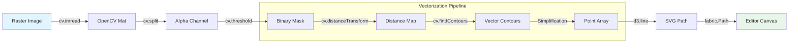

### 주요 기능

1. **자동 칼선 생성 (Auto Cut-line Generation)**:
   - 이미지의 알파 채널을 분석하여 외곽선을 추출합니다.
   - `cv.distanceTransform`을 사용하여 정밀한 **내부/외부 오프셋(Inset/Offset)**을 계산합니다.

2. **배경 제거 및 마스킹**:
   - `@imgly/background-removal`과 연동하여 전경을 분리합니다.
   - OpenCV를 통해 분리된 전경의 경계를 부드럽게 처리합니다.

3. **벡터화 (Vectorization)**:
   - 래스터 이미지를 벡터 경로(Path)로 변환하여 편집 가능한 형태로 만듭니다.
   - `d3-shape`를 사용하여 추출된 점들을 부드러운 곡선(Spline)으로 보간합니다.

---

## 7. 이미지 필터, 효과 및 특수효과 아키텍처

에디터는 이미지에 적용할 수 있는 세 가지 유형의 시각적 처리 옵션을 제공합니다: **필터 (Filters)**, **효과 (Effects)**, **특수효과 (Special Effects)**.

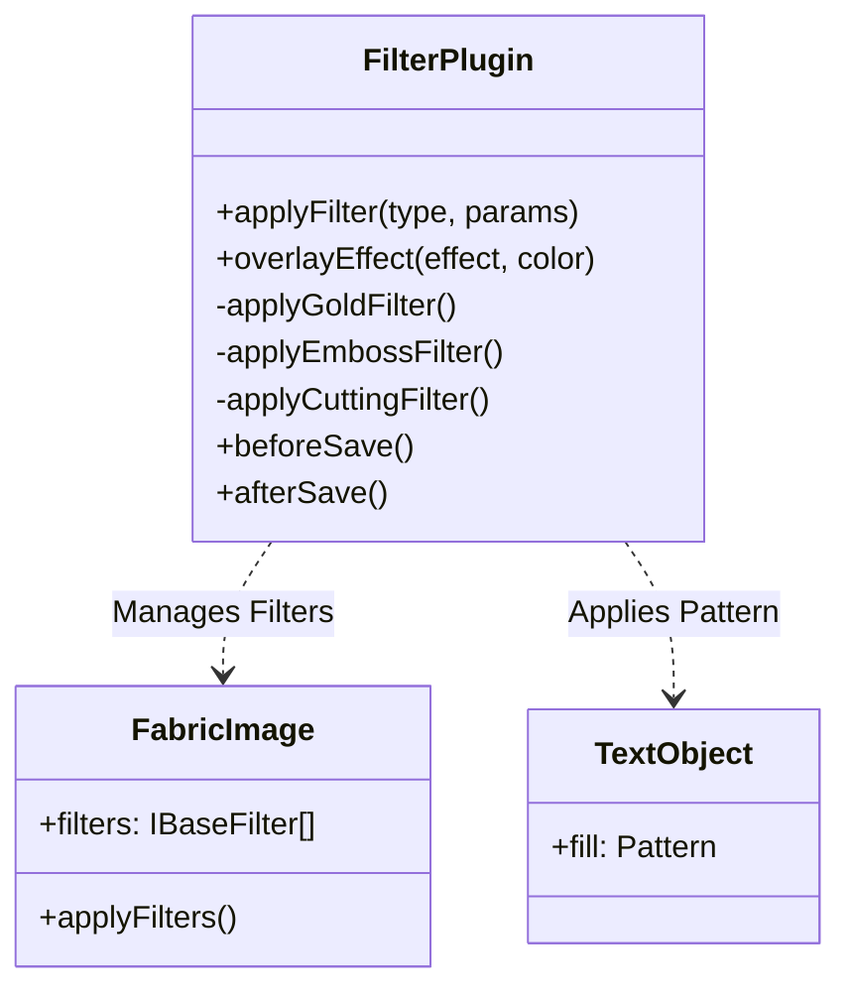

### 7.1 필터 (Filters)

**정의:** Fabric.js의 기본 WebGL 필터를 직접 사용하는 단일 이미지 처리 효과입니다.

**특징:**
- **단일 필터 적용**: 하나의 Fabric.js 필터만 사용
- **WebGL 기반**: 고성능 GPU 가속 픽셀 처리
- **이미지 전용**: `fabric.Image` 객체에만 적용 가능
- **즉시 적용**: 필터 추가 후 `applyFilters()` 호출로 즉시 렌더링

**사용 가능한 필터 목록:**
```typescript
type ImageFilterType =
  | 'None'          // 필터 없음
  | 'BlackWhite'    // 흑백
  | 'Brownie'       // 브라운 톤
  | 'Vintage'       // 빈티지
  | 'Kodachrome'    // 코다크롬
  | 'Technicolor'   // 테크니컬러
  | 'Polaroid'      // 폴라로이드
  | 'Invert'        // 색상 반전
  | 'Sepia'         // 세피아
  | 'Convolute'     // 컨볼루션 (파라미터 필요)
  | 'BlendColor'    // 색상 블렌드 (파라미터 필요)
  | 'Mask'          // 마스크 (파라미터 필요)
```

**구현 방식:**
```typescript
// FilterPlugin.applyFilter() 메서드 사용
applyFilter(name: ImageFilterType, object: fabric.Image, params: {}) {
  const Filter = fabric.Image.filters[name]
  const filterObj = new Filter(params)
  object.filters.push(filterObj)
  object.applyFilters()
}
```

### 7.2 효과 (Effects)

**정의:** 여러 개의 기본 필터를 조합하여 만든 복합 시각 효과입니다.

**특징:**
- **복합 필터 체이닝**: 2개 이상의 Fabric.js 필터를 조합
- **객체 타입별 처리**:
  - **이미지**: WebGL 필터 파이프라인 사용
  - **텍스트**: Canvas 2D API로 생성한 패턴(Pattern)을 `fill` 속성에 적용
- **메타데이터 저장**: `effects` 배열에 효과 이름 저장 (예: `['gold', 'emboss']`)
- **토글 가능**: 동일한 효과를 다시 적용하면 제거됨

**사용 가능한 효과 목록:**

| 효과 이름 | 설명 | 구성 필터 | 적용 대상 |
|---------|------|----------|---------|
| **Gold** (금박) | 황금빛 광택 효과 | `BlendColor(#FFD700, multiply)` + `Saturation(0.3)` | 이미지, 텍스트 |
| **Emboss** (엠보싱) | 양각 효과 | `Grayscale` + `Brightness(0.1)` + `Contrast(0.15)` | 이미지, 텍스트 |
| **Cutting** (커팅) | 민트 그린 하이라이트 | `BlendColor(#dbecea, lighten)` + `Brightness(0.1)` | 이미지, 텍스트 |

**구현 방식:**
```typescript
// FilterPlugin.overlayEffect() 메서드 사용
async overlayEffect(object: fabric.Object, options: { effect: string; color: string }) {
  if (object instanceof fabric.Image) {
    // 이미지: 복합 필터 적용
    switch (options.effect) {
      case 'gold':
        this.applyGoldFilter(object)  // BlendColor + Saturation
        break
      case 'emboss':
        this.applyEmbossFilter(object)  // Grayscale + Brightness + Contrast
        break
    }
    object.applyFilters()
  } else if (object.type === 'text') {
    // 텍스트: 패턴 생성 및 적용
    const pattern = await this.createEffectPatternForText(options.effect)
    object.set('fill', pattern)
  }

  // 메타데이터 저장
  object.effects.push(options.effect)
}
```

### 7.3 특수효과 (Special Effects)

**정의:** 오버레이 객체를 사용하여 구현되는 고급 시각 효과입니다.

**특징:**
- **별도 오버레이 객체**: 원본 객체와 분리된 추가 Fabric 객체 생성
- **ID 기반 연결**: `{원본ID}_gold` 형식의 ID로 원본과 연결
- **히스토리 동기화**: `HistoryPlugin`이 undo/redo 시 오버레이 위치 자동 정렬
- **세션 간 유지**: JSON 저장 시 오버레이 객체도 함께 저장되어 로드 시 복원

**구현 방식:**
```typescript
// ServicePlugin._createMaskForEffects() 메서드에서 처리
async _createMaskForEffects(obj: fabric.Object): Promise<fabric.Object> {
  const effect = obj.effects[0]
  // 효과에 따른 오버레이 마스크 생성
  const overlayMask = await createOverlayForEffect(obj, effect)

  overlayMask.setOptions({
    id: obj.id + `_${effect}`,
    effects: [effect],
    extensionType: 'overlay'
  })

  return overlayMask
}

// HistoryPlugin.realignOverlays()에서 동기화
private realignOverlays() {
  const overlays = this._canvas.getObjects()
    .filter(obj => obj.extensionType === 'overlay')

  for (const overlay of overlays) {
    const originalId = overlay.id.split('_')[0]
    const originalObj = this._canvas.getObjects()
      .find(obj => obj.id === originalId)

    if (originalObj) {
      // 오버레이 위치를 원본 객체와 동기화
      overlay.set({
        left: originalObj.left,
        top: originalObj.top,
        scaleX: originalObj.scaleX,
        scaleY: originalObj.scaleY,
        angle: originalObj.angle
      })
    }
  }
}
```

### 7.4 저장 및 로드 전략 (Save & Load Strategy)

파일 크기와 성능을 최적화하기 위해 효과가 적용된 객체를 저장하고 로드할 때 다음과 같은 전략을 사용합니다:

**저장 전 (`beforeSave`):**
- **필터 제거:** 무거운 `fabric.Image.filters` 인스턴스는 이미지 객체에서 **제거**됩니다.
- **메타데이터 유지:** 효과 이름(예: `['gold', 'emboss']`)이 `effects` 속성에 저장됩니다.
- **오버레이 보존:** `extensionType === 'overlay'` 객체는 그대로 유지됩니다.

**저장 후 (`afterSave`):**
- **세션 복원:** 메모리 상의 객체에 필터를 즉시 복원하여 편집 세션을 유지합니다.

**로드 (`afterLoad`):**
- **텍스트 객체:** `fabric.Pattern`이 자동으로 복원됩니다.
- **이미지 객체:** `effects` 메타데이터를 기반으로 필터를 재적용하거나 오버레이 객체를 로드합니다.
- **오버레이 동기화:** `HistoryPlugin`이 오버레이 객체의 위치를 원본 객체와 자동으로 정렬합니다.

---

## 8. 텍스트 처리 아키텍처 (Text Processing Architecture)

에디터는 강력한 텍스트 처리 기능을 제공하며, 폰트 로딩부터 고급 효과까지 다양한 기능을 지원합니다.

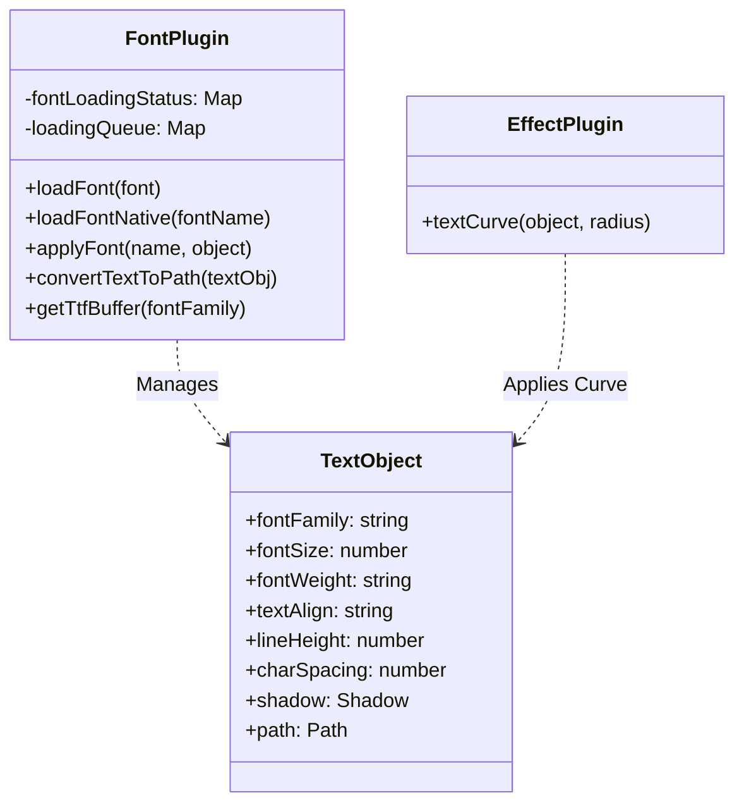

### 8.1 폰트 로딩 (Font Loading)

**정의:** 웹 폰트를 동적으로 로드하고 관리하는 시스템입니다.

**특징:**
- **이중 로딩 전략**: CSS Font Loading API (우선) + FontFaceObserver (폴백)
- **한글 정규화**: NFD/NFC 유니코드 정규화로 한글 폰트 호환성 보장
- **로딩 큐 관리**: 동일 폰트 중복 로딩 방지 및 대기열 처리
- **상태 추적**: `loading`, `loaded`, `failed` 상태 관리
- **TTF 버퍼 캐싱**: 텍스트 벡터화를 위한 TTF 파일 캐싱

**구현 방식:**
```typescript
// FontPlugin.loadFont() - 메인 로딩 메서드
async loadFont(font: FontSource): Promise<void> {
  const serverFontName = normalizeFontName(font.name) // NFD 정규화

  // 중복 로딩 방지
  if (this.fontLoadingStatus.get(serverFontName) === 'loaded') {
    return Promise.resolve()
  }

  // 로딩 중이면 큐에 추가
  if (this.fontLoadingStatus.get(serverFontName) === 'loading') {
    return new Promise((resolve, reject) => {
      this.loadingQueue.get(serverFontName)!.push({ resolve, reject })
    })
  }

  // CSS Font Loading API 사용
  return this.loadFontNative(serverFontName)
}

// FontPlugin.loadFontNative() - 네이티브 API 로딩
private async loadFontNative(fontName: string): Promise<void> {
  const testText = createNormalizedTestText() // NFD/NFC 테스트 텍스트
  const fontSpec = `40px "${fontName}"`

  // 1. 폰트 로드
  await document.fonts.load(fontSpec, testText)

  // 2. 사용 가능 여부 검증
  if (!document.fonts.check(fontSpec)) {
    throw new Error(`폰트 사용 불가: ${fontName}`)
  }

  // 3. 브라우저 메트릭 계산 대기 (30ms + 2 RAF)
  await new Promise(resolve => requestAnimationFrame(resolve))
  await new Promise(resolve => requestAnimationFrame(resolve))
  await new Promise(resolve => setTimeout(resolve, 30))
}
```

**한글 정규화 처리:**
```typescript
// NFD 정규화 (서버와 일관성 유지)
function normalizeFontName(fontName: string): string {
  return fontName.normalize('NFD')
}

// NFD/NFC 교차 매칭
function findFontVariantMatch(targetName: string, loadedFonts: Map): string | null {
  const nfd = targetName.normalize('NFD')
  const nfc = targetName.normalize('NFC')

  if (loadedFonts.has(nfd)) return nfd
  if (loadedFonts.has(nfc)) return nfc
  return null
}
```

### 8.2 텍스트 속성 (서식) (Text Properties)

**정의:** 텍스트 객체에 적용할 수 있는 다양한 서식 속성입니다.

**지원 속성:**

| 속성 | 타입 | 설명 | UI 컨트롤 |
|-----|------|------|----------|
| **fontFamily** | `string` | 폰트 패밀리 | FontPreviewDropdown |
| **fontSize** | `number` | 폰트 크기 (px) | ControlInput (슬라이더) |
| **fontWeight** | `'normal' \| 'bold'` | 폰트 굵기 | 토글 버튼 (B) |
| **underline** | `boolean` | 밑줄 | 토글 버튼 (U) |
| **textAlign** | `'left' \| 'center' \| 'right'` | 텍스트 정렬 | 정렬 버튼 그룹 |
| **lineHeight** | `number` | 줄 간격 | ControlInput (슬라이더) |
| **charSpacing** | `number` | 자간 (글자 간격) | ControlInput (슬라이더) |

**혼합 스타일 (Mixed Styles) 지원:**
- **선택 범위 스타일링**: 텍스트의 일부만 선택하여 다른 속성 적용 가능
- **Mixed 상태 표시**: 선택 범위 내 속성이 혼합된 경우 'mixed' 표시
- **styles 속성**: Fabric.js의 `styles` 객체로 문자별 스타일 저장

**구현 방식:**
```typescript
// TextAttributes.vue - 선택 범위 속성 수집
function collectRangeValues<T>(
  obj: fabric.IText,
  prop: keyof fabric.IText,
  start?: number,
  end?: number
): Set<T> {
  const values = new Set<T>()
  const hasSelection = obj.selectionStart !== obj.selectionEnd

  if (hasSelection) {
    // 선택 범위의 각 문자 스타일 수집
    for (let i = start!; i < end!; i++) {
      const lineIndex = obj.get2DCursorLocation(i).lineIndex
      const charIndex = obj.get2DCursorLocation(i).charIndex
      const charStyle = obj.styles?.[lineIndex]?.[charIndex]
      values.add(charStyle?.[prop] || obj[prop])
    }
  } else {
    // 전체 텍스트 속성
    values.add(obj[prop] as T)
  }

  return values
}

// 속성 변경 (선택 범위 우선)
function onChangeFontSize(e: FocusEvent) {
  const obj = activeSelection.value[0] as fabric.IText
  const value = parseInt(e.target.value)

  if (obj.selectionStart !== obj.selectionEnd) {
    // 선택 범위에만 적용
    obj.setSelectionStyles({ fontSize: value })
  } else {
    // 전체 텍스트에 적용
    obj.set('fontSize', value)
  }

  canvas.renderAll()
}
```

### 8.3 텍스트 특수효과

**지원 효과:**
- **Gold (금박)**: 황금빛 패턴 채우기
- **Emboss (엠보싱)**: 양각 효과
- **Cutting (커팅)**: 민트 그린 하이라이트

**패턴 생성 (Gold 효과 예시):**
```typescript
// utils/effects/gold.ts
function createGoldPatternCanvas(): HTMLCanvasElement {
  const size = 256
  const canvas = document.createElement('canvas')
  canvas.width = canvas.height = size
  const ctx = canvas.getContext('2d')!

  // 금색 그라데이션
  const gradient = ctx.createLinearGradient(0, 0, size, size)
  gradient.addColorStop(0, '#FFD700')
  gradient.addColorStop(0.5, '#FFA500')
  gradient.addColorStop(1, '#FFD700')

  ctx.fillStyle = gradient
  ctx.fillRect(0, 0, size, size)

  // 노이즈 텍스처 추가
  addNoiseTexture(ctx, size, 0.15)

  // 하이라이트 추가
  addSpecularHighlights(ctx, size, 8)

  return canvas
}
```

### 8.4 그림자 (Shadow)

**정의:** 텍스트 및 객체에 그림자 효과를 적용합니다.

**특징:**
- **Fabric.Shadow 사용**: Fabric.js의 네이티브 그림자 기능
- **속성 제어**: 색상, 흐림, X/Y 오프셋
- **효과와 연동**: Emboss 효과 적용 시 자동 그림자 추가

**구현 방식:**
```typescript
// fabric.Shadow 객체 생성
const shadow = new fabric.Shadow({
  color: 'rgba(0, 0, 0, 0.35)',
  blur: 6,
  offsetX: 2,
  offsetY: 2
})

// 텍스트 객체에 적용
textObject.set('shadow', shadow)
canvas.renderAll()

// 그림자 제거
textObject.set('shadow', null)
```

### 8.5 곡선 텍스트 (Curved Text)

**정의:** 텍스트를 곡선 경로를 따라 배치하는 기능입니다.

**특징:**
- **SVG Path 기반**: Fabric.js의 `path` 속성 활용
- **양방향 곡선**: 위쪽(upward) / 아래쪽(downward) 곡선 지원
- **동적 조정**: 반지름, 간격, 방향 실시간 조정
- **자동 재계산**: 텍스트 길이 변경 시 반지름 자동 조정

**SVG Path 기반 곡선:**
```typescript
// TextEffect.vue - SVG Path 생성
function generatePathData(r: number, reverse: boolean = false) {
  return `
    M ${-r}, ${0}
    A ${r} ${r} 0 1 ${!reverse ? 1 : 0} ${r}, 0
  `
}

// 곡선 적용
function curveText() {
  const pathData = generatePathData(radius.value, curveDirection.value === 'downward')
  const path = new fabric.Path(pathData, {
    stroke: '#000',
    strokeWidth: 0,
    fill: ''
  })

  // Path 세그먼트 정보 계산
  path.segmentsInfo = fabric.util.getPathSegmentsInfo(path.path)

  // 텍스트 객체에 path 적용
  textObject.set({
    path,
    extensionType: 'curveText',
    curveRadius: radius.value,
    charSpacing: gap.value,
    curveDirection: curveDirection.value
  })
}

// 반지름 자동 계산
function calcRadius(count: number): number {
  const effectiveSize = fontSize + gap / 2
  const textLength = effectiveSize * count
  return textLength / Math.PI
}
```

**UI 컨트롤:**
- **반지름 슬라이더**: 곡선의 반지름 조정
- **간격 슬라이더**: 글자 간 간격 조정
- **방향 선택**: 위쪽/아래쪽 곡선 토글
- **자동 조정**: 텍스트 입력 시 반지름 자동 재계산

### 8.6 텍스트 벡터화 (Text to Path Conversion)

**정의:** 텍스트 객체를 편집 불가능한 벡터 경로로 변환합니다.

**특징:**
- **SVG 기반 변환**: `convertSvgTextToPath` 유틸리티 사용
- **혼합 스타일 지원**: 다양한 폰트/크기/색상 혼합 가능
- **변환 보존**: 회전, 기울임, 반전 등 변환 유지
- **TTF 버퍼 활용**: 정확한 글리프 렌더링

**구현 방식:**
```typescript
// FontPlugin.convertTextToPath()
async convertTextToPath(textObj: fabric.Text): Promise<fabric.Object | null> {
  // 1. 텍스트를 SVG로 변환
  const svgString = textObj.toSVG()

  // 2. 사용된 모든 폰트 수집 (styles 포함)
  const fontsToLoad = new Set<string>([textObj.fontFamily])
  // ... styles 속성에서 폰트 수집 ...

  // 3. 모든 폰트의 TTF buffer 로드
  for (const font of fontsToLoad) {
    await this.getTtfBuffer(font)
  }

  // 4. SVG text → path 변환
  const { svg: pathSvg } = await convertSvgTextToPath(mainTtfBuffer, svgString)

  // 5. Fabric.js로 로드
  return new Promise((resolve) => {
    fabric.loadSVGFromString(pathSvg, (objects) => {
      const group = new fabric.Group(objects)
      resolve(group)
    })
  })
}
```

---

## 9. WASM 컬러 엔진 아키텍처 (WASM Color Engine Architecture)

에디터의 핵심 차별화 요소인 **클라이언트 사이드 색상 관리 시스템**은 WebAssembly를 통해 구현되었습니다.

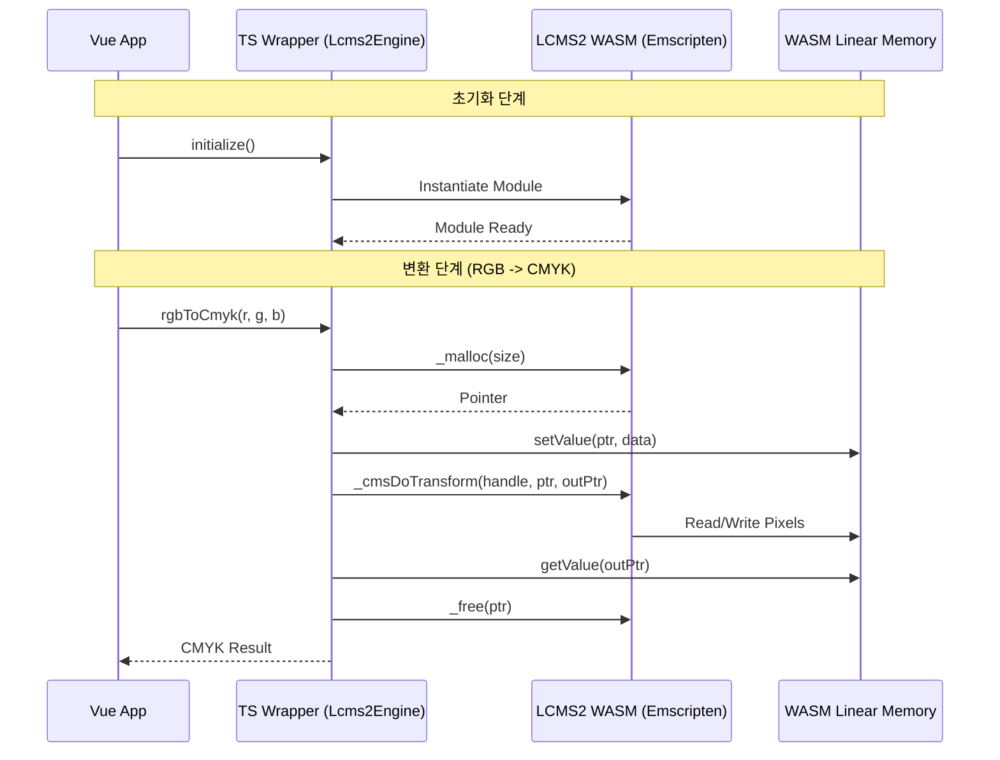

### 주요 특징

1. **Little CMS 2 (v2.16)**: 업계 표준 오픈소스 색상 관리 엔진(C언어)을 사용합니다.

2. **Emscripten 컴파일**:
   - 최적화 플래그: `-O3`, `-flto` (Link Time Optimization)
   - 환경: Web, Worker, Node.js 호환

3. **성능 최적화**:
   - **Transform 캐싱**: 비용이 높은 Transform 생성 작업을 메모리에 캐싱하여 재사용합니다.
   - **직접 메모리 접근**: `setValue`/`getValue`를 통해 JS와 WASM 힙 메모리 간 데이터를 효율적으로 교환합니다.

4. **정확성**:
   - **Black Point Compensation (BPC)**: Adobe Photoshop과 동일한 렌더링 결과를 보장하기 위해 BPC 플래그를 활성화했습니다.
   - **ICC 프로파일 지원**: 표준 프로파일(Japan Color 2001 등) 및 커스텀 프로파일을 지원합니다.

---

## 10. 템플릿 저장/로드 아키텍처 (Template Save/Load Architecture)

에디터는 사용자 디자인 저장, 템플릿 로드, 관리자용 템플릿 생성 등 다양한 저장/로드 시나리오를 지원합니다.

### 10.1 아키텍처 개요

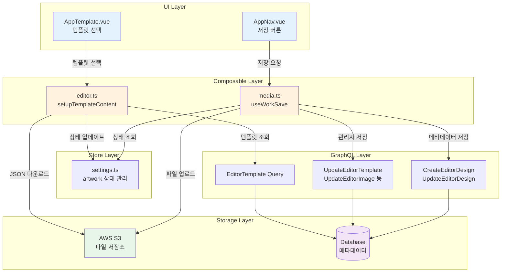

### 10.2 템플릿 저장 흐름 (Save Flow)

#### 10.2.1 저장 트리거

| UI 요소 | 동작 | 대상 사용자 |
|---------|------|------------|
| "내 작업에 저장" 버튼 | `saveWork()` | 일반 사용자 |
| "편집완료" 버튼 | `saveForAdmin(finishEdit)` | 관리자 |
| PDF 내보내기 | `saveAllPagesToSinglePDF()` | 모든 사용자 |
| 자동 저장 | 5분 주기 자동 호출 | 모든 사용자 |

#### 10.2.2 저장 처리 단계

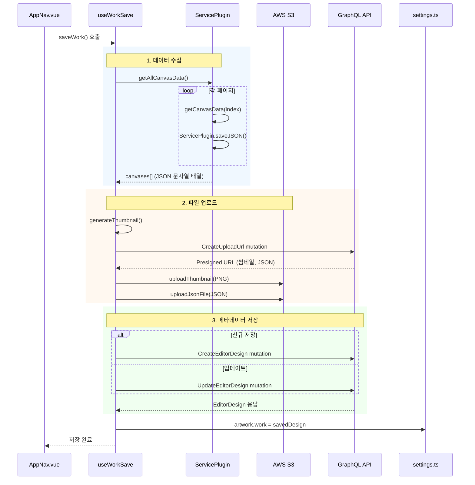

#### 10.2.3 저장 데이터 구조

**workState 객체:**
```typescript
interface WorkState {
  name: string              // 작업명
  productId: string         // 상품 ID
  sizeNo: string           // 사이즈 번호
  totalPage: number        // 총 페이지 수
  settings: CanvasSettings // 캔버스 설정
  canvases: string[]       // 각 페이지 JSON 데이터
}
```

**EditorDesign 저장 구조:**
```typescript
interface EditorDesignInput {
  image: { originalSource: string }  // 썸네일 S3 URL
  media: { originalSource: string }  // JSON 데이터 S3 URL
  name: string                       // 작업명
  metadata: {
    sizeinfo: WowPressProductSize
    productId: string
    sizeNo: string
    totalPage: number
    settings: CanvasSettings
    content?: { type: string, id: string }  // 관리자용
  }
}
```

#### 10.2.4 S3 업로드 데이터 상세

에디터에서 S3에 업로드하는 데이터는 **2가지 파일**입니다:

**1. 썸네일 이미지 (PNG)**

| 항목 | 내용 |
|------|------|
| **형식** | PNG (image/png) |
| **품질** | 80% (`quality: 0.8`) |
| **크기** | workspace 영역 크기 (캔버스 실제 작업 영역) |
| **파일명** | `{작업명}_{타임스탬프}_thumbnail.png` |

**생성 과정:**
1. Canvas에서 workspace 영역만 추출
2. 제외 객체 제거: `cutline-template`, `cut-border`, `safe-zone-border`, `page-outline`, 가이드라인
3. 뷰포트 초기화 (zoom/pan 제거)
4. DataURL → Blob → File 변환
5. S3 업로드

**2. 캔버스 데이터 (JSON)**

| 항목 | 내용 |
|------|------|
| **형식** | JSON (application/json) |
| **내용** | 모든 페이지의 Fabric.js 캔버스 상태 배열 |
| **파일명** | `{작업명}_{타임스탬프}.json` |

**JSON 구조:**
```json
[
  {
    "version": "5.x.x",
    "objects": [
      {
        "type": "textbox",
        "id": "text_001",
        "extensionType": "text",
        "left": 100,
        "top": 200,
        "text": "Hello World",
        "fontFamily": "나눔고딕",
        "fontSize": 24,
        "fill": "#000000"
      },
      {
        "type": "image",
        "id": "img_001",
        "src": "https://...",
        "left": 300,
        "top": 100,
        "scaleX": 0.5,
        "scaleY": 0.5,
        "filters": [],
        "effects": ["gold"]
      }
    ],
    "background": "#ffffff",
    "width": 1000,
    "height": 1400
  }
]
```

**포함되는 객체 정보:**
- 텍스트: 폰트, 크기, 색상, 위치, 스타일, 곡선 설정
- 이미지: src (URL 또는 Base64), 크기, 위치, 필터, 효과
- 도형: 타입, 채우기, 테두리, 위치
- 그룹: 포함된 객체들
- 오버레이: 효과 적용 객체 (금박, 엠보싱 등)
- 칼선 템플릿: cutline-template 객체

**이미지 src 저장 형식:**

이미지의 `src` 속성은 상황에 따라 다른 형식으로 저장됩니다:

| 케이스 | src 저장 형태 | 원인 |
|--------|--------------|------|
| CDN 이미지 로드 | URL (`https://...`) | 원본 URL 유지 |
| 로컬 파일 업로드 | Base64 data URL | `FileReader.readAsDataURL()` |
| 이미지 처리 후 | Base64 data URL | `canvas.toDataURL()` 결과 |
| 필터/효과 적용 후 | Base64 data URL | Fabric.js 내부 처리 |

**Base64 저장 방식의 설계 의도:**

에디터의 최종 목표는 **인쇄용 PDF 생성**입니다. 이 워크플로우에서 Base64 인라인 저장은 의도된 설계입니다:

```
이미지 처리 (배경 제거, 필터 등)
    ↓
toDataURL() → Base64 저장  ← 처리 결과 보존
    ↓
JSON 저장 (Base64 포함)
    ↓
PDF 생성 시 바로 임베딩  ← 추가 네트워크 요청 불필요
```

**Base64 방식의 장점 (인쇄 워크플로우 관점):**

1. **Self-contained PDF**: 인쇄용 PDF는 모든 리소스를 내장해야 함
2. **처리 결과 보존**: 배경 제거, 필터 적용 등의 결과는 원본 URL과 다름
3. **네트워크 독립성**: PDF 생성 시 외부 URL fetch 불필요
4. **안정성**: CDN 장애나 오프라인 상황에서도 PDF 생성 가능

**트레이드오프:**

- JSON 파일 크기 증가 (이미지가 많을수록 커짐)
- S3 저장 비용 증가

이는 인쇄 품질과 안정성을 위한 의도적인 트레이드오프입니다.

**3. Presigned URL 발급**

```graphql
mutation CreateUploadUrl($input: CreateUploadUrlInput!) {
  createUploadUrl(input: $input) {
    finalPath           # 최종 S3 경로
    url {
      url               # 업로드용 Presigned URL
      expiresAt         # 만료 시간 (ISO-8601)
    }
  }
}
```

| 입력 파라미터 | 값 |
|-------------|-----|
| `filename` | 파일명 (정규식: `^[\w\-. \p{IsHangul}]+$`) |
| `contentType` | `image/png` 또는 `application/json` |
| `purpose` | `PERSONAL_DOCUMENT` |
| `accessLevel` | `PRIVATE` (파일 소유자만 접근) |
| `expiresIn` | `PT24H` (24시간 유효) |

**4. S3 저장 경로**

| 파일 타입 | 경로 패턴 |
|----------|----------|
| 썸네일 | `users/{userId}/personal-document/{baseFileName}_thumbnail.png` |
| JSON | `users/{userId}/personal-document/{baseFileName}.json` |

#### 10.2.5 관리자 저장 흐름

관리자는 디자인 저장 후 추가로 콘텐츠 타입에 따른 업데이트를 수행합니다:

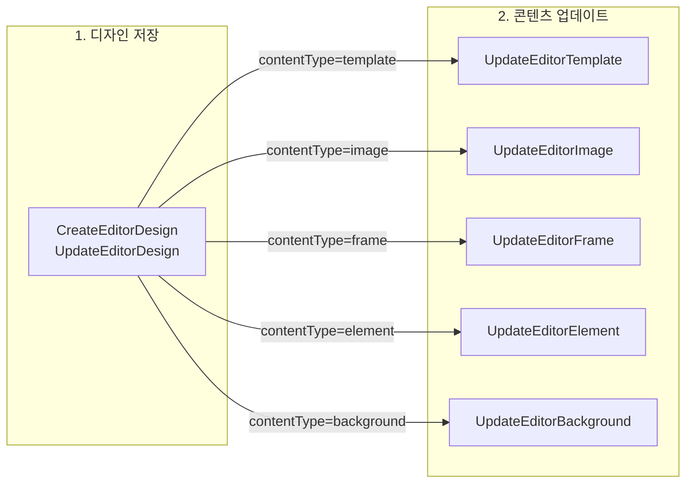

### 10.3 템플릿 로드 흐름 (Load Flow)

#### 10.3.1 로드 트리거

템플릿 로드는 `AppTemplate.vue`에서 사용자가 템플릿을 선택할 때 시작됩니다:

```
템플릿 목록 → 템플릿 클릭 → addContentToCanvas(content) → setupTemplateContent(content)
```

#### 10.3.2 로드 처리 단계

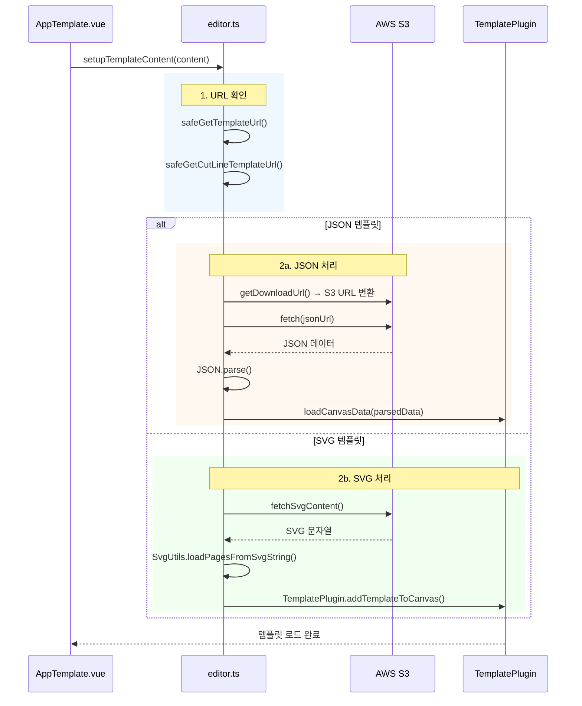

#### 10.3.3 템플릿 데이터 구조

**EditorTemplate 구조:**
```typescript
interface EditorTemplate {
  id: string
  name: string
  design: {
    document: { url: string }  // JSON 또는 SVG URL
  }
  image: {
    image: { url: string }     // 썸네일 URL
  }
  cutLineTemplate?: {
    image: { url: string }     // 칼선 템플릿 URL
  }
  tags: string[]
  colors: string[]
  metadata: Record<string, any>
}
```

### 10.4 템플릿 데이터 저장소 (Template Data Storage)

템플릿 데이터는 **2개의 저장소**에 나뉘어 저장됩니다:

#### 10.4.1 저장소 구조

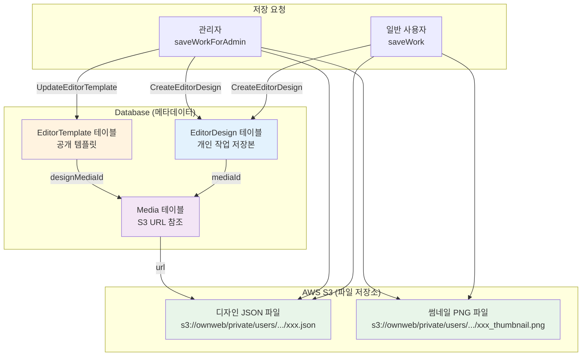

#### 10.4.2 EditorDesign vs EditorTemplate

| 구분 | EditorDesign | EditorTemplate |
|------|--------------|----------------|
| **소유권** | 개별 사용자 (userId) | 관리자/스토어 (storeId) |
| **용도** | 개인 작업 저장본 | 재사용 가능한 공개 템플릿 |
| **저장 주체** | 일반 사용자 | 관리자 |
| **접근 범위** | 개인 전용 | 글로벌 또는 스토어별 |
| **추가 필드** | - | code, tags, colors, category, cutLineTemplate |

#### 10.4.3 데이터베이스 스키마

**EditorDesign 테이블:**
```sql
editor_design (
  id,
  name,
  mediaId,        -- → Media 테이블 (디자인 JSON S3 URL)
  imageId,        -- → Media 테이블 (썸네일 S3 URL)
  userId,         -- 소유자
  metadata,       -- JSON (productId, sizeNo, settings 등)
  createdAt,
  updatedAt
)
```

**EditorTemplate 테이블:**
```sql
editor_template (
  id,
  code,           -- 템플릿 코드
  name,
  designMediaId,  -- → Media 테이블 (디자인 JSON S3 URL)
  imageId,        -- → Media 테이블 (썸네일 S3 URL)
  cutLineTemplateId, -- → 칼선 템플릿
  storeId,        -- 스토어 ID (글로벌이면 NULL)
  tags,           -- 태그 배열
  colors,         -- 색상 배열
  category,       -- 카테고리
  sizeNo,         -- 사이즈 번호
  metadata,       -- JSON
  createdAt,
  updatedAt
)
```

**Media 테이블:**
```sql
media (
  id,
  url,            -- S3 URL (s3://ownweb/...)
  contentType,    -- image/png, application/json
  ...
)
```

#### 10.4.4 S3 저장 경로

| 데이터 타입 | S3 경로 패턴 |
|------------|-------------|
| 디자인 JSON | `s3://ownweb/private/users/{userId}/editor/{uuid}-{timestamp}.json` |
| 썸네일 PNG | `s3://ownweb/private/users/{userId}/editor/{uuid}_thumbnail.png` |

#### 10.4.5 데이터 흐름 비교

**일반 사용자 저장:**
```
saveWork()
    ↓
S3 업로드 (JSON + 썸네일)
    ↓
CreateEditorDesign 뮤테이션
    ↓
EditorDesign 레코드 생성
    └── mediaId → Media (S3 URL)
```

**관리자 템플릿 저장:**
```
saveWorkForAdmin()
    ↓
S3 업로드 (JSON + 썸네일)
    ↓
CreateEditorDesign 뮤테이션
    ↓
EditorDesign 레코드 생성
    ↓
UpdateEditorTemplate 뮤테이션  ← 추가 단계
    ↓
EditorTemplate 레코드 업데이트
    └── designMediaId → Media (S3 URL)
```

### 10.5 핵심 파일 경로

| 레이어 | 파일 경로 | 역할 |
|--------|----------|------|
| UI | `apps/web/src/components/AppNav.vue` | 저장 버튼 UI 및 이벤트 처리 |
| UI | `apps/web/src/tools/AppTemplate.vue` | 템플릿 목록 및 선택 UI |
| Composable | `apps/web/src/composables/media.ts` | `useWorkSave` - 저장 핵심 로직 |
| Composable | `apps/web/src/composables/editor.ts` | `setupTemplateContent` - 템플릿 로드 로직 |
| Store | `apps/web/src/stores/settings.ts` | 아트워크 상태 관리 (`artwork.work`) |
| GraphQL | `apps/web/src/graphql/mutations/editor-design.graphql` | 디자인 저장 뮤테이션 |
| GraphQL | `apps/web/src/graphql/mutations/editor-content.graphql` | 콘텐츠 업데이트 뮤테이션 |
| Plugin | `packages/canvas-core/src/plugins/ServicePlugin.ts` | `saveJSON()` - 캔버스 직렬화 |
| Plugin | `packages/canvas-core/src/plugins/TemplatePlugin.ts` | 템플릿 캔버스 적용 |

### 10.6 저장/로드 특징

| 특징 | 설명 |
|------|------|
| **S3 저장소 활용** | 파일(JSON, PNG)은 AWS S3에 저장, 메타데이터는 DB에 저장 |
| **Presigned URL** | `CreateUploadUrl` 뮤테이션으로 임시 업로드 URL 생성 |
| **다중 페이지 지원** | 배열 형식으로 여러 페이지 JSON 저장 |
| **권한 분리** | 일반 사용자는 EditorDesign만, 관리자는 콘텐츠까지 업데이트 |
| **자동 썸네일** | Canvas에서 PNG 썸네일 자동 생성 |
| **파일 타입 분기** | JSON 템플릿과 SVG 템플릿 각각 다른 로드 경로 |

---

## 11. 향후 개선 항목

에디터 개선 항목들은 별도의 개선안 문서에서 관리됩니다.

> **[EDITOR-IMPROVEMENT.md](./EDITOR-IMPROVEMENT.md)** 참조
