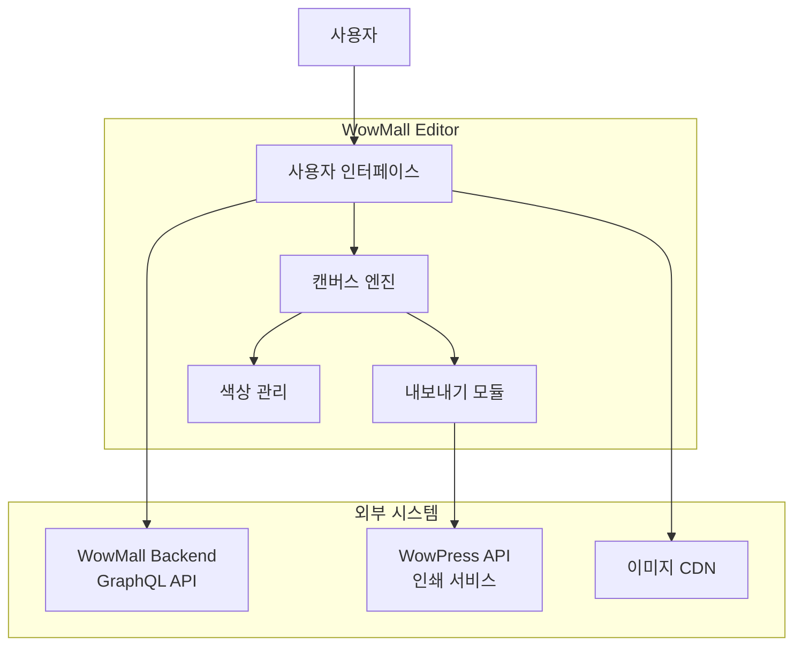

# WowMall Editor 요구사항정의서 (SRS)

> **Software Requirements Specification**
>
> 버전: 1.0
> 작성일: 2025-12-02
> 작성자: 전산사업부
> 문서 ID: WOWMALL-EDITOR-SRS-001

---

## 목차

1. [개요](#1-개요)
2. [시스템 개요](#2-시스템-개요)
3. [기능 요구사항](#3-기능-요구사항)
4. [비기능 요구사항](#4-비기능-요구사항)
5. [인터페이스 요구사항](#5-인터페이스-요구사항)
6. [데이터 요구사항](#6-데이터-요구사항)
7. [제약사항](#7-제약사항)
8. [부록](#8-부록)

---

## 1. 개요

### 1.1 문서 목적

본 문서는 WowMall Editor의 소프트웨어 요구사항을 정의합니다. 개발팀, 테스트팀, 관련 이해관계자가 시스템의 기능 및 비기능 요구사항을 명확히 이해하고 구현할 수 있도록 작성되었습니다.

### 1.2 문서 범위

- 에디터 코어 기능 (캔버스 편집, 객체 조작)
- 텍스트/이미지/도형 처리 기능
- 색상 관리 시스템
- 템플릿 시스템
- 파일 내보내기 기능
- WowPress API 연동

### 1.3 용어 정의

| 용어 | 정의 |
|------|------|
| **캔버스** | 사용자가 디자인을 편집하는 작업 영역 |
| **객체** | 캔버스에 배치되는 텍스트, 이미지, 도형 등의 요소 |
| **칼선** | 인쇄물 재단을 위한 절단 가이드 라인 |
| **안전 영역** | 재단 시 잘리지 않도록 보장되는 내부 영역 |
| **재단선** | 최종 인쇄물의 외곽 절단선 |
| **도련** | 재단선 바깥으로 확장되는 여백 영역 (Bleed) |
| **CMYK** | 인쇄용 색상 모드 (Cyan, Magenta, Yellow, Key) |
| **RGB** | 화면 표시용 색상 모드 (Red, Green, Blue) |
| **ICC 프로파일** | 색상 변환을 위한 국제 표준 프로파일 |
| **벡터화** | 래스터 이미지를 벡터 경로로 변환 |
| **목업** | 디자인을 실제 제품에 적용한 모습의 시뮬레이션 |

### 1.4 참조 문서

| 문서명 | 버전 | 설명 |
|--------|------|------|
| EDITOR-PRD.md | 1.0 | 제품 요구사항 정의서 |
| EDITOR-ARCHITECTURE.md | 1.0 | 에디터 아키텍처 설계서 |
| WOWPRESS-API-INTERFACE.md | 1.0 | WowPress API 인터페이스 정의서 |
| 2026-development-plan.md | 1.0 | 2026년 개발 계획서 |

---

## 2. 시스템 개요

### 2.1 시스템 목적

WowMall Editor는 웹 브라우저에서 동작하는 그래픽 디자인 에디터로, 사용자가 인쇄물을 직접 디자인하고 주문할 수 있는 통합 솔루션을 제공합니다.

### 2.2 시스템 범위



### 2.3 사용자 유형

| 사용자 유형 | 설명 | 접근 권한 |
|------------|------|----------|
| **일반 사용자** | 디자인 편집 및 주문 | 기본 편집, 템플릿 사용, 주문 |
| **관리자** | 템플릿 관리, 시스템 설정 | 전체 기능 + 관리 기능 |
| **파트너** | 샵 맞춤 템플릿 관리 | 기본 편집 + 샵 템플릿 관리 |

### 2.4 운영 환경

| 항목 | 사양 |
|------|------|
| **클라이언트** | 웹 브라우저 (Chrome, Firefox, Safari, Edge) |
| **최소 해상도** | 1280 x 720 |
| **권장 해상도** | 1920 x 1080 이상 |
| **네트워크** | 인터넷 연결 필수 (HTTPS) |
| **입력 장치** | 마우스, 키보드 (터치 부분 지원) |

---

## 3. 기능 요구사항

### 3.1 캔버스 관리 (FR-CANVAS)

#### FR-CANVAS-001: 캔버스 초기화

| 항목 | 내용 |
|------|------|
| **요구사항 ID** | FR-CANVAS-001 |
| **요구사항명** | 캔버스 초기화 |
| **우선순위** | 필수 |
| **설명** | 시스템은 상품 사양에 따라 적절한 크기의 캔버스를 초기화해야 한다 |
| **입력** | 상품 ID, 사이즈 번호 |
| **처리** | 1. 상품 정보 조회<br/>2. 사이즈 정보 추출<br/>3. 캔버스 크기 계산 (너비, 높이, 재단선, 안전영역)<br/>4. 캔버스 생성 및 가이드 표시 |
| **출력** | 초기화된 캔버스 객체 |
| **검증 기준** | - 캔버스 크기가 상품 사양과 일치<br/>- 재단선/안전영역 가이드가 정확히 표시됨 |

#### FR-CANVAS-002: 캔버스 줌

| 항목 | 내용 |
|------|------|
| **요구사항 ID** | FR-CANVAS-002 |
| **요구사항명** | 캔버스 줌 제어 |
| **우선순위** | 필수 |
| **설명** | 사용자는 캔버스를 확대/축소하여 세밀하게 편집할 수 있어야 한다 |
| **입력** | 마우스 휠 스크롤, 줌 버튼 클릭, 줌 레벨 직접 입력 |
| **처리** | 1. 줌 레벨 계산 (10% ~ 400%)<br/>2. 마우스 포인터 위치 기준 줌<br/>3. 캔버스 뷰포트 업데이트 |
| **출력** | 변경된 줌 레벨 표시, 캔버스 렌더링 |
| **검증 기준** | - 줌 범위: 10% ~ 400%<br/>- 마우스 포인터 위치 중심으로 줌<br/>- 현재 줌 레벨 UI 표시 |

#### FR-CANVAS-003: 캔버스 팬

| 항목 | 내용 |
|------|------|
| **요구사항 ID** | FR-CANVAS-003 |
| **요구사항명** | 캔버스 팬 (이동) |
| **우선순위** | 필수 |
| **설명** | 사용자는 캔버스를 드래그하여 뷰포트를 이동할 수 있어야 한다 |
| **입력** | 스페이스바 + 마우스 드래그, 스크롤바 |
| **처리** | 1. 팬 모드 활성화<br/>2. 드래그 거리 계산<br/>3. 뷰포트 위치 업데이트 |
| **출력** | 이동된 뷰포트 |
| **검증 기준** | - 스페이스바 + 드래그로 팬 동작<br/>- 부드러운 스크롤 |

#### FR-CANVAS-004: 눈금자 표시

| 항목 | 내용 |
|------|------|
| **요구사항 ID** | FR-CANVAS-004 |
| **요구사항명** | 눈금자 및 가이드 표시 |
| **우선순위** | 높음 |
| **설명** | 캔버스 상단과 좌측에 눈금자를 표시하여 정확한 위치/크기 확인이 가능해야 한다 |
| **입력** | 눈금자 토글 버튼, 단위 선택 (mm/px) |
| **처리** | 1. 현재 줌 레벨에 따른 눈금 간격 계산<br/>2. 눈금자 렌더링<br/>3. 마우스 위치에 따른 십자선 표시 |
| **출력** | 눈금자 UI, 현재 마우스 위치 좌표 |
| **검증 기준** | - 줌 레벨에 따라 눈금 간격 조정<br/>- mm/px 단위 전환 가능 |

#### FR-CANVAS-005: 가이드 영역 표시

| 항목 | 내용 |
|------|------|
| **요구사항 ID** | FR-CANVAS-005 |
| **요구사항명** | 재단선/안전영역 가이드 표시 |
| **우선순위** | 필수 |
| **설명** | 인쇄물의 재단선과 안전영역을 시각적으로 구분하여 표시해야 한다 |
| **입력** | 가이드 토글 버튼 |
| **처리** | 1. 재단선 (빨간색 점선) 렌더링<br/>2. 안전영역 (파란색 점선) 렌더링<br/>3. 도련 영역 표시 |
| **출력** | 가이드 라인이 표시된 캔버스 |
| **검증 기준** | - 재단선/안전영역 색상 구분 명확<br/>- 토글로 표시/숨김 가능<br/>- 가이드가 객체 편집을 방해하지 않음 |

---

### 3.2 객체 조작 (FR-OBJECT)

#### FR-OBJECT-001: 객체 선택

| 항목 | 내용 |
|------|------|
| **요구사항 ID** | FR-OBJECT-001 |
| **요구사항명** | 객체 선택 |
| **우선순위** | 필수 |
| **설명** | 사용자는 캔버스의 객체를 클릭하여 선택할 수 있어야 한다 |
| **입력** | 마우스 클릭, Shift+클릭 (다중 선택), 드래그 영역 선택 |
| **처리** | 1. 클릭 위치의 객체 탐지<br/>2. 선택 상태 업데이트<br/>3. 선택 핸들 표시<br/>4. 속성 패널 업데이트 |
| **출력** | 선택된 객체의 선택 핸들 표시, 속성 패널 |
| **검증 기준** | - 단일/다중 선택 지원<br/>- 영역 드래그 선택 지원<br/>- 선택 해제 (빈 영역 클릭) |

#### FR-OBJECT-002: 객체 이동

| 항목 | 내용 |
|------|------|
| **요구사항 ID** | FR-OBJECT-002 |
| **요구사항명** | 객체 이동 |
| **우선순위** | 필수 |
| **설명** | 선택된 객체를 드래그하여 위치를 변경할 수 있어야 한다 |
| **입력** | 마우스 드래그, 방향키, 좌표 직접 입력 |
| **처리** | 1. 드래그 시작 위치 기록<br/>2. 이동 거리 계산<br/>3. 스냅 포인트 감지<br/>4. 객체 위치 업데이트 |
| **출력** | 이동된 객체 위치, 스냅 가이드 라인 |
| **검증 기준** | - 마우스 드래그로 부드러운 이동<br/>- 방향키로 1px 이동, Shift+방향키로 10px 이동<br/>- 다른 객체/가이드에 스냅 |

#### FR-OBJECT-003: 객체 크기 조정

| 항목 | 내용 |
|------|------|
| **요구사항 ID** | FR-OBJECT-003 |
| **요구사항명** | 객체 크기 조정 |
| **우선순위** | 필수 |
| **설명** | 선택된 객체의 크기를 조정할 수 있어야 한다 |
| **입력** | 크기 조정 핸들 드래그, 크기 직접 입력 |
| **처리** | 1. 핸들 위치에 따른 크기 변경 방향 결정<br/>2. Shift 키: 비율 유지<br/>3. Alt 키: 중심점 기준 크기 조정<br/>4. 객체 크기 업데이트 |
| **출력** | 변경된 객체 크기, 크기 정보 표시 |
| **검증 기준** | - 8방향 핸들 지원<br/>- Shift: 비율 고정<br/>- Alt: 중심 기준 크기 조정 |

#### FR-OBJECT-004: 객체 회전

| 항목 | 내용 |
|------|------|
| **요구사항 ID** | FR-OBJECT-004 |
| **요구사항명** | 객체 회전 |
| **우선순위** | 필수 |
| **설명** | 선택된 객체를 회전할 수 있어야 한다 |
| **입력** | 회전 핸들 드래그, 각도 직접 입력 |
| **처리** | 1. 회전 중심점 결정 (객체 중심)<br/>2. 드래그 각도 계산<br/>3. Shift 키: 15도 단위 스냅<br/>4. 객체 회전 적용 |
| **출력** | 회전된 객체, 현재 각도 표시 |
| **검증 기준** | - 자유 회전 지원<br/>- Shift: 15도 단위 스냅<br/>- 각도 직접 입력 가능 |

#### FR-OBJECT-005: 객체 복사/붙여넣기

| 항목 | 내용 |
|------|------|
| **요구사항 ID** | FR-OBJECT-005 |
| **요구사항명** | 객체 복사/붙여넣기 |
| **우선순위** | 필수 |
| **설명** | 객체를 복사하여 같은 캔버스 또는 다른 페이지에 붙여넣을 수 있어야 한다 |
| **입력** | Ctrl+C (복사), Ctrl+V (붙여넣기), Ctrl+D (복제) |
| **처리** | 1. 선택된 객체를 클립보드에 저장<br/>2. 붙여넣기 시 원본 위치에서 10px 오프셋<br/>3. 새 객체 ID 생성<br/>4. 캔버스에 추가 |
| **출력** | 복제된 객체 |
| **검증 기준** | - 단축키 동작<br/>- 다중 객체 복사 지원<br/>- 그룹 객체 복사 지원 |

#### FR-OBJECT-006: 객체 삭제

| 항목 | 내용 |
|------|------|
| **요구사항 ID** | FR-OBJECT-006 |
| **요구사항명** | 객체 삭제 |
| **우선순위** | 필수 |
| **설명** | 선택된 객체를 삭제할 수 있어야 한다 |
| **입력** | Delete 키, Backspace 키, 컨텍스트 메뉴 |
| **처리** | 1. 선택된 객체 확인<br/>2. 히스토리에 삭제 작업 기록<br/>3. 캔버스에서 객체 제거<br/>4. 선택 해제 |
| **출력** | 객체가 제거된 캔버스 |
| **검증 기준** | - 단축키 동작<br/>- 다중 삭제 지원<br/>- Undo로 복구 가능 |

#### FR-OBJECT-007: 레이어 순서 변경

| 항목 | 내용 |
|------|------|
| **요구사항 ID** | FR-OBJECT-007 |
| **요구사항명** | 레이어 순서 변경 |
| **우선순위** | 높음 |
| **설명** | 객체의 z-index를 변경하여 앞/뒤 순서를 조정할 수 있어야 한다 |
| **입력** | 메뉴/버튼 (맨 앞으로, 앞으로, 뒤로, 맨 뒤로) |
| **처리** | 1. 현재 z-index 확인<br/>2. 새 위치 계산<br/>3. 관련 객체들의 z-index 재조정<br/>4. 캔버스 재렌더링 |
| **출력** | 순서가 변경된 객체 |
| **검증 기준** | - 4가지 순서 변경 동작 모두 지원<br/>- 레이어 패널에서 순서 드래그 가능 |

#### FR-OBJECT-008: 객체 정렬

| 항목 | 내용 |
|------|------|
| **요구사항 ID** | FR-OBJECT-008 |
| **요구사항명** | 객체 정렬 |
| **우선순위** | 높음 |
| **설명** | 다중 선택된 객체를 정렬할 수 있어야 한다 |
| **입력** | 정렬 버튼 (좌측, 중앙, 우측, 상단, 중간, 하단) |
| **처리** | 1. 선택된 객체들의 바운딩 박스 계산<br/>2. 정렬 기준점 결정<br/>3. 각 객체 위치 재계산<br/>4. 객체 위치 업데이트 |
| **출력** | 정렬된 객체들 |
| **검증 기준** | - 6방향 정렬 지원<br/>- 캔버스 기준/선택 객체 기준 정렬 옵션 |

#### FR-OBJECT-009: 객체 그룹화

| 항목 | 내용 |
|------|------|
| **요구사항 ID** | FR-OBJECT-009 |
| **요구사항명** | 객체 그룹화/해제 |
| **우선순위** | 높음 |
| **설명** | 다중 객체를 그룹으로 묶거나 해제할 수 있어야 한다 |
| **입력** | Ctrl+G (그룹화), Ctrl+Shift+G (그룹 해제) |
| **처리** | 1. 선택된 객체들을 그룹 객체로 묶기<br/>2. 그룹 내부 상대 위치 계산<br/>3. 그룹 해제 시 개별 객체로 분리 |
| **출력** | 그룹화된/해제된 객체 |
| **검증 기준** | - 그룹 전체 이동/크기 조정/회전<br/>- 중첩 그룹 지원<br/>- 그룹 내부 객체 더블클릭으로 편집 |

---

### 3.3 히스토리 관리 (FR-HISTORY)

#### FR-HISTORY-001: 실행 취소 (Undo)

| 항목 | 내용 |
|------|------|
| **요구사항 ID** | FR-HISTORY-001 |
| **요구사항명** | 실행 취소 |
| **우선순위** | 필수 |
| **설명** | 사용자의 편집 작업을 취소하고 이전 상태로 복원할 수 있어야 한다 |
| **입력** | Ctrl+Z, Undo 버튼 |
| **처리** | 1. 히스토리 스택에서 이전 상태 가져오기<br/>2. 현재 상태를 Redo 스택에 저장<br/>3. 캔버스를 이전 상태로 복원 |
| **출력** | 이전 상태의 캔버스 |
| **검증 기준** | - 최대 50단계 Undo 지원<br/>- 연속 Undo 가능<br/>- 히스토리 없을 때 비활성화 |

#### FR-HISTORY-002: 다시 실행 (Redo)

| 항목 | 내용 |
|------|------|
| **요구사항 ID** | FR-HISTORY-002 |
| **요구사항명** | 다시 실행 |
| **우선순위** | 필수 |
| **설명** | 실행 취소된 작업을 다시 적용할 수 있어야 한다 |
| **입력** | Ctrl+Y 또는 Ctrl+Shift+Z, Redo 버튼 |
| **처리** | 1. Redo 스택에서 상태 가져오기<br/>2. 현재 상태를 Undo 스택에 저장<br/>3. 캔버스에 상태 적용 |
| **출력** | 복원된 상태의 캔버스 |
| **검증 기준** | - Undo 후에만 활성화<br/>- 새 작업 시 Redo 스택 초기화 |

---

### 3.4 텍스트 기능 (FR-TEXT)

#### FR-TEXT-001: 텍스트 추가

| 항목 | 내용 |
|------|------|
| **요구사항 ID** | FR-TEXT-001 |
| **요구사항명** | 텍스트 객체 추가 |
| **우선순위** | 필수 |
| **설명** | 캔버스에 새 텍스트 객체를 추가할 수 있어야 한다 |
| **입력** | 텍스트 도구 선택 → 캔버스 클릭 |
| **처리** | 1. 클릭 위치에 텍스트 객체 생성<br/>2. 기본 텍스트 ("텍스트를 입력하세요") 설정<br/>3. 인라인 편집 모드 활성화<br/>4. 기본 폰트 적용 |
| **출력** | 편집 가능한 텍스트 객체 |
| **검증 기준** | - 클릭 위치에 텍스트 생성<br/>- 즉시 편집 모드 진입<br/>- 기본 폰트/크기 적용 |

#### FR-TEXT-002: 텍스트 편집

| 항목 | 내용 |
|------|------|
| **요구사항 ID** | FR-TEXT-002 |
| **요구사항명** | 인라인 텍스트 편집 |
| **우선순위** | 필수 |
| **설명** | 캔버스에서 직접 텍스트를 편집할 수 있어야 한다 |
| **입력** | 텍스트 객체 더블클릭, 키보드 입력 |
| **처리** | 1. 편집 모드 활성화<br/>2. 커서 위치 표시<br/>3. 키보드 입력 처리<br/>4. 실시간 렌더링 |
| **출력** | 수정된 텍스트 |
| **검증 기준** | - 커서 이동 (방향키, Home, End)<br/>- 텍스트 선택 (Shift+방향키, 더블클릭=단어, 트리플클릭=전체)<br/>- 다국어 입력 지원 (한글 조합 포함) |

#### FR-TEXT-003: 폰트 적용

| 항목 | 내용 |
|------|------|
| **요구사항 ID** | FR-TEXT-003 |
| **요구사항명** | 폰트 선택 및 적용 |
| **우선순위** | 필수 |
| **설명** | 텍스트에 다양한 웹 폰트를 적용할 수 있어야 한다 |
| **입력** | 폰트 선택 드롭다운, 폰트 검색 |
| **처리** | 1. 사용 가능한 폰트 목록 표시<br/>2. 폰트 선택 시 비동기 로딩<br/>3. 한글 정규화 처리 (NFD/NFC)<br/>4. 텍스트 객체에 폰트 적용 |
| **출력** | 폰트가 적용된 텍스트 |
| **검증 기준** | - 폰트 미리보기 표시<br/>- 로딩 인디케이터 표시<br/>- 폰트 로딩 실패 시 폴백 처리 |

#### FR-TEXT-004: 텍스트 서식

| 항목 | 내용 |
|------|------|
| **요구사항 ID** | FR-TEXT-004 |
| **요구사항명** | 텍스트 서식 설정 |
| **우선순위** | 필수 |
| **설명** | 텍스트의 크기, 굵기, 밑줄, 정렬 등을 설정할 수 있어야 한다 |
| **입력** | 속성 패널 컨트롤, 단축키 |
| **처리** | 1. 선택 범위 확인<br/>2. 해당 속성 변경<br/>3. 혼합 스타일 지원 (부분 선택 시) |
| **출력** | 서식이 적용된 텍스트 |

| 속성 | 범위 | 단축키 |
|------|------|--------|
| 폰트 크기 | 1 ~ 1000 pt | - |
| 굵게 | on/off | Ctrl+B |
| 밑줄 | on/off | Ctrl+U |
| 텍스트 정렬 | 좌/중앙/우 | - |
| 줄 간격 | 0.5 ~ 3.0 | - |
| 자간 | -100 ~ 500 | - |

#### FR-TEXT-005: 텍스트 색상

| 항목 | 내용 |
|------|------|
| **요구사항 ID** | FR-TEXT-005 |
| **요구사항명** | 텍스트 색상 설정 |
| **우선순위** | 필수 |
| **설명** | 텍스트의 채우기 색상을 설정할 수 있어야 한다 |
| **입력** | 컬러 피커, HEX 입력, CMYK 입력 |
| **처리** | 1. 색상 선택/입력<br/>2. 부분 선택 시 해당 범위에만 적용<br/>3. 색상 모드에 따른 변환 |
| **출력** | 색상이 적용된 텍스트 |
| **검증 기준** | - RGB/CMYK 모두 입력 가능<br/>- 혼합 색상 표시 (부분 선택 시) |

#### FR-TEXT-006: 텍스트 효과

| 항목 | 내용 |
|------|------|
| **요구사항 ID** | FR-TEXT-006 |
| **요구사항명** | 텍스트 특수 효과 |
| **우선순위** | 필수 |
| **설명** | 텍스트에 금박, 엠보싱, 커팅 등의 특수 효과를 적용할 수 있어야 한다 |
| **입력** | 효과 선택 버튼 |
| **처리** | 1. 효과 유형 선택<br/>2. 텍스트 객체에 효과 메타데이터 저장<br/>3. 효과 패턴/필터 적용<br/>4. 시각적 미리보기 렌더링 |
| **출력** | 효과가 적용된 텍스트 |

| 효과 | 설명 | 구현 방식 |
|------|------|----------|
| Gold (금박) | 황금빛 패턴 | Canvas 패턴 채우기 |
| Emboss (엠보싱) | 양각 효과 | Grayscale + Brightness + Contrast |
| Cutting (커팅) | 민트 그린 하이라이트 | BlendColor + Brightness |

#### FR-TEXT-007: 그림자 효과

| 항목 | 내용 |
|------|------|
| **요구사항 ID** | FR-TEXT-007 |
| **요구사항명** | 텍스트 그림자 |
| **우선순위** | 높음 |
| **설명** | 텍스트에 그림자 효과를 적용할 수 있어야 한다 |
| **입력** | 그림자 토글, 파라미터 (색상, blur, offsetX, offsetY) |
| **처리** | 1. Shadow 객체 생성<br/>2. 텍스트 객체에 적용<br/>3. 캔버스 렌더링 |
| **출력** | 그림자가 적용된 텍스트 |
| **검증 기준** | - 그림자 색상 변경 가능<br/>- blur 범위: 0 ~ 50px<br/>- offset 범위: -100 ~ 100px |

#### FR-TEXT-008: 곡선 텍스트

| 항목 | 내용 |
|------|------|
| **요구사항 ID** | FR-TEXT-008 |
| **요구사항명** | 곡선 경로 텍스트 |
| **우선순위** | 높음 |
| **설명** | 텍스트를 곡선 경로를 따라 배치할 수 있어야 한다 |
| **입력** | 곡선 텍스트 모드 활성화, 반지름/방향 조절 |
| **처리** | 1. SVG Path 생성 (Arc)<br/>2. 텍스트 객체에 path 적용<br/>3. 반지름/간격/방향 조절 UI |
| **출력** | 곡선 경로를 따르는 텍스트 |
| **검증 기준** | - 위쪽/아래쪽 곡선 방향 선택<br/>- 반지름 슬라이더로 곡률 조절<br/>- 자간 조절 가능 |

#### FR-TEXT-009: 텍스트 벡터화

| 항목 | 내용 |
|------|------|
| **요구사항 ID** | FR-TEXT-009 |
| **요구사항명** | 텍스트를 벡터 경로로 변환 |
| **우선순위** | 높음 |
| **설명** | 편집 가능한 텍스트를 벡터 경로로 변환하여 글리프 수정이 가능해야 한다 |
| **입력** | "패스로 변환" 버튼 |
| **처리** | 1. TTF 버퍼 로드<br/>2. 텍스트를 SVG 문자열로 변환<br/>3. SVG text → path 변환<br/>4. Fabric 객체로 로드 |
| **출력** | 벡터 경로 그룹 객체 |
| **검증 기준** | - 변환 후 개별 글리프 편집 가능<br/>- 혼합 스타일 텍스트 변환 지원<br/>- 변환 후 텍스트 편집 불가 안내 |

---

### 3.5 이미지 기능 (FR-IMAGE)

#### FR-IMAGE-001: 이미지 업로드

| 항목 | 내용 |
|------|------|
| **요구사항 ID** | FR-IMAGE-001 |
| **요구사항명** | 이미지 파일 업로드 |
| **우선순위** | 필수 |
| **설명** | 로컬 이미지 파일을 업로드하여 캔버스에 추가할 수 있어야 한다 |
| **입력** | 파일 선택 다이얼로그, 드래그 앤 드롭 |
| **처리** | 1. 파일 유효성 검사 (형식, 크기)<br/>2. 이미지 리사이징 (필요시)<br/>3. CDN 업로드<br/>4. 캔버스에 이미지 추가 |
| **출력** | 캔버스에 배치된 이미지 객체 |
| **검증 기준** | - 지원 형식: JPG, PNG, GIF, SVG, WebP<br/>- 최대 파일 크기: 20MB<br/>- 업로드 진행률 표시 |

#### FR-IMAGE-002: 이미지 자르기

| 항목 | 내용 |
|------|------|
| **요구사항 ID** | FR-IMAGE-002 |
| **요구사항명** | 이미지 크롭 |
| **우선순위** | 높음 |
| **설명** | 이미지의 일부 영역만 표시하도록 자를 수 있어야 한다 |
| **입력** | 크롭 도구 선택, 영역 드래그 |
| **처리** | 1. 크롭 UI 활성화<br/>2. 크롭 영역 선택<br/>3. 비율 고정 옵션 처리<br/>4. 클리핑 마스크 적용 |
| **출력** | 크롭된 이미지 |
| **검증 기준** | - 자유 크롭 및 비율 고정 (1:1, 4:3, 16:9)<br/>- 크롭 취소 가능<br/>- 원본 이미지 보존 (비파괴 편집) |

#### FR-IMAGE-003: 이미지 필터

| 항목 | 내용 |
|------|------|
| **요구사항 ID** | FR-IMAGE-003 |
| **요구사항명** | 이미지 필터 적용 |
| **우선순위** | 높음 |
| **설명** | 이미지에 다양한 시각적 필터를 적용할 수 있어야 한다 |
| **입력** | 필터 선택 UI |
| **처리** | 1. Fabric.js 필터 객체 생성<br/>2. 이미지 객체에 필터 추가<br/>3. applyFilters() 호출<br/>4. WebGL 기반 렌더링 |
| **출력** | 필터가 적용된 이미지 |

| 필터명 | 설명 |
|--------|------|
| None | 필터 없음 |
| BlackWhite | 흑백 |
| Sepia | 세피아 톤 |
| Vintage | 빈티지 |
| Polaroid | 폴라로이드 |
| Invert | 색상 반전 |
| Brownie | 브라운 톤 |
| Kodachrome | 코다크롬 |
| Technicolor | 테크니컬러 |

#### FR-IMAGE-004: 배경 제거

| 항목 | 내용 |
|------|------|
| **요구사항 ID** | FR-IMAGE-004 |
| **요구사항명** | AI 기반 배경 제거 |
| **우선순위** | 높음 |
| **설명** | 이미지의 배경을 자동으로 제거하여 전경만 남길 수 있어야 한다 |
| **입력** | "배경 제거" 버튼 |
| **처리** | 1. @imgly/background-removal 라이브러리 호출<br/>2. AI 모델로 전경/배경 분리<br/>3. 알파 채널 생성<br/>4. 결과 이미지로 교체 |
| **출력** | 배경이 제거된 이미지 |
| **검증 기준** | - 처리 진행률 표시<br/>- 취소 가능<br/>- 원본 이미지 보존 옵션 |

#### FR-IMAGE-005: 자동 칼선 생성

| 항목 | 내용 |
|------|------|
| **요구사항 ID** | FR-IMAGE-005 |
| **요구사항명** | 이미지 외곽선 자동 추출 |
| **우선순위** | 높음 |
| **설명** | 이미지의 외곽선을 자동으로 추출하여 칼선으로 사용할 수 있어야 한다 |
| **입력** | "칼선 생성" 버튼, 오프셋 값 |
| **처리** | 1. OpenCV.js로 이미지 로드<br/>2. 알파 채널 추출<br/>3. cv.findContours로 외곽선 추출<br/>4. cv.distanceTransform으로 오프셋 계산<br/>5. 벡터 경로로 변환 |
| **출력** | 칼선 경로 객체 |
| **검증 기준** | - 인셋/오프셋 조절 가능 (-20mm ~ +20mm)<br/>- 복잡한 형태도 처리 가능<br/>- 스무딩 옵션 |

---

### 3.6 도형 기능 (FR-SHAPE)

#### FR-SHAPE-001: 도형 추가

| 항목 | 내용 |
|------|------|
| **요구사항 ID** | FR-SHAPE-001 |
| **요구사항명** | 기본 도형 추가 |
| **우선순위** | 필수 |
| **설명** | 캔버스에 기본 도형을 추가할 수 있어야 한다 |
| **입력** | 도형 도구 선택, 캔버스 드래그 |
| **처리** | 1. 도형 유형 선택<br/>2. 드래그로 크기 결정<br/>3. 도형 객체 생성<br/>4. 캔버스에 추가 |
| **출력** | 도형 객체 |

| 도형 | 설명 | 파라미터 |
|------|------|----------|
| 사각형 | 직사각형/정사각형 | rx, ry (둥근 모서리) |
| 원/타원 | 원형/타원형 | 반지름 |
| 선 | 직선/화살표 | 시작점, 끝점, 화살표 옵션 |
| 다각형 | 삼각형 ~ n각형 | 꼭지점 수 |

#### FR-SHAPE-002: 도형 속성

| 항목 | 내용 |
|------|------|
| **요구사항 ID** | FR-SHAPE-002 |
| **요구사항명** | 도형 속성 설정 |
| **우선순위** | 필수 |
| **설명** | 도형의 채우기, 테두리, 투명도 등을 설정할 수 있어야 한다 |
| **입력** | 속성 패널 컨트롤 |
| **처리** | 해당 속성 값 변경 및 렌더링 |
| **출력** | 속성이 적용된 도형 |

| 속성 | 설명 | 범위/옵션 |
|------|------|----------|
| 채우기 색상 | 도형 내부 색상 | RGB/CMYK |
| 채우기 투명도 | 채우기 불투명도 | 0% ~ 100% |
| 테두리 색상 | 도형 테두리 색상 | RGB/CMYK |
| 테두리 두께 | 테두리 굵기 | 0 ~ 100px |
| 테두리 스타일 | 실선/점선/대시 | solid, dotted, dashed |
| 객체 투명도 | 전체 불투명도 | 0% ~ 100% |

---

### 3.7 색상 관리 (FR-COLOR)

#### FR-COLOR-001: 색상 모드 전환

| 항목 | 내용 |
|------|------|
| **요구사항 ID** | FR-COLOR-001 |
| **요구사항명** | RGB/CMYK 색상 모드 |
| **우선순위** | 필수 |
| **설명** | 에디터의 색상 모드를 RGB 또는 CMYK로 설정할 수 있어야 한다 |
| **입력** | 색상 모드 선택 드롭다운 |
| **처리** | 1. 색상 모드 변경<br/>2. 기존 색상값 변환<br/>3. 컬러 피커 UI 업데이트<br/>4. 색상 입력 필드 변경 |
| **출력** | 변경된 색상 모드 UI |
| **검증 기준** | - 제품 설정에 따른 기본 모드<br/>- 실시간 색상 변환 미리보기 |

#### FR-COLOR-002: 컬러 피커

| 항목 | 내용 |
|------|------|
| **요구사항 ID** | FR-COLOR-002 |
| **요구사항명** | 색상 선택 UI |
| **우선순위** | 필수 |
| **설명** | 다양한 방식으로 색상을 선택할 수 있어야 한다 |
| **입력** | 색상환, 슬라이더, 입력 필드 |
| **처리** | 색상값 파싱 및 적용 |
| **출력** | 선택된 색상 |

| 입력 방식 | 설명 |
|----------|------|
| 색상환 + 명도 | HSL 기반 선택 |
| RGB 슬라이더 | R, G, B 개별 조절 |
| CMYK 슬라이더 | C, M, Y, K 개별 조절 |
| HEX 입력 | #RRGGBB 직접 입력 |
| 스포이드 | 캔버스에서 색상 추출 |

#### FR-COLOR-003: CMYK 변환

| 항목 | 내용 |
|------|------|
| **요구사항 ID** | FR-COLOR-003 |
| **요구사항명** | 정확한 색상 변환 |
| **우선순위** | 필수 |
| **설명** | RGB ↔ CMYK 간 정확한 색상 변환이 가능해야 한다 |
| **입력** | 원본 색상값 |
| **처리** | 1. Little CMS 2 WASM 모듈 초기화<br/>2. ICC 프로파일 로드<br/>3. 색상 변환 Transform 생성<br/>4. 변환 실행 |
| **출력** | 변환된 색상값 |
| **검증 기준** | - Adobe Photoshop과 동일한 변환 결과<br/>- Black Point Compensation 적용<br/>- Japan Color 2001 프로파일 지원 |

---

### 3.8 스마트 코드 (FR-SMARTCODE)

#### FR-SMARTCODE-001: QR 코드 생성

| 항목 | 내용 |
|------|------|
| **요구사항 ID** | FR-SMARTCODE-001 |
| **요구사항명** | QR 코드 생성 및 삽입 |
| **우선순위** | 필수 |
| **설명** | URL 또는 텍스트를 QR 코드로 생성하여 캔버스에 추가할 수 있어야 한다 |
| **입력** | 데이터 (URL/텍스트), 크기, 에러 정정 레벨 |
| **처리** | 1. QR 코드 생성<br/>2. SVG/이미지 렌더링<br/>3. 캔버스에 추가 |
| **출력** | QR 코드 객체 |
| **검증 기준** | - 에러 정정 레벨: L, M, Q, H<br/>- 최대 데이터 크기 제한 표시<br/>- 색상 변경 가능 |

#### FR-SMARTCODE-002: 바코드 생성

| 항목 | 내용 |
|------|------|
| **요구사항 ID** | FR-SMARTCODE-002 |
| **요구사항명** | 바코드 생성 및 삽입 |
| **우선순위** | 높음 |
| **설명** | 다양한 형식의 바코드를 생성하여 캔버스에 추가할 수 있어야 한다 |
| **입력** | 데이터, 바코드 유형 |
| **처리** | 1. 바코드 형식 검증<br/>2. 바코드 생성<br/>3. 캔버스에 추가 |
| **출력** | 바코드 객체 |

| 바코드 유형 | 용도 |
|------------|------|
| CODE128 | 일반 용도 |
| EAN-13 | 상품 코드 |
| EAN-8 | 소형 상품 |
| UPC-A | 미국 상품 코드 |
| CODE39 | 산업용 |

---

### 3.9 템플릿 기능 (FR-TEMPLATE)

#### FR-TEMPLATE-001: 템플릿 목록 조회

| 항목 | 내용 |
|------|------|
| **요구사항 ID** | FR-TEMPLATE-001 |
| **요구사항명** | 템플릿 목록 조회 |
| **우선순위** | 필수 |
| **설명** | 사용 가능한 템플릿 목록을 조회하여 표시할 수 있어야 한다 |
| **입력** | 카테고리 필터, 검색어 |
| **처리** | 1. GraphQL API 호출<br/>2. 템플릿 목록 조회<br/>3. 썸네일 로드<br/>4. 그리드/리스트 표시 |
| **출력** | 템플릿 목록 UI |
| **검증 기준** | - 카테고리별 필터링<br/>- 무한 스크롤 또는 페이지네이션<br/>- 썸네일 지연 로딩 |

#### FR-TEMPLATE-002: 템플릿 적용

| 항목 | 내용 |
|------|------|
| **요구사항 ID** | FR-TEMPLATE-002 |
| **요구사항명** | 템플릿 캔버스 적용 |
| **우선순위** | 필수 |
| **설명** | 선택한 템플릿을 캔버스에 로드하여 편집할 수 있어야 한다 |
| **입력** | 템플릿 선택 |
| **처리** | 1. 템플릿 데이터 조회<br/>2. 캔버스 초기화<br/>3. 객체 복원<br/>4. 폰트/이미지 로드<br/>5. 렌더링 |
| **출력** | 템플릿이 적용된 캔버스 |
| **검증 기준** | - 모든 객체 정확히 복원<br/>- 폰트 로딩 대기<br/>- 이미지 로딩 대기 |

#### FR-TEMPLATE-003: 작업 저장

| 항목 | 내용 |
|------|------|
| **요구사항 ID** | FR-TEMPLATE-003 |
| **요구사항명** | 디자인 작업 저장 |
| **우선순위** | 필수 |
| **설명** | 현재 디자인 상태를 저장하여 나중에 다시 불러올 수 있어야 한다 |
| **입력** | 저장 버튼 (Ctrl+S), 자동 저장 트리거 |
| **처리** | 1. 캔버스 상태 직렬화 (JSON)<br/>2. 효과/필터 메타데이터 저장<br/>3. 썸네일 PNG 자동 생성<br/>4. S3 Presigned URL 발급<br/>5. 썸네일 및 JSON 파일 S3 업로드<br/>6. GraphQL CreateEditorDesign/UpdateEditorDesign 호출<br/>7. 저장 상태 스토어 업데이트 |
| **출력** | 저장 완료 메시지, 저장된 EditorDesign 객체 |
| **검증 기준** | - 저장 성공/실패 피드백<br/>- 자동 저장 (5분 간격)<br/>- 다중 페이지 일괄 저장<br/>- 네트워크 오류 시 재시도 |

| 저장 데이터 구조 |
|-----------------|
| `workState.name`: 작업명 |
| `workState.productId`: 상품 ID |
| `workState.sizeNo`: 사이즈 번호 |
| `workState.totalPage`: 총 페이지 수 |
| `workState.settings`: 캔버스 설정 |
| `workState.canvases[]`: 각 페이지 JSON 데이터 |

#### FR-TEMPLATE-004: 관리자 템플릿 저장

| 항목 | 내용 |
|------|------|
| **요구사항 ID** | FR-TEMPLATE-004 |
| **요구사항명** | 관리자 템플릿 저장 |
| **우선순위** | 필수 |
| **설명** | 관리자가 편집한 디자인을 템플릿/이미지/프레임/요소/배경으로 저장할 수 있어야 한다 |
| **입력** | 편집완료 버튼, 콘텐츠 타입 (template/image/frame/element/background) |
| **처리** | 1. 일반 저장 프로세스 수행 (FR-TEMPLATE-003)<br/>2. 콘텐츠 타입에 따른 업데이트 뮤테이션 호출:<br/>   - template: UpdateEditorTemplate<br/>   - image: UpdateEditorImage<br/>   - frame: UpdateEditorFrame<br/>   - element: UpdateEditorElement<br/>   - background: UpdateEditorBackground |
| **출력** | 저장 완료 메시지, 업데이트된 콘텐츠 객체 |
| **검증 기준** | - 콘텐츠 타입별 정확한 뮤테이션 호출<br/>- 디자인과 콘텐츠 연결 유지<br/>- 관리자 권한 검증 |

#### FR-TEMPLATE-005: 템플릿 로드 (JSON)

| 항목 | 내용 |
|------|------|
| **요구사항 ID** | FR-TEMPLATE-005 |
| **요구사항명** | JSON 형식 템플릿 로드 |
| **우선순위** | 필수 |
| **설명** | JSON 형식으로 저장된 템플릿을 캔버스에 로드할 수 있어야 한다 |
| **입력** | 템플릿 선택 (EditorTemplate 객체) |
| **처리** | 1. 템플릿 URL 확인 (safeGetTemplateUrl)<br/>2. 칼선 템플릿 URL 확인 (safeGetCutLineTemplateUrl)<br/>3. S3 다운로드 URL 변환 (getDownloadUrl)<br/>4. JSON 파일 fetch 및 파싱<br/>5. loadCanvasData() 호출로 캔버스에 객체 복원<br/>6. 폰트/이미지 리소스 로딩 대기 |
| **출력** | 템플릿이 적용된 캔버스 |
| **검증 기준** | - 모든 객체 정확히 복원<br/>- 다중 페이지 템플릿 지원<br/>- 폰트 로딩 완료 후 렌더링<br/>- 이미지 로딩 완료 후 렌더링 |

#### FR-TEMPLATE-006: 템플릿 로드 (SVG)

| 항목 | 내용 |
|------|------|
| **요구사항 ID** | FR-TEMPLATE-006 |
| **요구사항명** | SVG 형식 템플릿 로드 |
| **우선순위** | 필수 |
| **설명** | SVG 형식으로 저장된 템플릿을 캔버스에 로드할 수 있어야 한다 |
| **입력** | 템플릿 선택 (EditorTemplate 객체, .svg 확장자) |
| **처리** | 1. 템플릿 URL 확인<br/>2. SVG 파일 fetch (fetchSvgContent)<br/>3. SVG 파싱 (SvgUtils.loadPagesFromSvgString)<br/>4. 템플릿 캔버스 적용 (TemplatePlugin.addTemplateToCanvas) |
| **출력** | SVG 템플릿이 적용된 캔버스 |
| **검증 기준** | - SVG 경로 정확히 복원<br/>- 다중 페이지 SVG 지원<br/>- 벡터 객체 편집 가능 |

#### FR-TEMPLATE-007: 썸네일 자동 생성

| 항목 | 내용 |
|------|------|
| **요구사항 ID** | FR-TEMPLATE-007 |
| **요구사항명** | 저장 시 썸네일 자동 생성 |
| **우선순위** | 필수 |
| **설명** | 디자인 저장 시 캔버스에서 자동으로 썸네일 이미지를 생성해야 한다 |
| **입력** | 캔버스 상태 |
| **처리** | 1. Canvas → PNG DataURL 변환<br/>2. DataURL → Blob 변환<br/>3. 썸네일 리사이징 (권장 크기)<br/>4. S3 업로드 |
| **출력** | 썸네일 이미지 URL |
| **검증 기준** | - 첫 페이지 기준 썸네일 생성<br/>- 적절한 크기로 리사이징<br/>- PNG 포맷 유지 |

#### FR-TEMPLATE-008: S3 Presigned URL 발급

| 항목 | 내용 |
|------|------|
| **요구사항 ID** | FR-TEMPLATE-008 |
| **요구사항명** | 파일 업로드용 Presigned URL 발급 |
| **우선순위** | 필수 |
| **설명** | 파일 업로드를 위한 S3 Presigned URL을 발급받아야 한다 |
| **입력** | 파일 타입 (thumbnail/json), 파일명 |
| **처리** | 1. CreateUploadUrl GraphQL mutation 호출<br/>2. Presigned URL 및 최종 URL 수신<br/>3. PUT 요청으로 파일 업로드 |
| **출력** | Presigned URL, 최종 S3 URL |
| **검증 기준** | - URL 유효 시간 내 업로드<br/>- 올바른 Content-Type 설정<br/>- 업로드 성공/실패 처리 |

---

### 3.10 파일 업로드 및 관리 (FR-FILE)

#### FR-FILE-001: 이미지 파일 업로드

| 항목 | 내용 |
|------|------|
| **요구사항 ID** | FR-FILE-001 |
| **요구사항명** | 이미지 파일 업로드 |
| **우선순위** | 필수 |
| **설명** | 로컬 이미지 파일을 업로드하여 캔버스에 추가할 수 있어야 한다 |
| **입력** | 파일 선택 다이얼로그, 드래그 앤 드롭 |
| **처리** | 1. 파일 유효성 검사 (형식, 크기)<br/>2. 클라이언트 측 이미지 리사이징 (필요시)<br/>3. S3/CDN 업로드<br/>4. 업로드 완료 후 캔버스에 이미지 추가 |
| **출력** | 캔버스에 배치된 이미지 객체, 업로드된 파일 URL |

| 지원 형식 | 최대 크기 | 비고 |
|----------|----------|------|
| JPG/JPEG | 20MB | 손실 압축 |
| PNG | 20MB | 투명 배경 지원 |
| GIF | 10MB | 정적 이미지만 (애니메이션 첫 프레임) |
| SVG | 5MB | 벡터 그래픽 |
| WebP | 20MB | 차세대 포맷 |
| TIFF | 50MB | 고품질 인쇄용 |
| PSD | 100MB | 레이어 병합 후 처리 |

| 검증 기준 |
|----------|
| - 지원하지 않는 형식 업로드 시 에러 메시지 표시 |
| - 최대 크기 초과 시 경고 및 압축 옵션 제공 |
| - 업로드 진행률 표시 (%) |
| - 드래그 앤 드롭 시 드롭 영역 하이라이트 |
| - 다중 파일 동시 업로드 지원 (최대 10개) |

#### FR-FILE-002: 칼선 파일 업로드

| 항목 | 내용 |
|------|------|
| **요구사항 ID** | FR-FILE-002 |
| **요구사항명** | 칼선(Die-cut) 파일 업로드 |
| **우선순위** | 높음 |
| **설명** | SVG 또는 AI 형식의 칼선 파일을 업로드하여 재단 가이드로 사용할 수 있어야 한다 |
| **입력** | 파일 선택 다이얼로그, 칼선 관리 UI |
| **처리** | 1. 파일 형식 검증 (SVG/AI)<br/>2. 경로 데이터 파싱<br/>3. 벡터 경로 추출<br/>4. 칼선 레이어로 등록<br/>5. 캔버스에 오버레이 표시 |
| **출력** | 칼선 가이드가 적용된 캔버스 |

| 지원 형식 | 설명 |
|----------|------|
| SVG | Scalable Vector Graphics, 권장 형식 |
| AI (PDF 호환) | Adobe Illustrator, PDF 스트림 파싱 |
| EPS | Encapsulated PostScript (제한적 지원) |
| DXF | CAD 파일 형식 (기본 지원) |

| 검증 기준 |
|----------|
| - 칼선 경로가 닫힌 경로(closed path)인지 검증 |
| - 복잡한 경로도 정확히 렌더링 |
| - 칼선 색상/두께 커스터마이징 |
| - 칼선 표시/숨김 토글 |
| - 복수 칼선 지원 (다중 재단 영역) |

#### FR-FILE-003: 칼선 일괄 업로드

| 항목 | 내용 |
|------|------|
| **요구사항 ID** | FR-FILE-003 |
| **요구사항명** | 칼선 파일 일괄 업로드 (관리자) |
| **우선순위** | 높음 |
| **설명** | 관리자가 제품 카테고리별 칼선 파일을 일괄 업로드하여 관리할 수 있어야 한다 |
| **입력** | 칼선 파일 ZIP 또는 개별 파일 다중 선택, 카테고리/상품 매핑 정보 |
| **처리** | 1. ZIP 압축 해제 (해당시)<br/>2. 개별 파일 검증<br/>3. 파일명 기반 상품 매핑<br/>4. 미리보기 생성<br/>5. 서버 저장 및 DB 등록 |
| **출력** | 업로드 결과 리포트 (성공/실패 목록) |

| 검증 기준 |
|----------|
| - ZIP 파일 최대 100MB |
| - 개별 파일 최대 50개 동시 처리 |
| - 파일명 규칙: `{상품코드}_{사이즈코드}.svg` |
| - 중복 파일 덮어쓰기 확인 |
| - 업로드 진행 상황 실시간 표시 |

#### FR-FILE-004: 폰트 파일 업로드

| 항목 | 내용 |
|------|------|
| **요구사항 ID** | FR-FILE-004 |
| **요구사항명** | 커스텀 폰트 업로드 |
| **우선순위** | 중간 |
| **설명** | 사용자가 보유한 폰트 파일을 업로드하여 에디터에서 사용할 수 있어야 한다 |
| **입력** | TTF/OTF/WOFF/WOFF2 파일 |
| **처리** | 1. 폰트 파일 형식 검증<br/>2. 폰트 메타데이터 추출 (패밀리명, 스타일)<br/>3. 라이선스 경고 표시<br/>4. 폰트 등록 및 CSS @font-face 생성<br/>5. 폰트 목록에 추가 |
| **출력** | 사용 가능한 폰트 목록에 추가 |

| 지원 형식 | 우선순위 | 비고 |
|----------|---------|------|
| WOFF2 | 최우선 | 최적 압축, 빠른 로딩 |
| WOFF | 높음 | 웹 폰트 표준 |
| TTF | 중간 | TrueType, 범용 |
| OTF | 중간 | OpenType, 고급 기능 |

| 검증 기준 |
|----------|
| - 최대 파일 크기: 10MB |
| - 폰트 패밀리명 중복 검사 |
| - 라이선스 확인 동의 필수 |
| - 업로드된 폰트는 해당 사용자 세션에서만 사용 가능 |
| - 한글 폰트 정규화 처리 (NFD/NFC) |

#### FR-FILE-005: 디자인 파일 저장

| 항목 | 내용 |
|------|------|
| **요구사항 ID** | FR-FILE-005 |
| **요구사항명** | 디자인 작업 파일 저장 |
| **우선순위** | 필수 |
| **설명** | 현재 작업 중인 디자인을 서버에 저장하고 나중에 불러올 수 있어야 한다 |
| **입력** | 저장 버튼 (Ctrl+S), 자동 저장 트리거 |
| **처리** | 1. 캔버스 상태 직렬화 (JSON)<br/>2. 효과/필터 메타데이터 분리 저장<br/>3. 사용된 이미지 URL 목록 추출<br/>4. 썸네일 이미지 생성<br/>5. GraphQL mutation 호출<br/>6. 버전 정보 업데이트 |
| **출력** | 저장 완료 알림, 저장 시간 표시 |

| 저장 데이터 구조 |
|----------------|
| - `designId`: 고유 식별자 |
| - `name`: 디자인명 |
| - `version`: 버전 번호 |
| - `canvasData`: JSON 직렬화된 캔버스 상태 |
| - `thumbnail`: Base64 또는 URL |
| - `productId`: 연결된 상품 ID |
| - `metadata`: 추가 메타데이터 |
| - `createdAt`, `updatedAt`: 타임스탬프 |

| 검증 기준 |
|----------|
| - 저장 성공/실패 피드백 (토스트 알림) |
| - 자동 저장 주기: 5분 |
| - 저장 전 변경사항 감지 |
| - 네트워크 오류 시 로컬 임시 저장 |
| - 동시 편집 충돌 감지 및 경고 |

#### FR-FILE-006: 디자인 파일 불러오기

| 항목 | 내용 |
|------|------|
| **요구사항 ID** | FR-FILE-006 |
| **요구사항명** | 저장된 디자인 불러오기 |
| **우선순위** | 필수 |
| **설명** | 이전에 저장한 디자인을 불러와 편집을 계속할 수 있어야 한다 |
| **입력** | 디자인 목록에서 선택, 직접 URL 접근 |
| **처리** | 1. 디자인 데이터 조회 (GraphQL query)<br/>2. 캔버스 초기화<br/>3. 객체 역직렬화 및 복원<br/>4. 사용된 폰트 로딩 대기<br/>5. 이미지 리소스 로딩 대기<br/>6. 효과/필터 재적용<br/>7. 히스토리 초기화 |
| **출력** | 복원된 디자인 캔버스 |

| 검증 기준 |
|----------|
| - 모든 객체 속성 정확히 복원 |
| - 폰트 로딩 실패 시 대체 폰트 사용 및 알림 |
| - 이미지 로딩 실패 시 플레이스홀더 표시 |
| - 로딩 진행률 표시 |
| - 이전 버전 디자인도 호환 |

#### FR-FILE-007: 디자인 파일 내보내기 (다운로드)

| 항목 | 내용 |
|------|------|
| **요구사항 ID** | FR-FILE-007 |
| **요구사항명** | 디자인 파일 로컬 다운로드 |
| **우선순위** | 중간 |
| **설명** | 디자인을 로컬 파일로 다운로드하여 백업하거나 공유할 수 있어야 한다 |
| **입력** | 다운로드 버튼 |
| **처리** | 1. 현재 디자인 상태 직렬화<br/>2. 사용된 이미지 Base64 인라인 (옵션)<br/>3. JSON 파일 생성<br/>4. 브라우저 다운로드 트리거 |
| **출력** | `.wmd` (WowMall Design) 파일 |

| 검증 기준 |
|----------|
| - 파일 확장자: `.wmd` |
| - 이미지 포함/제외 옵션 |
| - 파일명 형식: `{디자인명}_{날짜}.wmd` |
| - 파일 크기 제한 경고 (100MB 초과 시) |

#### FR-FILE-008: 디자인 파일 가져오기 (업로드)

| 항목 | 내용 |
|------|------|
| **요구사항 ID** | FR-FILE-008 |
| **요구사항명** | 로컬 디자인 파일 가져오기 |
| **우선순위** | 중간 |
| **설명** | 다운로드한 디자인 파일을 다시 에디터에 불러올 수 있어야 한다 |
| **입력** | `.wmd` 파일 선택 또는 드래그 앤 드롭 |
| **처리** | 1. 파일 형식 검증<br/>2. JSON 파싱<br/>3. 버전 호환성 확인<br/>4. 캔버스 복원<br/>5. 인라인 이미지 추출 및 업로드 |
| **출력** | 복원된 디자인 캔버스 |

| 검증 기준 |
|----------|
| - 유효하지 않은 파일 형식 거부 |
| - 버전 불일치 시 마이그레이션 시도 |
| - 가져오기 전 현재 작업 저장 확인 |

#### FR-FILE-009: 파일 업로드 진행 상태

| 항목 | 내용 |
|------|------|
| **요구사항 ID** | FR-FILE-009 |
| **요구사항명** | 파일 업로드 진행 상태 표시 |
| **우선순위** | 필수 |
| **설명** | 파일 업로드 중 진행 상태를 사용자에게 시각적으로 표시해야 한다 |
| **입력** | 파일 업로드 시작 이벤트 |
| **처리** | 1. 업로드 시작 시 프로그레스 바 표시<br/>2. XMLHttpRequest progress 이벤트 모니터링<br/>3. 진행률 (%) 실시간 업데이트<br/>4. 완료/실패 시 상태 변경 |
| **출력** | 프로그레스 바, 진행률 텍스트, 완료/실패 상태 |

| 검증 기준 |
|----------|
| - 진행률 0~100% 정확히 표시 |
| - 다중 파일 업로드 시 개별 + 전체 진행률 |
| - 업로드 취소 버튼 |
| - 실패 시 재시도 버튼 |
| - 네트워크 속도 표시 (옵션) |

#### FR-FILE-010: 파일 유효성 검사

| 항목 | 내용 |
|------|------|
| **요구사항 ID** | FR-FILE-010 |
| **요구사항명** | 업로드 파일 유효성 검사 |
| **우선순위** | 필수 |
| **설명** | 업로드되는 파일의 형식, 크기, 내용을 검증하여 보안 및 품질을 보장해야 한다 |
| **입력** | 업로드 대상 파일 |
| **처리** | 1. MIME 타입 확인 (확장자 + 매직 바이트)<br/>2. 파일 크기 확인<br/>3. 이미지: 해상도 확인 및 손상 여부 검사<br/>4. SVG: 스크립트 태그 제거 (XSS 방지)<br/>5. 악성 코드 패턴 검사 |
| **출력** | 검증 결과 (통과/실패 + 사유) |

| 검증 항목 | 기준 |
|----------|------|
| MIME 타입 | 확장자와 실제 콘텐츠 일치 |
| 파일 크기 | 형식별 최대 크기 이내 |
| 이미지 해상도 | 최소 72 DPI, 최대 10000 x 10000 px |
| 이미지 손상 | 디코딩 가능 여부 |
| SVG 보안 | `<script>`, `javascript:`, `on*` 이벤트 제거 |

| 검증 기준 |
|----------|
| - 검증 실패 시 명확한 에러 메시지 |
| - 보안 위험 파일 차단 및 로깅 |
| - 클라이언트 + 서버 양측 검증 |

---

### 3.11 페이지 관리 (FR-PAGE)

#### FR-PAGE-001: 다중 페이지

| 항목 | 내용 |
|------|------|
| **요구사항 ID** | FR-PAGE-001 |
| **요구사항명** | 다중 페이지 지원 |
| **우선순위** | 필수 |
| **설명** | 여러 페이지로 구성된 문서를 편집할 수 있어야 한다 |
| **입력** | 페이지 추가/삭제 버튼, 페이지 탭 |
| **처리** | 1. 페이지 객체 관리<br/>2. 페이지 전환 처리<br/>3. 페이지별 히스토리 관리 |
| **출력** | 다중 페이지 UI |
| **검증 기준** | - 상품별 최대 페이지 수 제한<br/>- 페이지 순서 변경<br/>- 페이지 복사 |

---

### 3.12 내보내기 (FR-EXPORT)

#### FR-EXPORT-001: PDF 내보내기

| 항목 | 내용 |
|------|------|
| **요구사항 ID** | FR-EXPORT-001 |
| **요구사항명** | PDF 파일 내보내기 |
| **우선순위** | 필수 |
| **설명** | 디자인을 인쇄용 PDF 파일로 내보낼 수 있어야 한다 |
| **입력** | 내보내기 버튼, 옵션 (해상도, 색상 모드, 재단선 포함) |
| **처리** | 1. 캔버스를 SVG로 변환<br/>2. SVG를 PDF로 변환<br/>3. CMYK 색상 변환 (필요시)<br/>4. 재단선/도련 추가 |
| **출력** | PDF 파일 |
| **검증 기준** | - 해상도: 72/150/300 DPI<br/>- 색상 모드: RGB/CMYK<br/>- 재단선/안전영역 표시 옵션 |

#### FR-EXPORT-002: 이미지 내보내기

| 항목 | 내용 |
|------|------|
| **요구사항 ID** | FR-EXPORT-002 |
| **요구사항명** | 이미지 파일 내보내기 |
| **우선순위** | 필수 |
| **설명** | 디자인을 PNG/JPG 이미지로 내보낼 수 있어야 한다 |
| **입력** | 내보내기 버튼, 옵션 (형식, 해상도, 품질) |
| **처리** | 1. 캔버스 렌더링<br/>2. 지정된 크기로 리사이징<br/>3. 파일 형식 변환<br/>4. 다운로드 |
| **출력** | 이미지 파일 (PNG/JPG) |
| **검증 기준** | - PNG: 투명 배경 지원<br/>- JPG: 품질 조절 (1-100)<br/>- 최대 해상도 제한 표시 |

---

### 3.13 WowPress 연동 (FR-WOWPRESS)

#### FR-WOWPRESS-001: 상품 정보 조회

| 항목 | 내용 |
|------|------|
| **요구사항 ID** | FR-WOWPRESS-001 |
| **요구사항명** | WowPress 상품 정보 조회 |
| **우선순위** | 필수 |
| **설명** | WowPress API에서 인쇄 상품 정보를 조회할 수 있어야 한다 |
| **입력** | 상품 ID |
| **처리** | 1. WowPress API 호출<br/>2. 상품 상세 정보 파싱<br/>3. 사이즈/용지/색상 옵션 로드 |
| **출력** | 상품 정보 객체 |
| **검증 기준** | - 캐싱 (1시간)<br/>- 에러 핸들링 |

#### FR-WOWPRESS-002: 가격 조회

| 항목 | 내용 |
|------|------|
| **요구사항 ID** | FR-WOWPRESS-002 |
| **요구사항명** | 실시간 가격 계산 |
| **우선순위** | 필수 |
| **설명** | 선택한 사양에 따른 가격을 실시간으로 조회할 수 있어야 한다 |
| **입력** | 상품 번호, 수량, 사양 옵션 |
| **처리** | 1. 가격 조회 API 호출<br/>2. 가격 정보 파싱<br/>3. UI 업데이트 |
| **출력** | 가격 정보 (금액, 예상 출고일) |
| **검증 기준** | - 옵션 변경 시 실시간 업데이트<br/>- 할인 가격 표시 |

#### FR-WOWPRESS-003: 주문 제출

| 항목 | 내용 |
|------|------|
| **요구사항 ID** | FR-WOWPRESS-003 |
| **요구사항명** | 인쇄 주문 제출 |
| **우선순위** | 필수 |
| **설명** | 디자인 파일과 함께 인쇄 주문을 WowPress에 제출할 수 있어야 한다 |
| **입력** | 사양 옵션, 수량, 배송 정보 |
| **처리** | 1. 디자인 PDF 생성<br/>2. 파일 업로드<br/>3. 주문 API 호출<br/>4. 주문 결과 처리 |
| **출력** | 주문 완료 정보 (주문 번호, 금액) |
| **검증 기준** | - 파일 업로드 진행률 표시<br/>- 주문 실패 시 재시도<br/>- 주문 번호 반환 |

---

## 4. 비기능 요구사항

### 4.1 성능 요구사항 (NFR-PERF)

| 요구사항 ID | 요구사항명 | 목표값 | 측정 방법 |
|------------|----------|--------|----------|
| NFR-PERF-001 | 초기 로딩 시간 | < 3초 | First Contentful Paint |
| NFR-PERF-002 | 편집 반응 속도 | < 100ms | 객체 조작 응답 시간 |
| NFR-PERF-003 | 저장 시간 | < 2초 | 저장 API 응답 시간 |
| NFR-PERF-004 | PDF 생성 시간 | < 10초 | PDF 생성 완료 시간 |
| NFR-PERF-005 | 메모리 사용량 | < 512MB | 평균 세션 메모리 |
| NFR-PERF-006 | 이미지 로딩 | < 2초/MB | 이미지 렌더링 완료 시간 |
| NFR-PERF-007 | 파일 업로드 속도 | > 1MB/s | 평균 업로드 속도 (네트워크 환경 영향) |
| NFR-PERF-008 | 파일 검증 시간 | < 500ms | 업로드 전 클라이언트 검증 시간 |
| NFR-PERF-009 | 다중 파일 업로드 | 동시 3개 | 병렬 업로드 처리 수 |

### 4.2 호환성 요구사항 (NFR-COMPAT)

| 요구사항 ID | 요구사항명 | 요구 사양 |
|------------|----------|----------|
| NFR-COMPAT-001 | Chrome | 90 버전 이상 |
| NFR-COMPAT-002 | Firefox | 88 버전 이상 |
| NFR-COMPAT-003 | Safari | 14 버전 이상 |
| NFR-COMPAT-004 | Edge | 90 버전 이상 |
| NFR-COMPAT-005 | 최소 해상도 | 1280 x 720 |
| NFR-COMPAT-006 | 권장 해상도 | 1920 x 1080 이상 |

### 4.3 보안 요구사항 (NFR-SEC)

| 요구사항 ID | 요구사항명 | 설명 |
|------------|----------|------|
| NFR-SEC-001 | 인증 | JWT 토큰 기반 인증 |
| NFR-SEC-002 | 통신 암호화 | HTTPS (TLS 1.2 이상) |
| NFR-SEC-003 | 파일 검증 | 업로드 파일 타입/크기 검증 |
| NFR-SEC-004 | XSS 방지 | 사용자 입력 이스케이프 |
| NFR-SEC-005 | CSRF 방지 | CSRF 토큰 검증 |

### 4.4 사용성 요구사항 (NFR-USAB)

| 요구사항 ID | 요구사항명 | 설명 |
|------------|----------|------|
| NFR-USAB-001 | 키보드 단축키 | 일반적인 단축키 지원 (Ctrl+Z, Ctrl+C 등) |
| NFR-USAB-002 | 툴팁 | 버튼/도구에 툴팁 표시 |
| NFR-USAB-003 | 에러 메시지 | 사용자 친화적 에러 메시지 |
| NFR-USAB-004 | 로딩 표시 | 비동기 작업 시 로딩 인디케이터 |
| NFR-USAB-005 | 확인 대화상자 | 중요 작업 전 확인 요청 |

### 4.5 접근성 요구사항 (NFR-A11Y)

| 요구사항 ID | 요구사항명 | 설명 |
|------------|----------|------|
| NFR-A11Y-001 | 키보드 네비게이션 | Tab 키로 주요 UI 탐색 |
| NFR-A11Y-002 | 대비 비율 | WCAG 2.1 AA 준수 (4.5:1) |
| NFR-A11Y-003 | 포커스 표시 | 포커스 상태 시각적 표시 |

---

## 5. 인터페이스 요구사항

### 5.1 사용자 인터페이스 (UI)

```
┌─────────────────────────────────────────────────────────────────────┐
│ [로고]  [파일▼] [편집▼] [보기▼]  │ [저장] [미리보기] [주문하기] │
├─────────────────────────────────────────────────────────────────────┤
│         │                                         │                │
│  도     │          캔버스 영역                    │   속성         │
│  구     │                                         │   패널         │
│  패     │     ┌───────────────────────┐          │                │
│  널     │     │                       │          │  ┌──────────┐  │
│         │     │     디자인 영역       │          │  │ 텍스트   │  │
│  [T]    │     │                       │          │  │ 속성     │  │
│  [□]    │     │                       │          │  └──────────┘  │
│  [○]    │     └───────────────────────┘          │                │
│  [이미지]│                                        │  ┌──────────┐  │
│         │                                         │  │ 색상     │  │
│         │                                         │  └──────────┘  │
│         │                                         │                │
├─────────┴─────────────────────────────────────────┴────────────────┤
│ [◀][1][2][3][▶]        │ 100% │ [눈금자] [가이드] │ 상품명 - 크기  │
└─────────────────────────────────────────────────────────────────────┘
```

### 5.2 외부 시스템 인터페이스

#### 5.2.1 GraphQL API (WowMall Backend)

| 엔드포인트 | 용도 |
|-----------|------|
| `query templates` | 템플릿 목록 조회 |
| `query template(id)` | 템플릿 상세 조회 |
| `mutation saveDesign` | 디자인 저장 |
| `query design(id)` | 저장된 디자인 로드 |

#### 5.2.2 REST API (WowPress)

| 엔드포인트 | 용도 |
|-----------|------|
| `GET /api/v1/std/prodlist` | 상품 목록 |
| `GET /api/v1/std/prod_info/{id}` | 상품 상세 |
| `POST /api/v1/ord/cjson_jobcost` | 가격 조회 |
| `POST /api/v1/ord/cjson_order` | 주문 제출 |
| `POST /api/v1/file/uploadurl` | 파일 업로드 |

---

## 6. 데이터 요구사항

### 6.1 디자인 데이터 구조

```typescript
interface DesignData {
  id: string
  name: string
  version: number
  pages: Page[]
  settings: EditorSettings
  createdAt: string
  updatedAt: string
}

interface Page {
  id: string
  index: number
  width: number       // mm
  height: number      // mm
  cutSize: number     // mm (재단선)
  safeSize: number    // mm (안전영역)
  objects: CanvasObject[]
}

interface CanvasObject {
  id: string
  type: 'text' | 'image' | 'shape' | 'qrcode' | 'barcode' | 'group'
  left: number
  top: number
  width: number
  height: number
  angle: number
  scaleX: number
  scaleY: number
  opacity: number
  effects: string[]
  // type별 추가 속성...
}
```

### 6.2 저장 데이터 용량

| 항목 | 최대 용량 |
|------|----------|
| 디자인 JSON | 10MB |
| 이미지 (개별) | 20MB |
| 이미지 (총합) | 100MB |
| PDF 출력 | 50MB |

### 6.3 파일 업로드 제한

| 파일 유형 | 최대 크기 | 지원 형식 | 비고 |
|----------|----------|----------|------|
| 이미지 | 20MB | JPG, PNG, GIF, SVG, WebP | 인쇄용 TIFF는 50MB |
| 고해상도 이미지 | 50MB | TIFF, PSD | 레이어 병합 처리 |
| 칼선 파일 | 5MB | SVG, AI, EPS, DXF | 벡터 형식만 |
| 칼선 일괄 업로드 | 100MB | ZIP | 관리자 전용 |
| 폰트 파일 | 10MB | TTF, OTF, WOFF, WOFF2 | 세션 내 사용 |
| 디자인 파일 | 100MB | .wmd | 이미지 포함 시 |

### 6.4 업로드 파일 보관 정책

| 항목 | 정책 |
|------|------|
| 이미지 저장소 | AWS S3 + CloudFront CDN |
| 이미지 보관 기간 | 디자인 삭제 후 30일 |
| 임시 업로드 | 24시간 후 자동 삭제 |
| 칼선 파일 | 영구 보관 (상품 연동) |
| 백업 주기 | 일일 증분 백업 |

---

## 7. 제약사항

### 7.1 기술적 제약사항

| 항목 | 제약 | 사유 |
|------|------|------|
| 브라우저 | 모던 브라우저만 지원 | WebGL, WASM 필요 |
| 오프라인 | 온라인 필수 | API 통신, 폰트 로딩 |
| 모바일 | 제한적 지원 | 세밀한 편집 어려움 |

### 7.2 비즈니스 제약사항

| 항목 | 제약 | 사유 |
|------|------|------|
| 색상 정확도 | 모니터 캘리브레이션에 따라 차이 가능 | 표준 ICC 프로파일 사용 |
| 폰트 사용권 | 제공된 폰트만 사용 가능 | 라이선스 제한 |
| 이미지 해상도 | 최소 150DPI 권장 | 인쇄 품질 |

---

## 8. 부록

### 8.1 단축키 목록

| 단축키 | 기능 |
|--------|------|
| Ctrl+Z | 실행 취소 |
| Ctrl+Y / Ctrl+Shift+Z | 다시 실행 |
| Ctrl+C | 복사 |
| Ctrl+V | 붙여넣기 |
| Ctrl+D | 복제 |
| Ctrl+G | 그룹화 |
| Ctrl+Shift+G | 그룹 해제 |
| Ctrl+S | 저장 |
| Delete / Backspace | 삭제 |
| Ctrl+A | 전체 선택 |
| Esc | 선택 해제 |
| Space + 드래그 | 캔버스 팬 |
| Ctrl + 휠 | 줌 |

### 8.2 관련 문서

- [EDITOR-PRD.md](./EDITOR-PRD.md) - 제품 요구사항 정의서
- [EDITOR-ARCHITECTURE.md](./EDITOR-ARCHITECTURE.md) - 아키텍처 설계서
- [WOWPRESS-API-INTERFACE.md](./WOWPRESS-API-INTERFACE.md) - WowPress API 정의서

### 8.3 변경 이력

| 버전 | 날짜 | 변경 내용 | 작성자 |
|------|------|----------|--------|
| 1.0 | 2025-12-02 | 초안 작성 | 전산사업부 |
