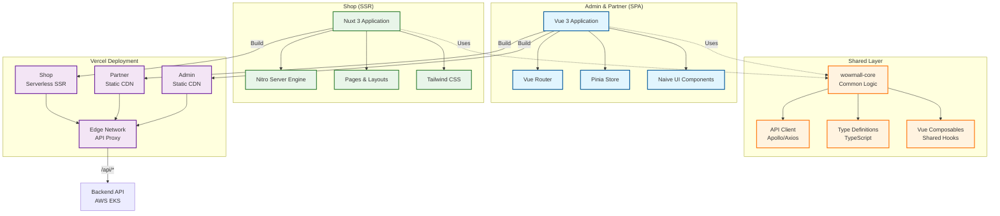

# 프론트엔드 아키텍처 (Frontend Architecture)

> 상위 문서: [SYSTEM-ARCHITECTURE.md](./SYSTEM-ARCHITECTURE.md)

---

## 1. 시스템 개요

프론트엔드는 `pnpm workspaces`와 `Turborepo`를 기반으로 하는 모노레포 구조이며, **Vercel**을 통해 배포됩니다. 세 개의 주요 애플리케이션(Admin, Partner, Shop)이 공통 코어 라이브러리를 공유하며 개발됩니다.

---

## 2. 프론트엔드 아키텍처 다이어그램

---

## 3. 기술 스택

- **프레임워크**: Vue 3 (Admin/Partner), Nuxt 3 (Shop)
- **빌드 도구**: Vite
- **상태 관리**: Pinia
- **UI 라이브러리**: Naive UI, Tailwind CSS
- **GraphQL 클라이언트**: Apollo Client

---

## 4. Vercel 배포 전략 (CI/CD)

프론트엔드는 Vercel의 강력한 CI/CD 파이프라인을 활용하여 자동화된 배포를 수행합니다.

### 4.1 Preview Deployments
- Pull Request 생성 시 Vercel이 자동으로 미리보기(Preview) 환경을 배포합니다.
- 팀원들은 실제 라이브 환경과 동일한 URL에서 변경 사항을 검토할 수 있습니다.

### 4.2 Production Deployments
- `main` 브랜치에 코드가 병합(Merge)되면 프로덕션 배포가 자동으로 트리거됩니다.
- 이전 배포로의 즉시 롤백(Instant Rollback)을 지원합니다.

---

## 5. API Proxy (Rewrites)

- `vercel.json`의 Rewrites 설정을 통해 `/api/*` 요청을 백엔드(AWS ALB)로 전달
- CORS 문제를 해결하고 클라이언트는 단일 도메인으로 통신
