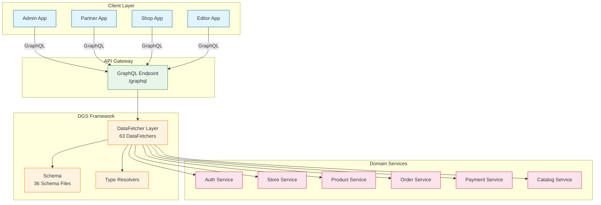
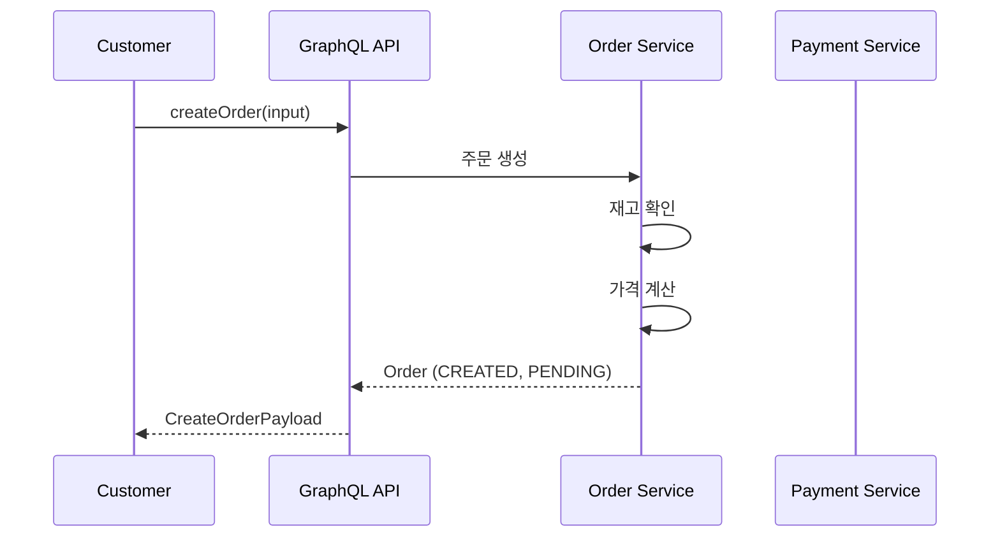
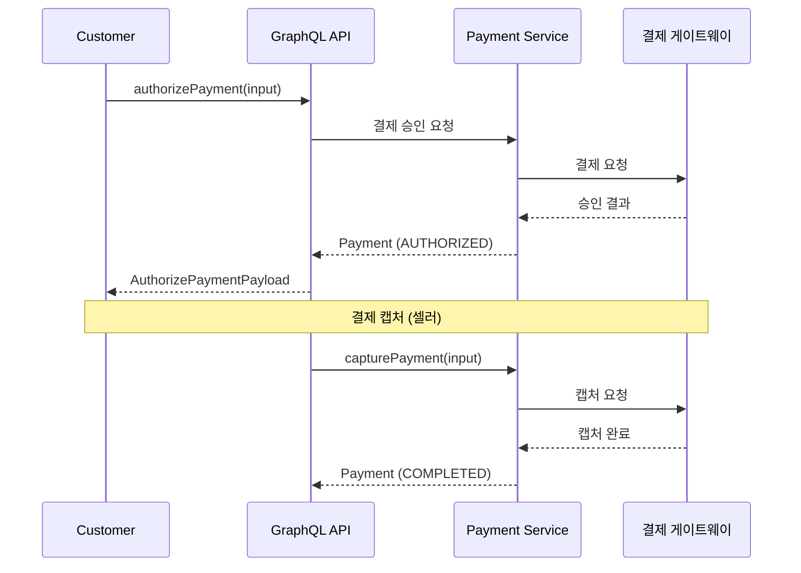
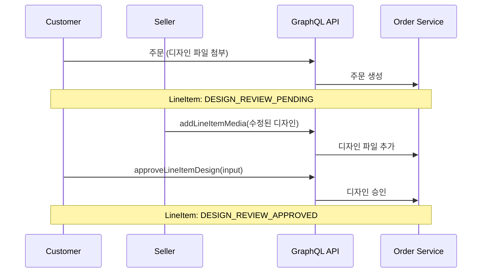

# GraphQL API 설계서 (GraphQL API Design)

> 상위 문서: [SYSTEM-ARCHITECTURE.md](./SYSTEM-ARCHITECTURE.md)

---

## 1. 개요

WowMall GraphQL API는 **Netflix DGS Framework**를 기반으로 구축되었으며, 프론트엔드 애플리케이션(Admin, Partner, Shop, Editor)에 데이터 조회 및 조작 기능을 제공합니다.

### 1.1 API 특징
- **Schema-First 접근**: GraphQL 스키마를 먼저 정의하고 코드를 생성
- **Relay Specification**: 페이지네이션을 위한 Connection 패턴 준수
- **Role-Based Access Control**: `@authenticated`, `@hasAnyRole` 디렉티브로 접근 제어
- **Multi-Tenancy**: 모든 작업이 `storeId` 기준으로 스코프됨

---

## 2. API 아키텍처



---

## 3. 커스텀 스칼라 (Custom Scalars)

| 스칼라 | 설명 | 예시 |
|--------|------|------|
| `Long` | 64비트 정수 | `9223372036854775807` |
| `DateTime` | RFC-3339 날짜시간 | `2024-01-15T09:30:00+09:00` |
| `Date` | RFC-3339 날짜 | `2024-01-15` |
| `Time` | RFC-3339 시간 | `09:30:00+09:00` |
| `LocalTime` | 24시간 시간 | `09:30:00.000` |
| `UUID` | RFC-4122 UUID | `550e8400-e29b-41d4-a716-446655440000` |
| `Currency` | ISO-4217 통화코드 | `KRW`, `USD` |
| `CountryCode` | ISO 3166-1 alpha-2 | `KR`, `US` |
| `Url` | URL 형식 | `https://example.com` |
| `PhoneNumber` | E.164 형식 | `+821012345678` |
| `Duration` | ISO-8601 기간 | `P1D`, `PT2H30M` |
| `HTML` | HTML 문자열 | `<p>내용</p>` |
| `HexColorCode` | Hex 색상코드 | `#FF5733` |
| `JSON` / `Object` | 임의 JSON 객체 | `{"key": "value"}` |
| `PositiveInt` | 양의 정수 (> 0) | `1`, `100` |
| `NonNegativeInt` | 0 이상 정수 (≥ 0) | `0`, `50` |

---

## 4. 디렉티브 (Directives)

```graphql
# 인증 필수
directive @authenticated on FIELD_DEFINITION

# 역할 기반 접근 제어
directive @hasAnyRole(roles: [UserRole!]!) on FIELD_DEFINITION

# 역할 정의
enum UserRole {
  SUPER_ADMIN  # 플랫폼 최고 관리자
  ADMIN        # 플랫폼 관리자
  SELLER       # 상점 판매자
  CUSTOMER     # 고객
}
```

### 4.1 접근 제어 매트릭스

| 역할 | 권한 범위 |
|------|----------|
| `SUPER_ADMIN` | 모든 상점, 모든 기능 접근 |
| `ADMIN` | 모든 상점 조회, 제한적 수정 |
| `SELLER` | 자신의 상점만 관리 |
| `CUSTOMER` | 자신의 주문/정보만 접근 |

---

## 5. 공통 타입 (Common Types)

### 5.1 Node 인터페이스
```graphql
interface Node {
  id: ID!
}
```

### 5.2 Money 타입
```graphql
type Money {
  amount: Long!
  currency: Currency!
}
```

### 5.3 Address 인터페이스
```graphql
interface Address {
  zipcode: String!
  siDo: String!         # 시/도
  siGunGu: String!      # 시/군/구
  eupMyeonDong: String! # 읍/면/동
  addressLine1: String!
  addressLine2: String
}
```

### 5.4 Connection 패턴 (Relay Specification)
```graphql
type ProductConnection {
  edges: [ProductEdge!]!
  pageInfo: PageInfo!
  totalCount: Int!
}

type ProductEdge {
  cursor: String!
  node: Product!
}

type PageInfo {
  hasNextPage: Boolean!
  hasPreviousPage: Boolean!
  startCursor: String
  endCursor: String
}
```

---

## 6. 도메인별 API

### 6.1 인증 도메인 (Auth Domain)

#### 타입 정의
```graphql
interface User implements Node {
  id: ID!
  email: String!
  role: UserRole!
  createdAt: DateTime!
}

type Customer implements User & Node {
  id: ID!
  email: String!
  role: UserRole!
  name: String
  phone: PhoneNumber
  addresses: [ShippingAddress!]!
  orders(first: Int, offset: Int): OrderConnection!
  createdAt: DateTime!
}

type Seller implements User & Node {
  id: ID!
  email: String!
  role: UserRole!
  stores: [Store!]!
  createdAt: DateTime!
}
```

#### Query
```graphql
type Query {
  # 현재 로그인한 사용자 정보
  me: User @authenticated

  # 이메일 유효성 검증
  validateEmail(input: ValidateEmailInput!): ValidateEmailPayload!
}
```

#### Mutation
```graphql
type Mutation {
  # 비밀번호 변경
  changePassword(input: ChangePasswordInput!): ChangePasswordPayload! @authenticated

  # 비밀번호 재설정 요청
  requestPasswordReset(input: RequestPasswordResetInput!): RequestPasswordResetPayload!

  # 비밀번호 재설정 토큰 검증
  validatePasswordResetToken(input: ValidatePasswordResetTokenInput!): ValidatePasswordResetTokenPayload!

  # 비밀번호 재설정
  resetPassword(input: ResetPasswordInput!): ResetPasswordPayload!

  # 고객 탈퇴
  withdrawCustomer(input: WithdrawCustomerInput!): WithdrawCustomerPayload! @hasAnyRole(roles: [CUSTOMER])

  # 판매자 탈퇴
  withdrawSeller(input: WithdrawSellerInput!): WithdrawSellerPayload! @hasAnyRole(roles: [SELLER])
}
```

---

### 6.2 상점 도메인 (Store Domain)

#### 타입 정의
```graphql
type Store implements Node {
  id: ID!
  name: String!
  slug: String!
  logo: Image
  favicon: Image
  description: String
  businessInfo: BusinessInfo
  shippingAddress: StoreAddress
  defaultShippingSettings: ShippingSettings
  paymentSettings: PaymentSettings!
  status: StoreStatus!
  theme: StoreTheme

  # 관계
  orders(first: Int, offset: Int, filter: OrderFilter): OrderConnection @hasAnyRole(roles: [SELLER])
  customProducts(first: Int, offset: Int, filter: ProductFilterInput): CustomProductConnection
  wowPressLinkedProducts(first: Int, offset: Int, filter: ProductFilterInput): WowPressLinkedProductConnection
  categories(first: Int, offset: Int): CategoryConnection
  collections(first: Int, offset: Int): CollectionConnection

  createdAt: DateTime!
  updatedAt: DateTime!
}

enum StoreStatus {
  ACTIVE      # 운영중
  INACTIVE    # 비활성
  SUSPENDED   # 정지됨
  CLOSED      # 폐쇄됨
}

type BusinessInfo {
  companyName: String!
  representativeName: String!
  businessNumber: String!
  businessType: String
  businessCategory: String
  address: StoreAddress
  phone: PhoneNumber
  email: String
}
```

#### Query
```graphql
type Query {
  # 상점 조회 (ID)
  store(id: ID!): StorePayload

  # 상점 조회 (슬러그)
  storeBySlug(slug: String!): Store

  # 상점 목록 (관리자 전용)
  stores(offset: Int, first: Int, filter: StoresFilter): StoreConnection @hasAnyRole(roles: [ADMIN, SUPER_ADMIN])

  # 슬러그 유효성 검증
  validateStoreSlug(input: ValidateStoreSlugInput!): ValidateStoreSlugPayload

  # 상점명 유효성 검증
  validateStoreName(input: ValidateStoreNameInput!): ValidateStoreSlugPayload

  # 사업자 정보 검증
  validateBusinessInfo(input: ValidateBusinessInfoInput!): ValidateBusinessInfoPayload @authenticated

  # 정책 템플릿 조회
  defaultPolicyTemplate(type: StorePolicyType!): StorePolicyTemplate @authenticated
}
```

#### Mutation
```graphql
type Mutation {
  # 상점 생성
  createStore(input: CreateStoreInput!): CreateStorePayload! @hasAnyRole(roles: [SELLER])

  # 상점 정보 수정
  updateStore(input: UpdateStoreInput!): UpdateStorePayload! @hasAnyRole(roles: [SELLER])

  # 상점 테마 수정
  updateStoreTheme(input: UpdateStoreThemeInput!): UpdateStoreThemePayload @hasAnyRole(roles: [SELLER])

  # 사업자 정보 수정
  updateStoreBusinessInfo(storeId: ID!, input: BusinessInfoInput!): Store @hasAnyRole(roles: [SELLER])

  # 섹션 순서 변경
  updateStoreSectionOrder(input: UpdateStoreSectionOrderInput!): UpdateStoreSectionOrderPayload! @hasAnyRole(roles: [SELLER])

  # 상점 정책 수정
  updateStorePolicy(input: UpdateStorePolicyInput!): UpdateStorePolicyPayload! @hasAnyRole(roles: [SELLER])

  # 분석 스크립트 관리
  addAnalyticsScript(input: AddAnalyticsScriptInput!): AddAnalyticsScriptPayload! @hasAnyRole(roles: [SELLER])
  updateAnalyticsScript(input: UpdateAnalyticsScriptInput!): UpdateAnalyticsScriptPayload! @hasAnyRole(roles: [SELLER])
  removeAnalyticsScript(input: RemoveAnalyticsScriptInput!): RemoveAnalyticsScriptPayload! @hasAnyRole(roles: [SELLER])

  # 배너 관리
  addBanner(input: AddBannerInput!): AddBannerPayload! @hasAnyRole(roles: [SELLER])
  updateBanner(input: UpdateBannerInput!): UpdateBannerPayload! @hasAnyRole(roles: [SELLER])
  removeBanner(input: RemoveBannerInput!): RemoveBannerPayload! @hasAnyRole(roles: [SELLER])
  updateBannerOrder(input: UpdateBannerOrderInput!): UpdateBannerOrderPayload! @hasAnyRole(roles: [SELLER])

  # 상점 상태 변경
  suspendStore(input: UpdateStoreStatusInput!): UpdateStoreStatusPayload! @hasAnyRole(roles: [SELLER, ADMIN])
  activateStore(input: UpdateStoreStatusInput!): UpdateStoreStatusPayload! @hasAnyRole(roles: [SELLER, ADMIN])
  closeStore(input: UpdateStoreStatusInput!): CloseStoreStatusPayload! @hasAnyRole(roles: [SELLER, ADMIN])
}
```

---

### 6.3 상품 도메인 (Product Domain)

#### 타입 정의
```graphql
interface Product implements Node {
  id: ID!
  productType: ProductType!
  title: String!
  description: String
  handle: String!               # URL-friendly 식별자
  medias(first: Int, offset: Int): MediaConnection!
  discountable: Boolean!
  vendor: String
  status: ProductStatus!
  categories: CategoryConnection
  tags: [String!]!
  price: Money
  hasOnlyDefaultVariant: Boolean!
  shippingSettings: ProductShippingSettings

  # 상품 안내 (JSON)
  detailsGuide: JSON
  priceGuide: JSON
  shippingGuide: JSON
  refundPolicyGuide: JSON

  store: Store!
  createdAt: DateTime!
  updatedAt: DateTime!
}

enum ProductType {
  CUSTOM           # 셀러 직접 생성 상품
  WOWPRESS_LINKED  # WowPress 연동 상품
}

enum ProductStatus {
  ACTIVE    # 판매중
  ARCHIVED  # 보관됨
  DRAFT     # 임시저장
}

type CustomProduct implements Product & Node {
  # Product 필드 상속
  # 커스텀 상품 전용 필드
  variants(first: Int, offset: Int): ProductVariantConnection!
  options: [ProductOption!]!
}

type WowPressLinkedProduct implements Product & Node {
  # Product 필드 상속
  # WowPress 연동 전용 필드
  wowPressProductId: String!
  designOption: DesignOption!
  supplyMethod: WowPressSupplyMethod!
  template: WowPressProductTemplate
}

enum DesignOption {
  SELF_DESIGN      # 고객 직접 디자인
  DESIGN_REQUEST   # 디자인 의뢰
  FILE_UPLOAD      # 파일 업로드
  UNKNOWN
}

enum WowPressSupplyMethod {
  DIRECT_TO_CUSTOMER  # 고객에게 직접 배송
  TO_SELLER           # 셀러에게 배송
}

type ProductVariant implements Node {
  id: ID!
  name: String!
  image: Image
  options: [ProductOptionValue!]!
  product: Product!
  price: Money!
  inventoryPolicy: ProductVariantInventoryPolicy!
  inventoryQuantity: Int
  createdAt: DateTime!
  updatedAt: DateTime!
}

type ProductOption {
  id: ID!
  name: String!
  product: Product!
  values: [ProductOptionValue!]!
  createdAt: DateTime!
  updatedAt: DateTime!
}

type StandaloneOptionGroup implements Node {
  id: ID!
  name: String!
  required: Boolean!
  maxSelections: Int!
  options: [StandaloneOption!]!
  position: Int!
}
```

#### Query
```graphql
type Query {
  # 상품 조회
  product(id: ID!): Product
  productByIdOrSlug(idOrSlug: String!, storeId: ID!): Product

  # 커스텀 상품 목록 (관리자)
  customProducts(first: Int, offset: Int, filter: ProductFilterInput): CustomProductConnection @hasAnyRole(roles: [ADMIN, SUPER_ADMIN])
  customProduct(id: ID!): CustomProduct

  # WowPress 연동 상품
  wowPressLinkedProducts(first: Int, offset: Int, filter: ProductFilterInput): WowPressLinkedProductConnection @hasAnyRole(roles: [ADMIN, SUPER_ADMIN])
  wowPressLinkedProduct(id: ID!): WowPressLinkedProduct

  # WowPress 상품 템플릿
  wowPressProductTemplates(first: Int, offset: Int, filter: WowPressProductTemplateFilter, sort: [WowPressProductTemplateSort!]): WowPressProductTemplateConnection @hasAnyRole(roles: [SELLER])
  wowPressProductTemplate(id: ID!): WowPressProductTemplate @hasAnyRole(roles: [SELLER])
}
```

#### Mutation
```graphql
type Mutation {
  # 커스텀 상품 관리
  createCustomProduct(input: CreateCustomProductInput!): CreateCustomProductPayload! @hasAnyRole(roles: [SELLER])
  updateCustomProduct(input: UpdateCustomProductInput!): UpdateCustomProductPayload! @hasAnyRole(roles: [SELLER])
  deleteCustomProduct(input: DeleteCustomProductInput!): DeleteCustomProductPayload! @hasAnyRole(roles: [SELLER])

  # WowPress 상품 템플릿 관리 (관리자)
  createWowPressProductTemplate(input: CreateWowPressProductTemplateInput!): CreateWowPressProductTemplatePayload! @hasAnyRole(roles: [ADMIN, SUPER_ADMIN])
  updateWowPressProductTemplate(input: UpdateWowPressProductTemplateInput!): UpdateWowPressProductTemplatePayload! @hasAnyRole(roles: [ADMIN, SUPER_ADMIN])
  deleteWowPressProductTemplate(input: DeleteWowPressProductTemplateInput!): DeleteWowPressProductTemplatePayload! @hasAnyRole(roles: [ADMIN, SUPER_ADMIN])

  # WowPress 연동 상품 관리
  createWowPressLinkedProduct(input: CreateWowPressLinkedProductInput!): CreateWowPressLinkedProductPayload! @hasAnyRole(roles: [SELLER])
  createWowPressLinkedProductsBulk(input: CreateWowPressLinkedProductsBulkInput!): CreateWowPressLinkedProductsBulkPayload! @hasAnyRole(roles: [SELLER])
  updateWowPressLinkedProduct(input: UpdateWowPressLinkedProductInput!): UpdateWowPressLinkedProductPayload! @hasAnyRole(roles: [SELLER])
  deleteWowPressLinkedProduct(input: DeleteWowPressLinkedProductInput!): DeleteWowPressLinkedProductPayload! @hasAnyRole(roles: [SELLER])

  # 상품 일괄 삭제
  deleteProductsBulk(input: DeleteProductsBulkInput!): DeleteProductsBulkPayload! @hasAnyRole(roles: [SELLER])

  # 상품 옵션 관리
  createProductOptions(input: CreateProductOptionsInput!): CreateProductOptionsPayload! @hasAnyRole(roles: [SELLER])
  updateProductOption(input: UpdateProductOptionInput!): UpdateProductOptionPayload! @hasAnyRole(roles: [SELLER])
  deleteProductOptions(input: DeleteProductOptionsInput!): DeleteProductOptionsPayload! @hasAnyRole(roles: [SELLER])
  reorderProductOptions(input: ReorderProductOptionsInput!): CreateProductOptionsPayload! @hasAnyRole(roles: [SELLER])
}
```

---

### 6.4 카탈로그 도메인 (Catalog Domain)

#### 타입 정의
```graphql
type Category implements Node {
  id: ID!
  name: String!
  handle: String!
  level: Int!
  parentId: ID
  parent: Category
  children: [Category!]!
  products(first: Int, offset: Int): ProductConnection!
  rank: Int!
  isArchived: Boolean!
  isInternal: Boolean!
  isLeaf: Boolean!
  isRoot: Boolean!
  createdAt: DateTime!
  updatedAt: DateTime!
}

interface Collection implements Node {
  id: ID!
  type: CollectionType!
  name: String!
  handle: String!
  store: Store!
  products(first: Int, offset: Int): ProductConnection!
  createdAt: DateTime!
  updatedAt: DateTime!
}

enum CollectionType {
  SYSTEM  # 시스템 생성 컬렉션
  CUSTOM  # 셀러 생성 컬렉션
}

enum SystemCollectionType {
  ALL_PRODUCTS  # 전체 상품
  NEW_ARRIVALS  # 신상품
  FEATURED      # 추천 상품
}

type CustomCollection implements Collection & Node {
  # Collection 필드 상속
}

type SystemCollection implements Collection & Node {
  # Collection 필드 상속
  systemType: SystemCollectionType!
}
```

#### Query
```graphql
type Query {
  # 카테고리 조회
  category(id: ID!): Category

  # 컬렉션 조회
  collection(id: ID!): Collection
  systemCollection(storeId: ID!, systemType: SystemCollectionType!): SystemCollection
}
```

#### Mutation
```graphql
type Mutation {
  # 컬렉션 관리
  createCollection(input: CreateCollectionInput!): CreateCollectionPayload! @hasAnyRole(roles: [SELLER])
  deleteCollection(input: DeleteCollectionInput!): DeleteCollectionPayload! @hasAnyRole(roles: [SELLER])
  addProductToCollection(input: AddProductToCollectionInput!): AddProductToCollectionPayload! @hasAnyRole(roles: [SELLER])
  removeProductFromCollection(input: RemoveProductFromCollectionInput!): RemoveProductFromCollectionPayload! @hasAnyRole(roles: [SELLER])

  # 카테고리 관리
  createCategory(input: CreateCategoryInput!): CreateCategoryPayload!
  updateCategory(input: UpdateCategoryInput!): UpdateCategoryPayload!
  deleteCategory(input: DeleteCategoryInput!): DeleteCategoryPayload!
  reorderCategories(input: ReorderCategoriesInput!): ReorderCategoriesPayload!
  moveCategory(input: MoveCategoryInput!): MoveCategoryPayload!

  # 상품-카테고리 연결
  addProductToCategory(input: AddProductToCategoryInput!): AddProductToCategoryPayload!
  addProductToCategories(input: AddProductToCategoriesInput!): AddProductToCategoriesPayload!
  updateProductCategories(input: UpdateProductCategoriesInput!): UpdateProductCategoriesPayload!
  removeProductFromCategory(input: RemoveProductFromCategoryInput!): RemoveProductToCategoryPayload!
}
```

---

### 6.5 주문 도메인 (Order Domain)

#### 타입 정의
```graphql
type Order implements Node {
  id: ID!
  displayId: String!              # 표시용 주문번호
  status: OrderStatus!
  financialStatus: OrderFinancialStatus!
  fulfillmentStatus: OrderFulfillmentStatus!

  customer: Customer!
  customerSnapshot: CustomerSnapshot!  # 주문 시점 고객 정보
  shippingAddress: ShippingAddress!
  items: [BaseLineItem!]!

  # 금액
  total: Money!
  subtotal: Money!
  shippingPrice: Money!
  discountTotal: Money!
  taxTotal: Money!

  # 관계 데이터
  payments: [Payment!]!
  fulfillmentOrders: [FulfillmentOrder!]!
  fulfillments: [Fulfillment!]!
  refunds: [Refund!]
  shippingMethods: [OrderShipping!]
  statusHistory: [OrderStatusHistory!]!
  cancellations: [OrderCancellation!]

  note: String
  canCancel: Boolean!
  createdAt: DateTime!
  updatedAt: DateTime!
}

enum OrderStatus {
  OPEN       # 처리중
  CLOSED     # 완료
  CANCELLED  # 취소됨
}

enum OrderFinancialStatus {
  PENDING              # 결제 대기
  AWAITING             # 입금 대기 (무통장)
  PAID                 # 결제 완료
  FAILED               # 결제 실패
  REFUNDED             # 환불 완료
  PARTIALLY_REFUNDED   # 부분 환불
}

enum OrderFulfillmentStatus {
  UNFULFILLED           # 미처리
  PARTIALLY_FULFILLED   # 부분 처리
  FULFILLED             # 처리 완료
  PENDING_FULFILLMENT   # 처리 대기
  OPEN                  # 열림
  IN_PROGRESS           # 진행중
  ON_HOLD               # 보류
  SCHEDULED             # 예약됨
  RESTOCKED             # 재입고됨
}

interface BaseLineItem implements Node {
  id: ID!
  type: LineItemType!
  product: Product!
  name: String!
  variant: ProductVariant
  quantity: Int!
  unitPrice: Money!
  totalPrice: Money!
  discountTotal: Money
  taxTotal: Money
  returnedQuantity: Int
  status: LineItemStatus!
  claimStatus: LineItemClaimStatus
  canExchange: Boolean!
  canCancel: Boolean!
  canReturn: Boolean!
}

enum LineItemStatus {
  CREATED        # 생성됨
  CONFIRMED      # 확인됨
  PROCESSING     # 처리중
  READY_TO_SHIP  # 배송 준비
  SHIPPED        # 배송중
  DELIVERED      # 배송 완료
  COMPLETED      # 완료
  CANCELLED      # 취소됨
  RETURNED       # 반품됨
  EXCHANGED      # 교환됨
}

enum LineItemClaimStatus {
  # 취소 관련
  CANCEL_REQUESTED
  CANCEL_APPROVED
  CANCEL_DECLINED
  CANCEL_REFUND_PROCESSED
  CANCEL_COMPLETED

  # 반품 관련
  RETURN_REQUESTED
  RETURN_APPROVED
  RETURN_DECLINED
  RETURN_ITEM_RECEIVED
  RETURN_REFUND_PROCESSED
  RETURN_COMPLETED
  RETURN_CANCELLED

  # 교환 관련
  EXCHANGE_REQUESTED
  EXCHANGE_APPROVED
  EXCHANGE_DECLINED
  EXCHANGE_ITEM_RECEIVED
  EXCHANGE_REPLACEMENT_SHIPPED
  EXCHANGE_COMPLETED
  EXCHANGE_CANCELLED

  # 디자인 검토 관련
  DESIGN_REVIEW_PENDING
  DESIGN_REVIEW_APPROVED
  DESIGN_REVIEW_REJECTED
}
```

#### Query
```graphql
type Query {
  # 주문 조회
  order(id: ID!): Order @authenticated
}

# Store 확장
extend type Store {
  orders(first: Int, offset: Int, filter: OrderFilter, sort: [OrderSortInput!]): OrderConnection @hasAnyRole(roles: [SELLER])
  orderCancellations(first: Int, offset: Int, status: [OrderCancellationStatus!], sort: [OrderCancellationSortInput!]): OrderCancellationConnection @hasAnyRole(roles: [SELLER])
}

# Customer 확장
extend type Customer {
  orders(first: Int, offset: Int, filter: OrderFilter, sort: [OrderSortInput!]): OrderConnection
}
```

#### Mutation
```graphql
type Mutation {
  # 주문 생성
  createOrder(input: CreateOrderInput!): CreateOrderPayload! @hasAnyRole(roles: [CUSTOMER])

  # 주문 취소
  cancelOrder(input: CancelOrderInput!): CancelOrderPayload! @authenticated

  # 취소 요청 처리 (셀러/관리자)
  approveOrderCancellation(input: ApproveOrderCancellationInput!): ApproveOrderCancellationPayload! @hasAnyRole(roles: [SELLER, ADMIN])
  declineOrderCancellation(input: ApproveOrderCancellationInput!): DeclineOrderCancellationPayload! @hasAnyRole(roles: [SELLER, ADMIN])
  processOrderCancellationRefund(input: ProcessOrderCancellationRefundInput!): ProcessOrderCancellationRefundPayload! @hasAnyRole(roles: [SELLER, ADMIN])
  completeOrderCancellation(input: CompleteOrderCancellationInput!): CompleteOrderCancellationPayload! @hasAnyRole(roles: [SELLER, ADMIN])

  # 환불
  refundOrder(input: RefundOrderInput!): RefundOrderPayload!

  # 결제 확인 (무통장)
  markOrderAsPaid(input: MarkOrderAsPaidInput!): MarkOrderAsPaidPayload! @hasAnyRole(roles: [SELLER])

  # 디자인 검토 (WowPress)
  addLineItemMedia(input: AddLineItemMediaInput!): AddLineItemMediaPayload! @hasAnyRole(roles: [SELLER])
  approveLineItemDesign(input: ApproveLineItemDesignInput!): ApproveLineItemDesignPayload! @hasAnyRole(roles: [CUSTOMER])
  rejectLineItemDesign(input: RejectLineItemDesignInput!): RejectLineItemDesignPayload! @hasAnyRole(roles: [CUSTOMER])
}
```

---

### 6.6 결제 도메인 (Payment Domain)

#### 타입 정의
```graphql
interface Payment {
  id: ID!
  amount: Money!
  paymentMethod: PaymentMethod!
  status: PaymentStatus!
  createdAt: DateTime!
  metadata: JSON
  capturedAt: DateTime
}

enum PaymentMethod {
  CREDIT_CARD      # 신용카드
  BANK_TRANSFER    # 무통장입금
  VIRTUAL_ACCOUNT  # 가상계좌
  MOBILE_PAYMENT   # 휴대폰결제
}

enum PaymentStatus {
  PENDING              # 대기
  AUTHORIZED           # 승인됨
  COMPLETED            # 완료
  FAILED               # 실패
  CANCELLED            # 취소됨
  REFUNDED             # 환불됨
  PARTIALLY_REFUNDED   # 부분환불됨
}

type CreditCardPayment implements Payment {
  # Payment 필드 상속
  cardCompany: String!
  cardNumber: String!          # 마스킹된 카드번호
  installmentMonths: Int
  approvalNumber: String
  pgTransactionId: String
  receiptUrl: String
}

type BankTransferPayment implements Payment {
  # Payment 필드 상속
  depositorName: String!
  dueDate: DateTime
  depositedAt: DateTime
  bankAccount: BankAccount!
}

type VirtualAccountPayment implements Payment {
  # Payment 필드 상속
  virtualAccount: BankAccount!
  dueDate: DateTime!
  depositedAt: DateTime
}

type BankAccount {
  bankCode: BankCode!
  bankName: String!
  accountNumber: String!
  accountHolder: String!
}

enum BankCode {
  BOK       # 한국은행
  KDB       # 산업은행
  IBK       # 기업은행
  KB        # 국민은행
  NH_BANK   # 농협은행
  WOORI     # 우리은행
  SC        # SC제일은행
  CITY      # 씨티은행
  DGB       # 대구은행
  BUSAN     # 부산은행
  GWANGJU   # 광주은행
  JEJU      # 제주은행
  JEONBUK   # 전북은행
  KYONGNAM  # 경남은행
  MG        # 새마을금고
  SHINHYEOP # 신협
  FSB       # 저축은행
  SUHYEOP   # 수협
  EPOST     # 우체국
  HANA      # 하나은행
  SHINHAN   # 신한은행
  K_BANK    # 케이뱅크
  KAKAO     # 카카오뱅크
  TOSS      # 토스뱅크
}

# 상점 결제 설정
type PaymentSettings implements Node {
  id: ID!
  store: Store!
  enabledPaymentMethods: [StorePaymentMethod!]!
  allPaymentMethods: [StorePaymentMethod!]!
  createdAt: DateTime!
  updatedAt: DateTime!
}

interface StorePaymentMethod {
  id: ID!
  name: String!
  isEnabled: Boolean!
}

type BankTransferStorePaymentMethod implements StorePaymentMethod & Node {
  # StorePaymentMethod 필드 상속
  bankAccounts: [StorePaymentMethodBankAccount!]!
  defaultBankAccount: StorePaymentMethodBankAccount!
}

type NicePayStorePaymentMethod implements StorePaymentMethod & Node {
  # StorePaymentMethod 필드 상속
  merchantId: String!
  clientKey: String!
  secretKey: String!
  methods: [NicePaymentMethod!]!
}

type TossPaymentStorePaymentMethod implements StorePaymentMethod & Node {
  # StorePaymentMethod 필드 상속
  clientKey: String!
  secretKey: String!
}

enum NicePaymentMethod {
  CARD              # 신용카드
  BANK              # 계좌이체
  DIRECT_CARD       # 다이렉트 카드
  VBANK             # 가상계좌
  CELLPHONE         # 휴대폰결제
  NAVERPAY_CARD     # 네이버페이 (카드)
  KAKAOPAY          # 카카오페이
  KAKAOPAY_CARD     # 카카오페이 (카드)
  KAKAOPAY_MONEY    # 카카오페이 (머니)
  SAMSUNGPAY_CARD   # 삼성페이
  PAYCO             # 페이코
  SSGPAY            # SSG페이
  CARD_AND_EASY_PAY # 카드+간편결제
}
```

#### Mutation
```graphql
type Mutation {
  # 결제 처리
  authorizePayment(input: AuthorizePaymentInput!): AuthorizePaymentPayload! @authenticated
  capturePayment(input: CapturePaymentInput!): CapturePaymentPayload! @hasAnyRole(roles: [SELLER])
  voidPayment(input: VoidPaymentInput!): VoidPaymentPayload! @hasAnyRole(roles: [SELLER])

  # 무통장입금 설정
  addBankTransferPayment(input: AddBankTransferPaymentInput!): AddBankTransferPaymentPayload! @hasAnyRole(roles: [SELLER])
  addBankAccount(input: AddBankAccountInput!): AddBankAccountPayload! @hasAnyRole(roles: [SELLER])
  updateBankAccount(input: UpdateBankAccountInput!): UpdateBankAccountPayload! @hasAnyRole(roles: [SELLER])
  removeBankAccount(input: RemoveBankAccountInput!): RemoveBankAccountPayload! @hasAnyRole(roles: [SELLER])

  # PG사 연동 설정
  addNicePayMethod(input: AddNicePayMethodInput!): AddNicePayMethodPayload! @hasAnyRole(roles: [SELLER])
  updateNicePayMethod(input: UpdateNicePayMethodInput!): UpdateNicePayMethodPayload! @hasAnyRole(roles: [SELLER])
  addTossPayMethod(input: AddTossPayMethodInput!): AddTossPayMethodPayload! @hasAnyRole(roles: [SELLER])
  updateTossPayMethod(input: UpdateTossPayMethodInput!): UpdateTossPayMethodPayload! @hasAnyRole(roles: [SELLER])

  # 결제 수단 상태 관리
  updatePaymentMethodStatus(input: UpdatePaymentMethodStatusInput!): UpdatePaymentMethodStatusPayload! @hasAnyRole(roles: [SELLER])
  removePaymentMethod(input: RemovePaymentMethodInput!): RemovePaymentMethodPayload! @hasAnyRole(roles: [SELLER])
}
```

---

## 7. 에러 처리

### 7.1 기본 에러 인터페이스
```graphql
interface Error {
  message: String!
}

interface DisplayableError {
  field: [String!]
  message: String!
}
```

### 7.2 공통 에러 타입
```graphql
type ValidationError implements Error {
  message: String!
  field: String
}

type NotFoundError implements Error {
  message: String!
  resourceType: String
  resourceId: ID
}

type UnauthorizedError implements Error {
  message: String!
}

type ForbiddenError implements Error {
  message: String!
}

type ConflictError implements Error {
  message: String!
}

type InternalError implements Error {
  message: String!
}

type UserError implements DisplayableError {
  field: [String!]
  message: String!
  code: String
}
```

### 7.3 도메인별 에러 타입

| 도메인 | 에러 타입 | 에러 코드 Enum |
|--------|----------|---------------|
| 결제 | `PaymentError` | `PaymentErrorCode` |
| 결제수단 | `PaymentMethodError` | `PaymentMethodErrorCode` |
| 주문생성 | `CreateOrderError` | `CreateOrderErrorCode` |
| 주문이행 | `OrderFulfillmentError` | `OrderFulfillmentErrorCode` |
| 회원탈퇴 | `WithdrawalError` | `WithdrawalErrorCode` |
| 상품생성 | `CreateCustomProductError` | `CreateCustomProductErrorCode` |
| 카테고리 | `CreateCategoryError` | `CreateCategoryErrorCode` |

---

## 8. 필터링 및 정렬

### 8.1 필터 입력 타입
```graphql
input ProductFilterInput {
  status: ProductStatus
  productType: ProductType
  categoryId: ID
  search: String
  AND: [ProductFilterInput!]
  OR: [ProductFilterInput!]
}

input OrderFilter {
  status: OrderStatus
  financialStatus: OrderFinancialStatus
  fulfillmentStatus: OrderFulfillmentStatus
  createdAt: DateTimeFilter
  search: String
}

input DateTimeFilter {
  gte: DateTime
  lte: DateTime
  gt: DateTime
  lt: DateTime
}
```

### 8.2 정렬 입력 타입
```graphql
input OrderSortInput {
  field: OrderSortField!
  direction: SortDirection!
}

enum OrderSortField {
  CREATED_AT
  UPDATED_AT
  TOTAL
}

enum SortDirection {
  ASC
  DESC
}
```

---

## 9. API 통계

| 구분 | 수량 |
|------|------|
| Schema 파일 | 36개 |
| DataFetcher 클래스 | 63개 |
| Query 작업 | 약 30개 |
| Mutation 작업 | 약 80개 |
| 도메인 | 28개 |

---

## 10. 주요 워크플로우

### 10.1 주문 생성 플로우


### 10.2 결제 플로우


### 10.3 디자인 검토 플로우 (WowPress)


---

## 11. 참고 자료

- [Netflix DGS Framework](https://netflix.github.io/dgs/)
- [GraphQL Specification](https://spec.graphql.org/)
- [Relay Cursor Connections Specification](https://relay.dev/graphql/connections.htm)
