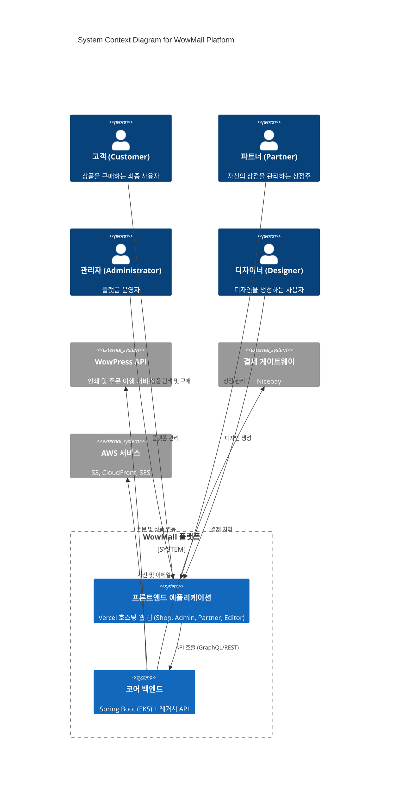
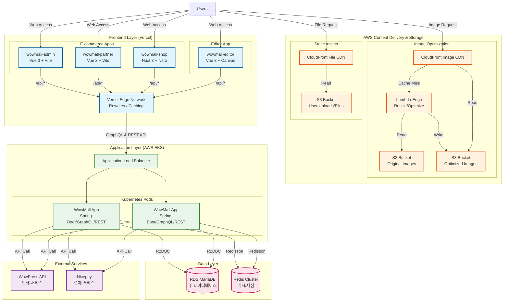

# WowMall 시스템 아키텍처 (System Architecture)

이 문서는 WowMall 플랫폼의 전체 시스템 아키텍처를 기술합니다.

---

## 상세 문서

| 영역 | 문서 | 설명 |
|------|------|------|
| **프론트엔드** | [FRONTEND-ARCHITECTURE.md](./FRONTEND-ARCHITECTURE.md) | Admin, Partner, Shop 애플리케이션 아키텍처 |
| **에디터** | [EDITOR-ARCHITECTURE.md](./EDITOR-ARCHITECTURE.md) | 그래픽 디자인 에디터 아키텍처 |
| **백엔드** | [BACKEND-ARCHITECTURE.md](./BACKEND-ARCHITECTURE.md) | Spring Boot 백엔드 아키텍처 |

---

## 1. 시스템 개요

WowMall은 와우프레스 API 연동을 기반으로 하는 **멀티 테넌트(Multi-tenant) 이커머스 플랫폼**입니다.
프론트엔드(Vercel)와 백엔드(AWS EKS)가 분리되어 GraphQL 및 REST API로 통신하는 **헤드리스 커머스(Headless Commerce)** 아키텍처를 채택하고 있습니다.

---

## 2. 시스템 컨텍스트 (C4 Level 1)

---

## 3. 전체 시스템 다이어그램 (Container Level)

---

## 4. 모노레포 구조 (Monorepo Structure)

| 영역 | 패키지명 | 경로 | 설명 |
|------|----------|------|------|
| **E-commerce Frontend** | `wowmall-admin` | `/wowmall-admin` | 관리자용 대시보드 (SPA) |
| | `wowmall-partner` | `/wowmall-partner` | 파트너용 포털 (SPA) |
| | `wowmall-shop` | `/wowmall-shop` | 고객용 스토어프론트 (SSR) |
| **Editor** | `@wowmall/editor` | `/apps/web` | 그래픽 디자인 에디터 (SPA) |
| | `@pf/canvas-core` | `/packages/canvas-core` | 캔버스 엔진 및 그래픽 처리 |
| | `@pf/color-runtime` | `/packages/color-runtime` | WASM 기반 색상 변환 |
| **Shared** | `wowmall-core` | `/wowmall-core` | 공통 비즈니스 로직, 타입, API 클라이언트 |

---

## 5. 기술 스택 요약

| 영역 | 기술 |
|------|------|
| **프론트엔드** | Vue 3, Nuxt 3, TypeScript, Vite, Pinia, Apollo Client |
| **에디터** | Fabric.js, Paper.js, OpenCV.js, Little CMS 2 (WASM) |
| **백엔드** | Kotlin, Spring Boot 3, WebFlux, Netflix DGS, R2DBC |
| **데이터** | MariaDB (RDS), Redis Cluster |
| **인프라** | AWS EKS, Vercel, CloudFront, S3, ArgoCD |
| **외부 서비스** | WowPress API, Nicepay |
